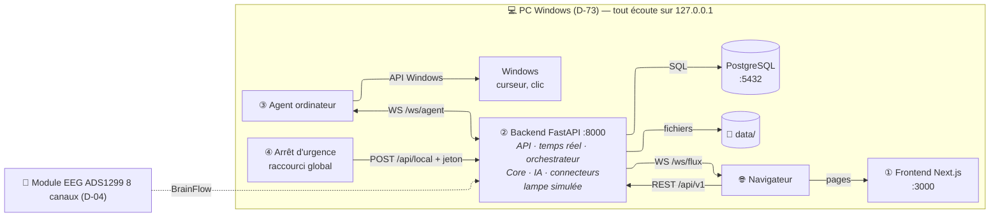
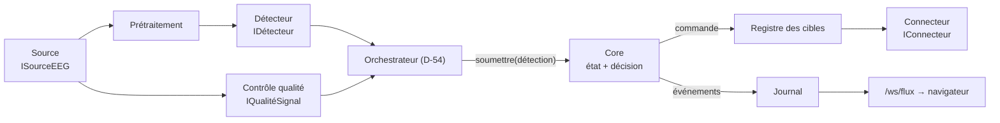

# Architecture technique v0 — CortexOS IA

| | |
|---|---|
| **Réf.** | ARCH-0 (Planning MVP, S2, mode A — D-96) |
| **Sources** | Cahier des charges v2.2 (§ 7, 10) · Spécification fonctionnelle v1.2 · DIAG-1 à DIAG-5 · Décisions D-54 à D-62 et D-72 à D-76 |
| **Version** | 0.1 — 25 septembre 2026 |
| **Statut** | Terminé (27/09/2026) · propositions P1 à P8 validées le 03/10/2026 (D-101) |

> Ce document dit **comment CortexOS IA est construit** : quels programmes tournent, avec quelles technologies, comment ils communiquent, comment le code est rangé et comment il est sécurisé. Il ne répète pas les diagrammes : il y renvoie. Il sera complété au fil des tranches (v1 à la fin du MVP).

---

## 1. Principes

| # | Principe | Conséquence concrète |
|---|---|---|
| A1 | **Monolithe modulaire** | Un seul backend FastAPI, découpé en modules aux interfaces claires (DIAG-4). Pas de microservices. |
| A2 | **Core indépendant** | Le Core est un paquet Python pur (D-62) : il n'importe ni FastAPI, ni PostgreSQL, ni BrainFlow. Il se teste seul. |
| A3 | **Coder contre des interfaces** | `ISourceEEG`, `IDétecteur`, `IConnecteur` : casque, simulation et fichier sont interchangeables ; ajouter une cible ne touche pas le Core (F-25). |
| A4 | **Tout reste sur le PC** | Aucun cloud, aucun service externe (D-74). Tous les programmes écoutent seulement sur `127.0.0.1`. |
| A5 | **Sûreté par défaut** | Dans le doute, aucune commande (ENF-03). Les machines à états de DIAG-5 sont codées telles quelles et refusent toute transition non prévue. |
| A6 | **Une information à un seul endroit** | Le journal fonctionnel (PostgreSQL) est la source de ce que l'interface affiche (spécification, principe P8). |

---

## 2. Les programmes qui tournent sur le PC

Tout tourne sur **un seul PC Windows** (D-73). Il y a **4 programmes** du projet, plus PostgreSQL et le navigateur.



| # | Programme | Rôle | Démarré par |
|---|---|---|---|
| ① | **Frontend** (Next.js) | Toutes les pages, dont la page vitrine (FW-51, D-76) | `npm run dev` |
| ② | **Backend** (FastAPI + Uvicorn) | API, passerelle temps réel, orchestrateur (D-54), Core, IA, connecteurs, **lampe simulée** (P4, D-101) | `uvicorn` |
| ③ | **Agent ordinateur** | Exécute la liste fermée de commandes sur Windows (curseur, sélection) | `python -m agent` |
| ④ | **Arrêt d'urgence** (C18) | Écoute un raccourci clavier global et envoie l'ordre d'arrêt (D-57, D-75) | `python -m arret_urgence` |
| — | **PostgreSQL** | Données métier (D-58) | service Windows |

> **Pourquoi l'agent et l'arrêt d'urgence sont-ils des programmes séparés ?** L'agent agit sur Windows (risque de blocage) : s'il plante, le backend continue et sait que la cible est indisponible. L'arrêt d'urgence doit marcher **même si** l'interface Web ou l'agent sont tombés (D-75) : il a donc son propre processus et son propre canal.

---

## 3. Technologies

### 3.1 Déjà décidées

| Domaine | Technologie | Décision |
|---|---|---|
| Langage backend, Core, IA | Python | Cahier § 10, D-62 |
| Backend / API | FastAPI | Cahier § 10 |
| Frontend | Next.js + TypeScript + Tailwind v4 | Cahier § 10, D-43 |
| Base de données | PostgreSQL + fichiers | D-58 |
| Acquisition EEG | BrainFlow (carte synthétique, puis casque) | Cahier § 10, D-21 |
| Traitement et IA | MNE-Python, scikit-learn, NumPy | Développement PC seul § 8 |
| Tests Python | pytest | Développement PC seul § 8 |
| Système | Windows | D-73 |

### 3.2 Bibliothèques proposées (P3, D-101)

Chacune répond à un besoin précis ; aucune n'ajoute un nouveau service à installer.

| Besoin | Bibliothèque proposée | Pourquoi celle-là |
|---|---|---|
| Serveur qui fait tourner FastAPI | **Uvicorn** | Serveur standard recommandé par FastAPI |
| Valider les données entrantes et la configuration | **Pydantic** (+ pydantic-settings) | Déjà inclus avec FastAPI |
| Accès à PostgreSQL depuis Python | **SQLAlchemy 2** + pilote **psycopg 3** | Standard Python, fonctionne avec FastAPI, évite d'écrire le SQL à la main pour chaque module |
| Faire évoluer le schéma de la base | **Alembic** | Garde l'historique des changements de tables, comme Git pour la base |
| Hacher les mots de passe (D-74) | **argon2-cffi** (Argon2id) | Algorithme recommandé aujourd'hui pour les mots de passe |
| Agent : bouger la souris, cliquer | **pynput** | Fonctionne sous Windows, sert aussi au raccourci clavier global |
| Agent : client WebSocket | **websockets** | Bibliothèque WebSocket de référence en Python |
| Arrêt d'urgence : envoyer le POST | **httpx** | Client HTTP simple, sert aussi aux tests de FastAPI |

### 3.3 Technologies écartées ou reportées

| Technologie | Statut | Pourquoi |
|---|---|---|
| **C++** | Reporté : piste pour plus tard (D-62) | Le Core ne fait que des décisions simples (comparer un seuil, changer d'état) : Python est largement assez rapide. Le coût réel est ailleurs (lecture du signal, calcul de l'IA), et ces bibliothèques sont déjà écrites en C/C++ sous Python (NumPy, BrainFlow). Un Core C++ ajouterait une liaison C++ ↔ Python à construire et à tester, sans gain mesurable au MVP. Si une mesure de latence (D-10) montre un jour que le Core est le goulot, il pourra être réécrit derrière la même interface `IContrôleCore`. |
| **Rust** | Hors projet pour l'instant (Planning § 10) | Même raison, avec en plus un langage nouveau à apprendre en parallèle du reste. |
| MQTT, ESP32 | Extension (D-72) | Utiles seulement pour un objet connecté réel |
| ROS 2 | Extension (D-11) | Robot et drone simulés |
| Django, Flutter, Redis, gRPC, Docker | `[À DÉFINIR — D-08]` | Aucun besoin identifié au MVP |

### 3.4 Environnement de développement (vérifié le 04/10/2026)

| Outil | Version sur le PC | Remarque |
|---|---|---|
| Git | 2.53.0 | Identité des commits : `eloge9` |
| Python | **3.14.3** (par défaut) · 3.13.12 (Astral, aussi installé) | Version du projet : 3.14 |
| Node.js | 24.13.1 (LTS) | Next.js 16 exige Node ≥ 20.9 |
| VS Code | 1.139.0 | — |

**Python 3.14 : compatibilité vérifiée côté paquets.** Le 04/10/2026, tous les paquets prévus (BrainFlow, MNE, scikit-learn, NumPy, SciPy, FastAPI, Uvicorn, Pydantic, SQLAlchemy, psycopg (binaire), Alembic, argon2-cffi, pynput, websockets, httpx, pytest) publient une version installable pour Python 3.14 sous Windows 64 bits. Confirmation finale lors de la création de l'environnement virtuel (`py -3.14 -m venv .venv`) en S4. Repli si une installation échoue : Python 3.13, déjà présent (proposé).

---

## 4. Organisation du dépôt (P1, D-101)

Un seul dépôt Git (monodépôt), un dossier par programme :

```text
CortexOS-IA/
├── core/                  # Paquet Python pur (D-62) : aucun import de FastAPI, BrainFlow, SQL
│   ├── etats.py           #   État global — DIAG-5 ①
│   ├── commande.py        #   Cycle de vie d'une commande — DIAG-5 ②
│   ├── decision.py        #   Seuil, garde-fous, motifs de rejet
│   ├── evenements.py      #   Événements émis (IÉmetteurÉvénements)
│   └── tests/
├── backend/
│   ├── app/
│   │   ├── main.py        #   Création de l'application FastAPI
│   │   ├── config.py      #   Réglages lus dans .env
│   │   ├── api/           #   Routes REST /api/v1/… et /api/local/…  (C2)
│   │   ├── temps_reel/    #   WebSocket /ws/flux et /ws/agent        (C3)
│   │   ├── chaine/        #   Orchestrateur                          (C4)
│   │   ├── modules/       #   comptes, profils, sessions, journal, parametres (C5–C9)
│   │   ├── eeg/           #   sources, qualité, prétraitement        (C11–C13)
│   │   ├── ia/            #   détecteurs, calibration, modèles       (C14–C16)
│   │   ├── cibles/        #   registre, connecteurs, lampe simulée   (C19, C20, C24)
│   │   └── persistance/   #   SQLAlchemy, migrations Alembic         (C10)
│   └── tests/
├── agent/                 # Agent ordinateur Windows (C23)
├── arret_urgence/         # Programme d'arrêt d'urgence (C18)
├── frontend/              # Next.js + TypeScript + Tailwind v4 (C1)
├── docs/                  # Documentation de référence
├── data/                  # Signal, modèles, exports — jamais commité (.gitignore)
├── .env.example           # Modèle de configuration (sans secrets)
└── README.md
```

**Règle de dépendance** (vérifiable par un test) : `core/` n'importe rien du projet ; `backend/` peut importer `core/` ; `agent/` et `arret_urgence/` n'importent ni l'un ni l'autre (ils ne parlent au backend que par le réseau local).

Correspondance avec DIAG-4 : chaque composant C1 à C24 a un dossier indiqué en commentaire ci-dessus ; C21 = PostgreSQL, C22 = `data/`.

---

## 5. Communication

| Liaison | Protocole | Adresse (P2, D-101) | Sécurité |
|---|---|---|---|
| Navigateur → Frontend | HTTP | `http://localhost:3000` | — |
| Navigateur → Backend | HTTP REST (JSON) | `http://localhost:8000/api/v1/…` | Cookie de session (section 7) |
| Backend → Navigateur | WebSocket | `ws://localhost:8000/ws/flux` | Cookie de session vérifié à l'ouverture |
| Agent ↔ Backend | WebSocket local (D-55) | `ws://127.0.0.1:8000/ws/agent` | Jeton local de l'agent |
| Arrêt d'urgence → Backend | HTTP POST (D-75) | `http://127.0.0.1:8000/api/local/arret-urgence` | Adresse 127.0.0.1 seulement + jeton local dédié |
| Backend → PostgreSQL | SQL | `127.0.0.1:5432` | Mot de passe dans `.env` |
| Backend → Lampe simulée | Appel de fonction Python (D-56) | — | — |

Le détail des routes et des messages est fixé dans le **Contrat d'API** (`08-contrat-api.md`, v1.0 validée le 05/10/2026, D-104 à D-107). Principes déjà retenus :

- **REST** pour les actions ponctuelles (créer une session, activer les commandes, lire le journal) ;
- **WebSocket `/ws/flux`** pour tout ce qui change en continu (état global, qualité, signal, détections, décisions, commandes, alertes) : le backend pousse, le navigateur ne demande pas ;
- **l'agent se connecte au backend** (il est client, le backend est serveur) (P5, D-101) : tant qu'il est connecté, la cible « Ordinateur » est disponible ; s'il se déconnecte, elle devient indisponible (F-23) et les commandes vers elle sont rejetées.

---

## 6. La chaîne temps réel



| Étape | Où | Comment ça tourne (P6, D-101) |
|---|---|---|
| Lecture de la source | `backend/app/eeg/` | BrainFlow lit dans un **fil d'exécution séparé** (*thread*), pour ne pas bloquer FastAPI |
| Qualité, prétraitement, détection | `eeg/`, `ia/` | Une **tâche asynchrone** de l'orchestrateur, à chaque fenêtre de signal (durée de fenêtre `[À DÉFINIR — Documentation technique]`) |
| Décision | `core/` | Appel de fonction, synchrone et rapide ; **seul point** où une commande peut naître |
| Entraînement d'un modèle | `ia/` | Tâche de fond dans le processus du backend (D-59), dans un fil séparé |
| Envoi à l'interface | `temps_reel/` | Le journal reçoit les événements du Core et les diffuse sur `/ws/flux` |

Les états et transitions sont ceux de **DIAG-5** : `core/etats.py` (① état global) et `core/commande.py` (② commande) en sont la traduction directe ; les comportements marqués ⚠ lèvent une erreur explicite tant que la décision correspondante (D-67 à D-71…) n'est pas prise.

---

## 7. Sécurité et accès

| Sujet | Choix | Référence |
|---|---|---|
| Réseau | Tous les programmes écoutent **uniquement sur `127.0.0.1`** : rien n'est joignable depuis un autre ordinateur | D-74 |
| Comptes | Comptes locaux dans PostgreSQL : identifiant + **mot de passe haché (Argon2id)**, jamais stocké en clair | D-74 |
| Session | Après connexion, le backend crée une session et envoie un **cookie** `HttpOnly` (illisible par JavaScript), `SameSite=Strict` ; la session est vérifiée à chaque requête et à l'ouverture du WebSocket | D-74 |
| Rôles | Rôles en base (Utilisateur, Accompagnant, Expérimentateur, Administrateur, D-47) ; droits détaillés `[À DÉFINIR — D-09]` | D-47, D-09 |
| Premier administrateur | Créé par une commande en ligne de commande au premier lancement (pas d'inscription publique, spéc. § 8) | P7, D-101 |
| Page vitrine | **Seule page publique** ; elle n'appelle aucune route protégée | D-76 |
| Arrêt d'urgence | Route `/api/local/arret-urgence` : refusée si la requête ne vient pas de `127.0.0.1` ou si le jeton est faux ; le jeton est généré au démarrage du backend dans `data/jeton-arret.txt` (P8, D-101) | D-75 |
| Agent | Jeton local de l'agent, même principe | P8, D-101 |
| Secrets | Mots de passe et jetons dans `.env` ou `data/`, **jamais commités** ; `.env.example` montre les clés sans valeurs | — |
| CORS | Le backend n'accepte les appels de navigateur que depuis `http://localhost:3000` | — |
| Données EEG | Restent dans `data/` et PostgreSQL sur le PC ; export seulement si le consentement le permet (F-35) ; conservation `[À DÉFINIR — D-09]` | D-74, D-09 |

---

## 8. Données

| Donnée | Stockage | Format | Détail |
|---|---|---|---|
| Comptes, profils, consentements, sessions, essais, détections, décisions, commandes, résultats, journal, paramètres | PostgreSQL | tables | Modèle de données : DIAG-13 (S22) ; classes : DIAG-3 |
| Signal EEG enregistré | `data/eeg/` | `[À DÉFINIR]` (par exemple FIF de MNE) | La base garde le chemin du fichier |
| Modèles entraînés | `data/modeles/` | `[À DÉFINIR]` (par exemple joblib) | Versionnés (F-09) |
| Exports | `data/exports/` | `[À DÉFINIR]` (CSV, JSON) | Seulement si consentement (F-35) |
| Jeux de données publics | `data/public/` | fichiers d'origine (PhysioNet) | Jamais commités |
| Journaux techniques du code | `data/logs/` | texte | Pour déboguer ; différents du journal fonctionnel (spéc. 4.8) |

---

## 9. Interface Web

| Page | Accès | Contenu |
|---|---|---|
| `/` **Page vitrine** (FW-51) | Public | Présentation de CortexOS IA, lien « Se connecter » ; contenu `[À DÉFINIR — D-76]` |
| `/connexion` | Public | Identifiant + mot de passe |
| `/app/…` | Connecté | Supervision, signal, calibration, commandes, sessions, journal, profil, administration (maquettes : MAQ, S3) |

Next.js (App Router) protège tout ce qui est sous `/app/` : sans session valide, redirection vers `/connexion`. La charte graphique (06) s'applique partout, y compris à la vitrine.

---

## 10. Tests et qualité

| Niveau | Outil | Ce qu'on vérifie |
|---|---|---|
| Core | pytest | Chaque transition de DIAG-5 autorisée passe ; chaque transition non prévue est refusée ; le tableau de vérification croisée de DIAG-5 devient des tests |
| Backend | pytest + client de test FastAPI | Routes, droits, arrêt d'urgence refusé sans jeton ou hors 127.0.0.1 |
| Architecture | pytest | `core/` n'importe ni FastAPI, ni SQLAlchemy, ni BrainFlow (règle de la section 4) |
| Frontend | lint TypeScript | Types et règles de style ; tests d'écran plus tard |
| Chaîne complète | Test d'intégration (S18) | Détecteur de test → Core → lampe simulée, puis → agent |

---

## 11. Lancer le projet en développement (Proposé)

1. Démarrer PostgreSQL (service Windows).
2. Backend : `uvicorn app.main:app --host 127.0.0.1 --port 8000 --reload` (dans `backend/`, environnement virtuel activé).
3. Frontend : `npm run dev` (dans `frontend/`).
4. Si la cible Ordinateur est utilisée : `python -m agent`.
5. Toujours, dès qu'une session est active : `python -m arret_urgence`.

Le README (S4) donnera les commandes exactes. Un script unique de lancement pourra venir plus tard.

---

## 12. Propositions (validées le 03/10/2026, D-101)

| ID | Proposition | Alternative |
|---|---|---|
| **P1** | Monodépôt avec les dossiers `core/`, `backend/`, `agent/`, `arret_urgence/`, `frontend/`, `docs/`, `data/` (section 4) | Plusieurs dépôts : plus lourd pour une personne |
| **P2** | Ports : frontend 3000, backend 8000, PostgreSQL 5432 ; préfixes `/api/v1`, `/api/local`, `/ws/flux`, `/ws/agent` | Autres ports si déjà pris sur ton PC |
| **P3** | Bibliothèques de la section 3.2 | Écrire le SQL à la main (psycopg seul), bcrypt au lieu d'Argon2 |
| **P4** | La **lampe simulée tourne dans le processus du backend** (classe Python appelée directement, D-56) ; son état s'affiche dans l'interface Web. DIAG-4 a été corrigé en conséquence (v1.3) | Un petit programme séparé avec sa fenêtre : il faudrait alors un protocole (HTTP local), ce qui contredit « appel direct » |
| **P5** | L'agent est **client** WebSocket et se connecte au backend ; connexion = cible disponible | Le backend se connecte à l'agent : il faudrait qu'il sache quand l'agent démarre |
| **P6** | Lecture BrainFlow et entraînement dans des fils séparés ; orchestrateur en tâche asynchrone | Processus séparé pour l'IA : plus complexe, non nécessaire au MVP |
| **P7** | Premier compte administrateur créé en ligne de commande | Page « premier lancement » dans l'interface |
| **P8** | Jetons locaux (arrêt d'urgence, agent) générés au démarrage du backend dans `data/` | Jetons fixes écrits à la main dans `.env` |

Semaine de réalisation de la page vitrine : `[À DÉFINIR]` (proposition : S4, avec le squelette du frontend).

---

## 13. Décisions et points ouverts

**Décisions qui fondent ce document :** D-54 (orchestrateur) · D-55 (agent en WebSocket) · D-56 (lampe en appel direct) · D-57 (arrêt par raccourci global) · D-58 (PostgreSQL + fichiers) · D-59 (entraînement en tâche de fond) · D-60 (authentification en S25) · D-61 (contrôle qualité séparé) · D-62 (Core Python) · **D-72** (ordinateur + lampe simulée) · **D-73** (Windows) · **D-74** (comptes locaux, tout sur le PC) · **D-75** (canal de l'arrêt d'urgence) · **D-76** (page vitrine) · **D-101** (P1 à P8).

**Encore ouverts :** liaison physique et compatibilité BrainFlow du module ADS1299 (D-04, à vérifier) · D-05 (scénarios de démonstration) · D-09 (droits par rôle, conservation, partage) · D-10 (seuils, latence cible) · D-19 (qui déclenche l'arrêt) · D-67 à D-71 (comportements de DIAG-5) · formats de fichiers.
