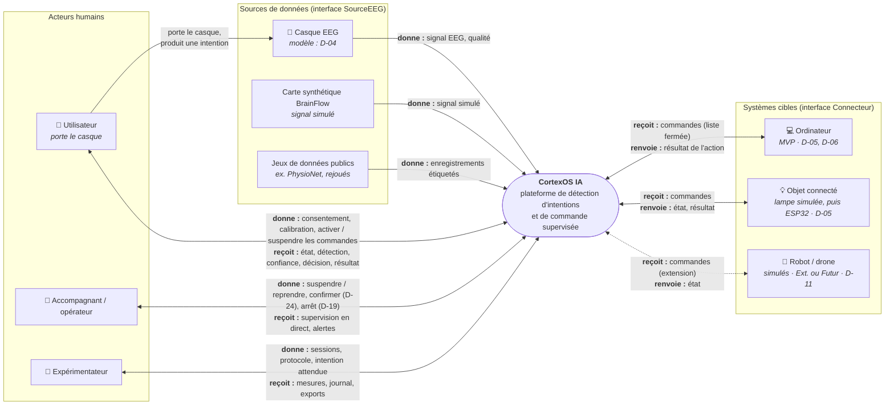

# DIAG-1 — Diagramme de contexte

| | |
|---|---|
| **Réf.** | DIAG-1 (Planning MVP, S1, mode B) |
| **Sources** | Cahier des charges 1.6, 4.1, 5.2 · Spécification fonctionnelle 3.1, 4.2, 4.6 · Développement sur PC seul, section 2 |
| **Version** | 1.1 — 25 septembre 2026 (intention captée par le casque, activation des commandes par l'utilisateur, verbes du point de vue de l'acteur) |

## Rôle du diagramme

Il montre **CortexOS IA comme une boîte noire** : qui interagit avec lui (acteurs humains), avec quels systèmes externes il échange, et ce qui circule. L'intérieur (modules, Core, agent ordinateur) n'apparaît pas ici : il sera détaillé dans le diagramme de composants (DIAG-4).

## Diagramme

**Légende** : les verbes (donne, reçoit, renvoie) sont du point de vue de l'acteur ou du système externe · flèche pleine = MVP ou phase sans matériel · flèche pointillée = extension ou futur. Les références D-xx renvoient au registre des décisions (`05-decisions.md`).

## Lecture

| Élément | Ce qu'il faut retenir |
|---|---|
| **Frontière du système** | Tout ce qui est dans la boîte « CortexOS IA » est à construire. Le casque, les jeux de données et les systèmes cibles existent déjà : on s'y connecte. |
| **Utilisateur** | Il ne transmet pas ses intentions à CortexOS : il les **produit**, le **casque** capte le signal, et c'est **CortexOS qui détecte** l'intention (le système ne lit pas les pensées, Cahier des charges 4.7). Dans l'interface, il donne son consentement, suit la calibration et active ou suspend les commandes (parcours B). |
| **Accompagnant** | Son rôle est la **sûreté** : il peut suspendre et, selon D-19 et D-24, confirmer ou arrêter. |
| **Expérimentateur** | Il fournit l'**intention attendue** : sans elle, la précision ne peut pas être mesurée (spécification 4.7). |
| **Trois sources de données** | Elles fournissent le même type de données par une même interface (`SourceEEG`) : c'est ce qui permet de développer sans casque. |
| **Systèmes cibles** | Chacun reçoit une **liste fermée** de commandes par son connecteur (F-24). Ajouter une cible ne modifie pas le Core (F-25). |
| **Agent ordinateur** | Il fait partie de CortexOS (programme séparé, mais construit dans le projet) : il est donc **dans** la boîte, pas à côté. L'ordinateur lui-même, lui, est externe. |

## Points ouverts

- D-04 : modèle du casque · D-05 : système cible du MVP · D-06 : système d'exploitation · D-11 : robot et drone · D-19 : arrêt d'urgence · D-24 : confirmation des commandes sensibles.
