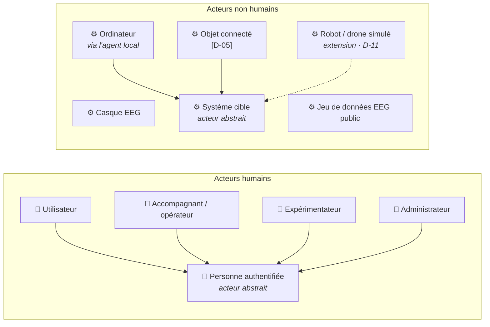
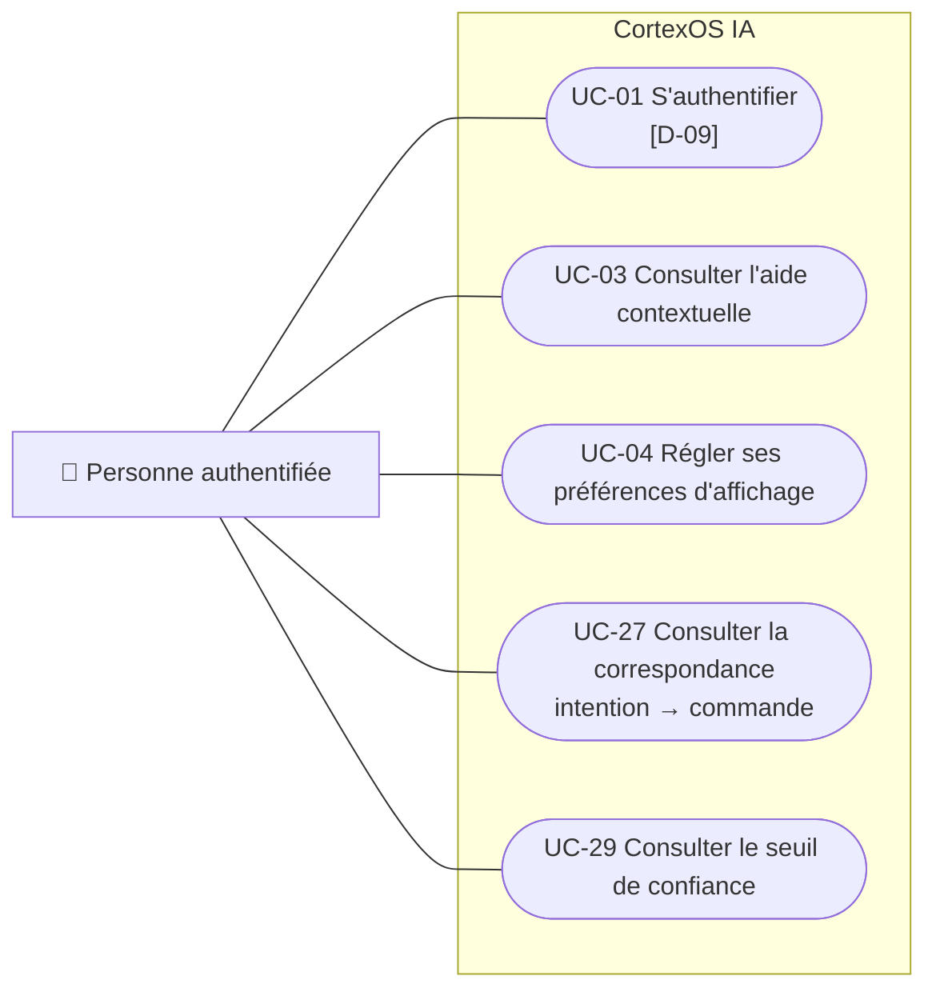
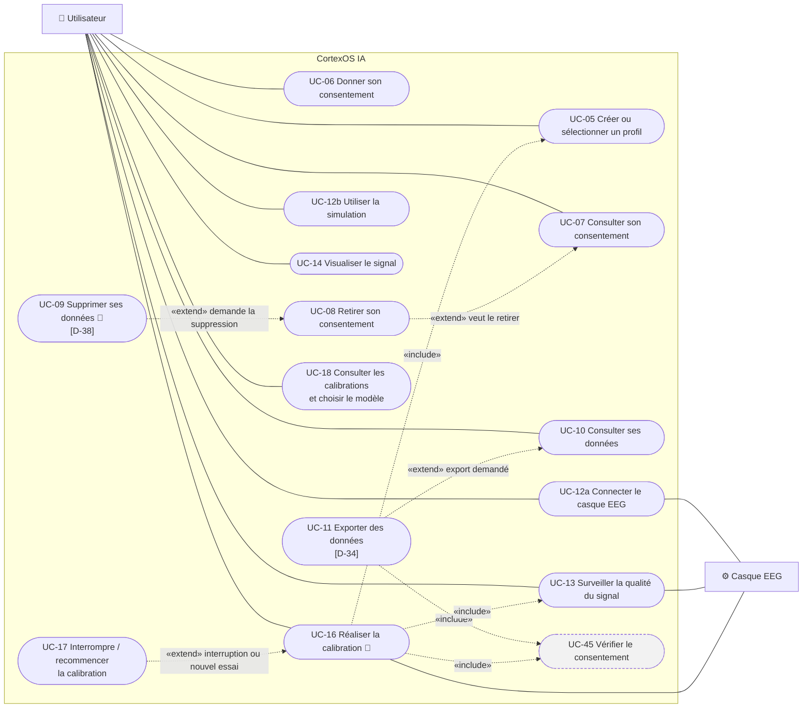
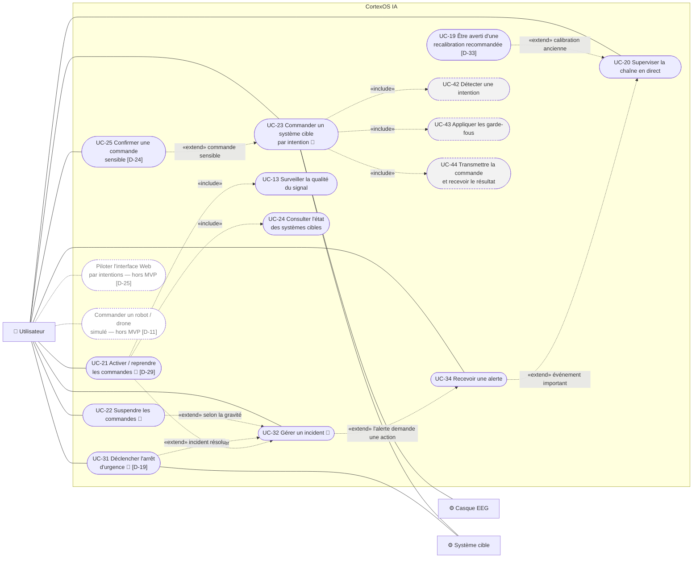
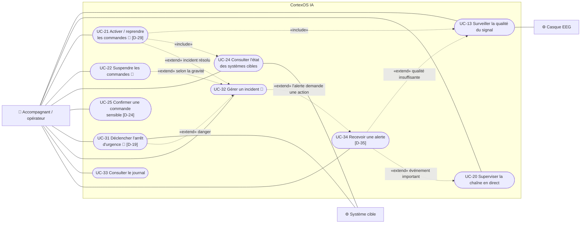
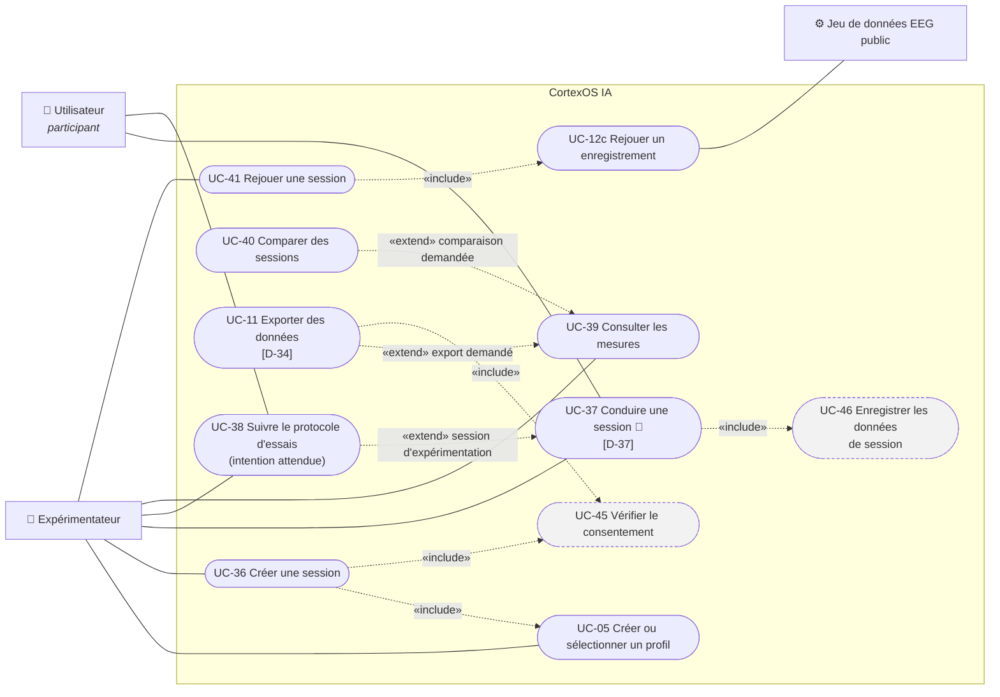
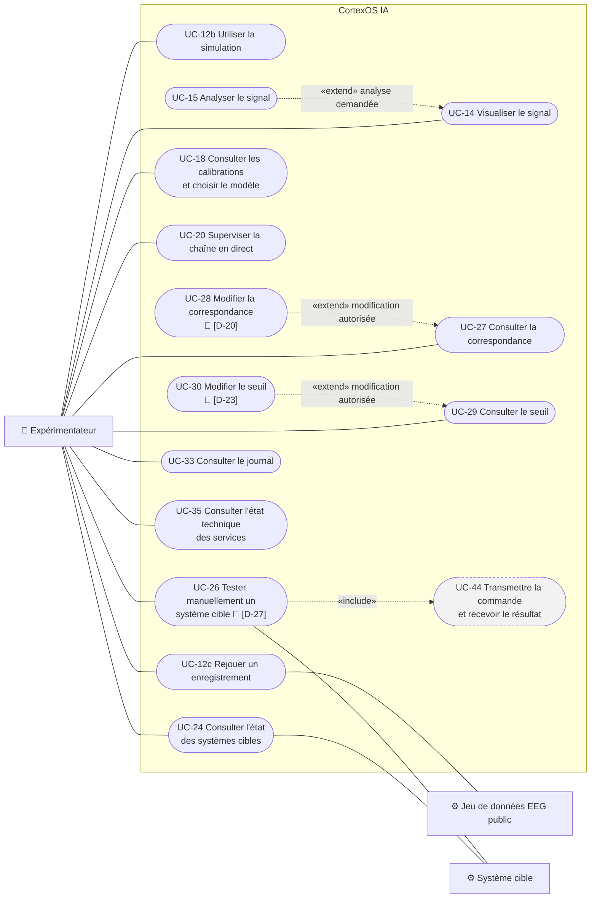
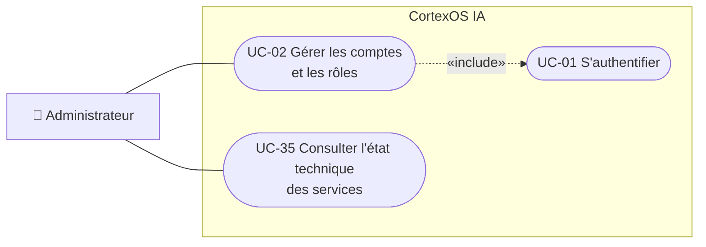

# DIAG-2a — Cas d'utilisation par acteur

| | |
|---|---|
| **Réf.** | DIAG-2 (Planning MVP, S1, mode B — D-46) |
| **Sources** | Catalogue des cas d'utilisation v1.0 (24/09/2026, repris en section 2) · Spécification fonctionnelle : acteurs et parcours A à E (section 3), F-01 à F-44, FW-01 à FW-50 |
| **Version** | 2.1 — 25 septembre 2026 (un diagramme par acteur principal, Administrateur) · vue d'ensemble dans `diag-02b-cas-utilisation-vue-ensemble.md` |

## Rôle du document

Un **cas d'utilisation** est un **objectif qu'un acteur atteint grâce au système** (verbe à l'infinitif + complément). Ce document répond à la question : *que peut faire chaque acteur avec CortexOS IA ?* Il ne dit pas **comment** : c'est le rôle des diagrammes de séquence (DIAG-6).

Il contient **un diagramme par acteur principal**, précédé d'un diagramme des acteurs (généralisations) La **vue d'ensemble** (tous les acteurs et tous les cas dans un seul cadre) est dans `diag-02b-cas-utilisation-vue-ensemble.md`.

## Notation

| Élément | Représentation | Sens |
|---|---|---|
| Acteur humain | 👤 **à gauche** | Personne qui déclenche le cas (ou y participe) |
| Acteur non humain | ⚙️ **à droite** | Système externe sollicité par le cas (casque, jeu de données, système cible) |
| Cas d'utilisation | forme arrondie, dans le cadre « CortexOS IA » | Objectif d'un acteur ; le cadre est la frontière du système (DIAG-1) |
| Cas interne | forme arrondie **grisée, bord pointillé** | Jamais déclenché seul : n'existe que par un `«include»` (UC-42 à UC-47) |
| `«include»` | flèche pointillée du cas de base **vers** le cas inclus | Le cas inclus est **toujours** exécuté |
| `«extend»` | flèche pointillée du cas optionnel **vers** le cas étendu, avec la condition | Le cas optionnel s'ajoute **seulement si** la condition est vraie |
| Généralisation | flèche pleine vers le parent | L'enfant hérite de tous les cas du parent |
| 📝 | après le nom du cas | Le cas **inclut UC-47 « Enregistrer dans le journal »** (flèche non dessinée pour garder les diagrammes lisibles) |
| `[D-xx]` | dans le nom du cas | Le cas ou son acteur dépend d'une décision non prise (`05-decisions.md`) |

> Mermaid n'a pas de type « cas d'utilisation » UML : les diagrammes utilisent un `flowchart` qui respecte les conventions ci-dessus. La version draw.io du rapport utilisera les symboles UML standards (D-39).

---

## 1. Diagrammes

### 1.0 Acteurs et généralisations

Tous les acteurs humains **héritent** de *Personne authentifiée* : ils peuvent tous faire les cas du diagramme 1.1 en plus des leurs.

### 1.1 Personne authentifiée (cas communs à tous)

### 1.2 Utilisateur

Diagramme en deux parties pour rester lisible : **1.2a Préparer** (profil, consentement, données, signal, calibration) et **1.2b Utiliser et sûreté**.

#### 1.2a Utilisateur — Préparer

#### 1.2b Utilisateur — Utiliser et sûreté

UC-13 et UC-24 apparaissent ici parce qu'ils sont **inclus** par UC-21 : l'utilisateur ne les déclenche pas directement dans ce diagramme.

### 1.3 Accompagnant / opérateur

### 1.4 Expérimentateur

Diagramme en deux parties : **1.4a Sessions et mesures** et **1.4b Signal, paramètres et systèmes cibles**.

#### 1.4a Expérimentateur — Sessions et mesures

#### 1.4b Expérimentateur — Signal, paramètres et systèmes cibles

### 1.5 Administrateur

Le rôle Administrateur est retenu (**D-47**). Le mécanisme d'authentification (UC-01) reste à définir (**D-09**).

---

## 2. Catalogue des cas d'utilisation

### 2.1 Acteurs

| Acteur | Type | Rôle |
|---|---|---|
| **Personne authentifiée** | Humain, abstrait | Tout ce que peut faire n'importe quelle personne connectée ; parent des 4 acteurs ci-dessous |
| **Utilisateur** | Humain | Porte le casque, calibre, commande par ses intentions, gère son consentement et ses données |
| **Accompagnant / opérateur** | Humain | Suit la session, suspend, confirme, arrête · droits `[À DÉFINIR — D-09, D-19, D-24]` |
| **Expérimentateur** | Humain | Prépare et conduit les sessions, analyse les mesures, règle les paramètres |
| **Administrateur** | Humain | Gère les comptes et les rôles (D-47) |
| **Casque EEG** | Non humain | Fournit le signal réel |
| **Jeu de données EEG public** | Non humain | Fournit des enregistrements rejoués comme source de signal |
| **Système cible** | Non humain, abstrait | Reçoit les commandes et renvoie un résultat · spécialisations : Ordinateur (via l'agent local), Objet connecté `[D-05]`, Robot / drone simulé (extension, D-11) |

Une même personne peut tenir plusieurs rôles (c'est le cas d'Eloge pendant le développement).

### 2.2 Cas d'utilisation

Colonnes : **Include** = cas toujours exécuté à l'intérieur · **Étendu par** = cas optionnel qui s'ajoute sous condition.

#### Accès et compte

| ID | Cas d'utilisation | Acteur principal | Acteur secondaire | Include | Étendu par (condition) | Réf. |
|---|---|---|---|---|---|---|
| UC-01 | S'authentifier | Personne authentifiée | — | — | — | F-43 · `[D-09]` |
| UC-02 | Gérer les comptes et les rôles | Administrateur | — | UC-01 | — | F-42, FW-42 |
| UC-03 | Consulter l'aide contextuelle | Personne authentifiée | — | — | — | FW-43 |
| UC-04 | Régler ses préférences d'affichage | Personne authentifiée | — | — | — | F-39, FW-45 |

#### Profil, consentement et données personnelles

| ID | Cas d'utilisation | Acteur principal | Acteur secondaire | Include | Étendu par (condition) | Réf. |
|---|---|---|---|---|---|---|
| UC-05 | Créer ou sélectionner un profil | Utilisateur, Expérimentateur | — | UC-01 | — | F-39, FW-39 |
| UC-06 | Donner son consentement | Utilisateur | — | — | — | F-40, FW-40 |
| UC-07 | Consulter son consentement | Utilisateur | — | — | UC-08 (veut le retirer) | F-40, FW-40 |
| UC-08 | Retirer son consentement | Utilisateur | — | — | UC-09 (demande aussi la suppression) | F-41, FW-41 |
| UC-09 | Supprimer ses données | Utilisateur | — | UC-47 | — | F-41, FW-41 · `[D-38]` |
| UC-10 | Consulter ses données | Utilisateur | — | — | UC-11 (veut les exporter) | FW-32, FW-40 |
| UC-11 | Exporter des données | Utilisateur, Expérimentateur | — | UC-45 | — | F-35, FW-34 · `[D-34]` |

#### Source de signal

| ID | Cas d'utilisation | Acteur principal | Acteur secondaire | Include | Étendu par (condition) | Réf. |
|---|---|---|---|---|---|---|
| UC-12 | Connecter / déconnecter la source de signal | Utilisateur, Expérimentateur | selon la source | — | — | F-01, F-03, FW-02, FW-08 |
| UC-12a | ↳ Connecter le casque EEG | Utilisateur | Casque EEG | — | — | F-01, FW-09 |
| UC-12b | ↳ Utiliser la simulation | Utilisateur, Expérimentateur | — | — | — | F-03 |
| UC-12c | ↳ Rejouer un enregistrement | Expérimentateur | Jeu de données EEG public | — | — | F-03 |
| UC-13 | Surveiller la qualité du signal | Utilisateur, Accompagnant | Casque EEG | — | UC-34 (qualité insuffisante ou perte du signal) | F-02, F-04, F-05, FW-10, FW-11 |
| UC-14 | Visualiser le signal en temps réel | Utilisateur, Expérimentateur | — | — | UC-15 (analyse demandée) | FW-12 |
| UC-15 | Analyser le signal (brut / filtré, bandes, spectre) | Expérimentateur | — | — | — | FW-13, FW-14 |

#### Calibration

| ID | Cas d'utilisation | Acteur principal | Acteur secondaire | Include | Étendu par (condition) | Réf. |
|---|---|---|---|---|---|---|
| UC-16 | Réaliser la calibration | Utilisateur | Casque EEG | UC-05, UC-13, UC-45, UC-47 | UC-17 (interruption ou nouvel essai) | F-06, F-07, F-09, FW-16, FW-17 |
| UC-17 | Interrompre / recommencer la calibration | Utilisateur | — | — | — | F-08, FW-17 |
| UC-18 | Consulter les calibrations et choisir la version du modèle | Utilisateur, Expérimentateur | — | — | — | FW-18, FW-19 |
| UC-19 | Être averti qu'une recalibration est recommandée | Utilisateur | — | — | — | F-10, FW-47 · `[D-33]` |

#### Utilisation : commander un système cible

| ID | Cas d'utilisation | Acteur principal | Acteur secondaire | Include | Étendu par (condition) | Réf. |
|---|---|---|---|---|---|---|
| UC-20 | Superviser la chaîne en direct | Utilisateur, Accompagnant, Expérimentateur | — | — | UC-34 (événement important), UC-19 (calibration ancienne) | FW-01 à FW-07, FW-25, FW-49 |
| UC-21 | Activer / reprendre les commandes | Utilisateur, Accompagnant | — | UC-13, UC-24, UC-47 | — | F-19, FW-26 · `[D-29]` |
| UC-22 | Suspendre les commandes | Utilisateur, Accompagnant | — | UC-47 | — | F-19, FW-26 |
| UC-23 | **Commander un système cible par intention** | Utilisateur | Casque EEG, Système cible | UC-42, UC-43, UC-44, UC-47 | UC-25 (commande sensible) | F-11 à F-17, F-21 à F-23, FW-03, FW-04 |
| UC-24 | Consulter l'état des systèmes cibles | Accompagnant, Expérimentateur | Système cible | — | — | F-23, FW-05, FW-22 |
| UC-25 | Confirmer une commande sensible | Utilisateur ou Accompagnant `[D-24]` | — | — | — | F-18, FW-28 · `[D-31]` |
| UC-26 | Tester manuellement un système cible (sans EEG) | Expérimentateur | Système cible | UC-44, UC-47 | — | F-26, FW-23 · `[D-27]` |
| UC-27 | Consulter la correspondance intention → commande | Personne authentifiée | — | — | UC-28 (modification autorisée) | F-14, FW-20 |
| UC-28 | Modifier la correspondance intention → commande | Expérimentateur | — | UC-47 | — | FW-21, FW-50 · `[D-20]` |
| UC-29 | Consulter le seuil de confiance | Personne authentifiée | — | — | UC-30 (modification autorisée) | FW-27 |
| UC-30 | Modifier le seuil de confiance | Expérimentateur (ou autre rôle `[D-23]`) | — | UC-47 | — | FW-27, FW-50 |

#### Sûreté et incidents

| ID | Cas d'utilisation | Acteur principal | Acteur secondaire | Include | Étendu par (condition) | Réf. |
|---|---|---|---|---|---|---|
| UC-31 | **Déclencher l'arrêt d'urgence** | Accompagnant (et Utilisateur ? `[D-19]`) | Système cible | UC-47 | — | F-20 |
| UC-32 | Gérer un incident | Accompagnant, Utilisateur | — | UC-47 | UC-22 (suspendre), UC-31 (danger), UC-21 (incident résolu → reprise) | F-04, F-05, F-16, FW-37 |
| UC-33 | Consulter le journal | Expérimentateur, Accompagnant | — | — | — | F-36, FW-36, FW-50 |
| UC-34 | Recevoir une alerte | Utilisateur, Accompagnant | — | — | UC-32 (l'alerte demande une action) | F-37, FW-06, FW-15, FW-48 · `[D-35]` |
| UC-35 | Consulter l'état technique des services | Expérimentateur, Administrateur | — | — | — | FW-38 |

#### Expérimentation et mesures

| ID | Cas d'utilisation | Acteur principal | Acteur secondaire | Include | Étendu par (condition) | Réf. |
|---|---|---|---|---|---|---|
| UC-36 | Créer une session | Expérimentateur | — | UC-05, UC-45 | — | F-27, FW-29 |
| UC-37 | Conduire une session (démarrer, pause, reprendre, arrêter) | Expérimentateur | Utilisateur (participant) | UC-46, UC-47 | UC-38 (session d'expérimentation) | F-28, F-29, FW-30 · `[D-37]` |
| UC-38 | Suivre le protocole d'essais (intention attendue) | Expérimentateur | Utilisateur (participant) | — | — | F-30 |
| UC-39 | Consulter les mesures d'une session | Expérimentateur | — | — | UC-40 (comparer), UC-11 (exporter) | F-31, F-32, FW-31 |
| UC-40 | Comparer des sessions | Expérimentateur | — | — | — | F-33, FW-33 |
| UC-41 | Rejouer une session enregistrée | Expérimentateur | — | UC-12c | — | F-34, FW-35 |

#### Cas internes (uniquement via « include »)

| ID | Cas d'utilisation | Inclus par | Réf. |
|---|---|---|---|
| UC-42 | Détecter une intention (avec niveau de confiance) | UC-23 | F-11, F-12, F-13 |
| UC-43 | Appliquer les garde-fous (état Actif, qualité, seuil, cible disponible, délai) ; en cas de refus, afficher le motif | UC-23 | F-15, F-16, F-17, F-21 |
| UC-44 | Transmettre la commande et recevoir le résultat | UC-23, UC-26 | F-22, F-23, F-24 |
| UC-45 | Vérifier le consentement | UC-11, UC-16, UC-36 | F-35, F-40 |
| UC-46 | Enregistrer les données de session | UC-37 | F-29 |
| UC-47 | Enregistrer dans le journal | UC-09, UC-16, UC-21, UC-22, UC-23, UC-26, UC-28, UC-30, UC-31, UC-32, UC-37 (📝 dans les diagrammes) | F-36 |

#### Hors MVP

| Cas d'utilisation | Acteur | Réf. |
|---|---|---|
| Piloter l'interface Web par intentions | Utilisateur | FW-46 · `[D-25]` |
| Commander un robot / drone simulé | Utilisateur | D-11 |

**Pas un cas d'utilisation :** « Ajouter un nouveau type de système cible » (F-25) est une activité de développement (écrire un connecteur), pas une action d'un acteur sur le système : elle apparaît dans l'architecture (DIAG-4).

---

## 3. Choix de modélisation

| Choix | Raison |
|---|---|
| Un diagramme **par acteur principal** (Utilisateur et Expérimentateur en deux parties) | Chaque diagramme reste lisible et répond à « que peut faire cet acteur ? ». Un cas partagé (ex. UC-20) apparaît dans plusieurs diagrammes : c'est le même cas |
| Acteur abstrait **Personne authentifiée** | Évite de relier les 4 acteurs à chacun des cas communs (s'authentifier, aide, préférences…) |
| **Détecter une intention** est un cas **interne** (UC-42) | Ce n'est pas un objectif d'acteur : c'est une étape obligatoire de « Commander par intention » |
| **UC-47 Journaliser** noté 📝 au lieu d'une flèche | Il est inclus par 11 cas : les flèches rendraient les diagrammes illisibles |
| **Utilisateur participant** dans le diagramme Expérimentateur | Il participe aux sessions sans les déclencher : acteur humain secondaire, donc à gauche |
| L'**Administrateur** est un acteur à part entière | Rôle retenu par D-47 |

## 4. Points ouverts

D-05 (objet connecté) · D-09 (authentification, droits par rôle) · D-19 (qui déclenche l'arrêt) · D-20 (correspondance modifiable) · D-23 (qui modifie le seuil) · D-24 (qui confirme) · D-25 (pilotage de l'interface) · D-27 (test manuel) · D-29 (reprise après incident) · D-31, D-33, D-34, D-35, D-37, D-38.
