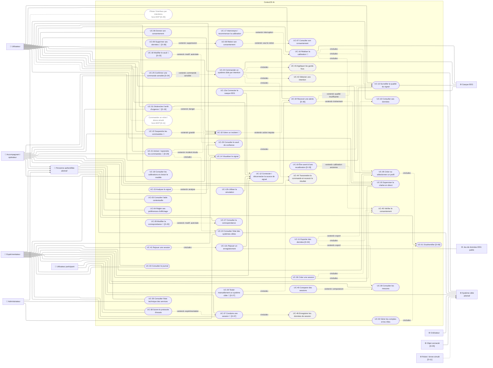

# DIAG-2b — Cas d'utilisation : vue d'ensemble

| | |
|---|---|
| **Réf.** | DIAG-2 (Planning MVP, S1, mode B — D-46) |
| **Sources** | Catalogue des cas d'utilisation (section 2 de `diag-02a-cas-utilisation-par-acteur.md`) |
| **Version** | 1.0 — 25 septembre 2026 |

## Notation

| Élément | Représentation | Sens |
|---|---|---|
| Acteur humain | 👤 **à gauche** | Personne qui déclenche le cas (ou y participe) |
| Acteur non humain | ⚙️ **à droite** | Système externe sollicité par le cas (casque, jeu de données, système cible) |
| Cas d'utilisation | forme arrondie, dans le cadre « CortexOS IA » | Objectif d'un acteur ; le cadre est la frontière du système (DIAG-1) |
| Cas interne | forme arrondie **grisée, bord pointillé** | Jamais déclenché seul : n'existe que par un `«include»` (UC-42 à UC-47) |
| `«include»` | flèche pointillée du cas de base **vers** le cas inclus | Le cas inclus est **toujours** exécuté |
| `«extend»` | flèche pointillée du cas optionnel **vers** le cas étendu, avec la condition | Le cas optionnel s'ajoute **seulement si** la condition est vraie |
| Généralisation | flèche pleine vers le parent | L'enfant hérite de tous les cas du parent |
| 📝 | après le nom du cas | Le cas **inclut UC-47 « Enregistrer dans le journal »** (flèche non dessinée pour garder les diagrammes lisibles) |
| `[D-xx]` | dans le nom du cas | Le cas ou son acteur dépend d'une décision non prise (`05-decisions.md`) |

> Mermaid n'a pas de type « cas d'utilisation » UML : les diagrammes utilisent un `flowchart` qui respecte les conventions ci-dessus. La version draw.io du rapport utilisera les symboles UML standards (D-39).

---

## Diagramme

Un seul cadre « CortexOS IA » contenant **tous les cas** (UC-01 à UC-46, plus les 2 cas hors MVP) ; **acteurs humains à gauche** avec leurs généralisations vers *Personne authentifiée* ; **acteurs non humains à droite** avec les spécialisations de *Système cible* ; toutes les relations `include`, `extend` et les spécialisations de UC-12. Seul UC-47 (journal) reste noté 📝.

Ce diagramme sert à **voir le système entier d'un coup d'œil** (vue de synthèse pour le rapport). Pour **lire** un cas précis, utiliser les diagrammes par acteur (`diag-02a-cas-utilisation-par-acteur.md`), plus lisibles. Il utilise la disposition `elk` de Mermaid, adaptée aux grands diagrammes.

---

Descriptions des cas, acteurs et relations : voir le catalogue dans `diag-02a-cas-utilisation-par-acteur.md`, section 2.
