# DIAG-3 — Diagramme de classes du domaine

| | |
|---|---|
| **Réf.** | DIAG-3 (Planning MVP, S2, mode B — D-46) |
| **Sources** | Analyse des classes du domaine v1.0 (24/09/2026) · Cahier des charges v2.0 (§ 4, 5, 6, glossaire) · Spécification fonctionnelle v1.0 (§ 1.4, 2, 3, 4.1 à 4.9) · Cas d'utilisation (DIAG-2) · Registre des décisions |
| **Version** | 2.1 — 25 septembre 2026 (validé ; D-50 à D-53) |

## Rôle du diagramme

Il décrit les **concepts métier** de CortexOS IA, leurs **attributs** et leurs **relations avec multiplicités**. C'est un modèle **du domaine**, pas de conception :

- aucune classe technique (contrôleur, service, API, base de données, connecteur logiciel, agent) : elles relèvent de DIAG-9 (Core) et DIAG-4 (composants) ;
- pas de méthodes ni de types de programmation ; les types indiqués sont des **énumérations métier** (section 2).

**Statuts des classes** : **Confirmée** (le concept est explicitement dans le projet) · **Déduite** (nécessaire d'après les règles métier) · **À confirmer** (possible, mais l'information manque) — marquées `«à confirmer»` dans le diagramme.

## Notation

| Élément | Sens |
|---|---|
| `A "1" -- "0..*" B` | association : un A est lié à 0 ou plusieurs B ; un B est lié à exactement un A |
| `◆` (losange plein, côté du tout) | **composition** : la partie n'existe pas sans le tout (supprimer une session supprime ses détections) |
| `△` (triangle vide, côté du parent) | **héritage** : la sous-classe est une sorte de la classe parente |
| `«abstract»` | classe abstraite : on ne crée que ses sous-classes |
| `«à confirmer»` | classe dont l'existence ou la forme dépend d'une décision ouverte |
| `[D-xx]` | décision non prise (`05-decisions.md`) |

Une multiplicité se lit **depuis la classe opposée** : `Session "1" *-- "0..*" Detection` = « une session contient 0 à plusieurs détections ; une détection appartient à exactement une session ».

---

## 1. Diagramme de classes

```mermaid
---
config:
  layout: elk
---
classDiagram
    direction LR

    %% ================= Personnes, profil, consentement =================
    class Personne {
        identifiant
        nom affiché
        rôles : Rôle [1..*] (D-47)
    }
    class Profil {
        pseudonyme
        préférences d'affichage
        date de création
    }
    class Consentement {
        portée : PortéeConsentement
        date de recueil
        date de retrait
    }

    %% ================= Source de signal =================
    class SourceDonnees["Source de données"] {
        <<abstract>>
    }
    class CasqueEEG["Casque EEG"] {
        modèle [D-04]
        nombre de canaux
        fréquence d'échantillonnage
        état de connexion
    }
    class Simulation {
        paramètres de simulation
    }
    class EnregistrementEEG["Enregistrement EEG"] {
        origine : session CortexOS ou jeu public
        durée
        fréquence d'échantillonnage
        date
    }
    class Canal {
        nom
        position
        qualité : NiveauQualité
    }

    %% ================= Calibration et modèle =================
    class Intention {
        nom [D-03]
        consigne
        déclenche une commande : oui/non [D-28]
    }
    class Calibration {
        date
        statut : StatutCalibration
        résultat exploitable : oui/non
        précision estimée
    }
    class ModeleDetection["Modèle de détection"] {
        version
        date
        actif : oui/non
    }
    class Essai {
        rang
        début
        fin
    }

    %% ================= Session et expérimentation =================
    class Session {
        type : TypeSession [D-18]
        statut : StatutSession
        conditions
        notes
        début
        fin
    }
    class Scenario["Scénario"] {
        <<à confirmer>>
        nom [D-05]
    }
    class Protocole {
        <<à confirmer>>
        nombre d'essais
        durée d'un essai
    }
    class Mesure {
        type : TypeMesure
        valeur
        source des données
        date de calcul
    }

    %% ================= Chaîne intention → résultat =================
    class Detection["Détection"] {
        horodatage
        niveau de confiance
    }
    class Decision["Décision"] {
        issue : IssueDécision
        motif de rejet : MotifRejet
        horodatage
    }
    class ParametresSurete["Paramètres de sûreté"] {
        <<à confirmer>>
        seuil de confiance [D-10, D-23]
        délai minimal entre commandes [D-30]
        délai de confirmation [D-31]
    }
    class Commande {
        horodatage d'envoi
        statut : StatutCommande
        origine : OrigineCommande
    }
    class Confirmation {
        issue : IssueConfirmation
        délai accordé
        horodatage
    }
    class Resultat["Résultat"] {
        succès : oui/non
        message
        horodatage
    }

    %% ================= Systèmes cibles et correspondance =================
    class SystemeCible["Système cible"] {
        <<abstract>>
        nom
        disponibilité : Disponibilité
    }
    class Ordinateur
    class ObjetConnecte["Objet connecté"] {
        <<à confirmer>>
    }
    class RobotDrone["Robot / drone simulé"] {
        <<à confirmer>>
    }
    class TypeCommande["Type de commande"] {
        nom
        sensible : oui/non [D-24]
    }
    class Correspondance {
        version
        active : oui/non
    }
    class RegleCorrespondance["Règle de correspondance"]

    %% ================= Journal et alertes =================
    class EvenementJournal["Événement du journal"] {
        horodatage
        type : TypeÉvénement
        gravité : Gravité
        description
        ancienne / nouvelle valeur
    }
    class Alerte {
        action proposée
        statut : StatutAlerte
    }

    %% ================= Relations : personnes =================
    Personne "0..1" -- "0..1" Profil : possède
    Profil "1" *-- "0..*" Consentement : historique

    %% ================= Relations : source =================
    SourceDonnees <|-- CasqueEEG
    SourceDonnees <|-- Simulation
    SourceDonnees <|-- EnregistrementEEG
    CasqueEEG "1" *-- "1..*" Canal

    %% ================= Relations : calibration et modèle =================
    Profil "1" *-- "0..*" Calibration
    Calibration "0..*" -- "1..*" Intention : calibre
    Calibration "0..*" -- "1" SourceDonnees : utilise
    Calibration "1" *-- "0..*" Essai
    Calibration "1" -- "0..1" ModeleDetection : produit si exploitable
    Profil "1" -- "0..*" ModeleDetection : versions
    Profil "1" -- "0..1" ModeleDetection : modèle actif
    ModeleDetection "0..*" -- "1..*" Intention : reconnaît

    %% ================= Relations : session =================
    Profil "1" -- "0..*" Session : concerne
    Personne "1" -- "0..*" Session : responsable
    Session "0..*" -- "1" SourceDonnees : utilise
    Session "1" -- "0..1" EnregistrementEEG : produit
    Session "0..*" -- "0..1" ModeleDetection : version utilisée
    Session "0..*" -- "0..1" Scenario
    Session "0..*" -- "0..1" Protocole
    Session "1" *-- "0..*" Essai
    Essai "0..*" -- "1" Intention : attendue
    Session "1" *-- "0..*" Mesure

    %% ================= Relations : chaîne =================
    Session "1" *-- "0..*" Detection
    Detection "0..*" -- "1" Intention : reconnue
    Essai "0..1" -- "0..*" Detection : pendant
    Detection "1" *-- "1" Decision
    Decision "0..*" -- "0..1" ParametresSurete : appliqués
    Decision "1" -- "0..1" Commande : si acceptée
    Commande "1" *-- "0..1" Confirmation : si sensible
    Confirmation "0..*" -- "0..1" Personne : confirmée par [D-24]
    Commande "1" *-- "0..1" Resultat
    Commande "0..*" -- "1" TypeCommande
    Commande "0..*" -- "1" SystemeCible : envoyée à
    Commande "0..*" -- "0..1" Session
    Commande "0..*" -- "0..1" Personne : auteur si manuelle

    %% ================= Relations : cibles et correspondance =================
    SystemeCible <|-- Ordinateur
    SystemeCible <|-- ObjetConnecte
    SystemeCible <|-- RobotDrone
    SystemeCible "1" *-- "1..*" TypeCommande : liste fermée
    Correspondance "1" *-- "1..*" RegleCorrespondance
    RegleCorrespondance "0..*" -- "1" Intention
    RegleCorrespondance "0..*" -- "1" TypeCommande
    Profil "0..1" -- "0..1" Correspondance : [D-20]

    %% ================= Relations : journal =================
    EvenementJournal "0..*" -- "0..1" Session
    EvenementJournal "0..*" -- "0..1" Personne : auteur
    Alerte "1" -- "1" EvenementJournal : naît de

    note for Essai "Un essai appartient soit à une Calibration, soit à une Session {xor}"
```

## 2. Énumérations

```mermaid
classDiagram
    direction LR
    class Role["Rôle"] {
        <<enumeration>>
        Utilisateur
        Accompagnant
        Expérimentateur
        Administrateur
    }
    class PorteeConsentement["PortéeConsentement"] {
        <<enumeration>>
        utilisation
        expérimentation
        export
    }
    class NiveauQualite["NiveauQualité"] {
        <<enumeration>>
        niveaux [À DÉFINIR]
    }
    class StatutCalibration {
        <<enumeration>>
        non commencée
        en cours
        terminée
        interrompue
    }
    class TypeSession {
        <<enumeration>>
        utilisation
        expérimentation
    }
    class StatutSession {
        <<enumeration>>
        créée
        en cours
        en pause
        terminée
        interrompue
    }
    class IssueDecision["IssueDécision"] {
        <<enumeration>>
        acceptée
        rejetée
        en attente de confirmation
    }
    class MotifRejet {
        <<enumeration>>
        confiance insuffisante
        qualité insuffisante
        système non actif
        cible indisponible
        délai non écoulé
        commande non autorisée
    }
    class StatutCommande {
        <<enumeration>>
        en attente de confirmation
        envoyée
        exécutée
        échouée
        annulée
        expirée
    }
    class OrigineCommande {
        <<enumeration>>
        EEG
        manuelle [D-27]
    }
    class IssueConfirmation {
        <<enumeration>>
        confirmée
        annulée
        expirée
    }
    class Disponibilite["Disponibilité"] {
        <<enumeration>>
        disponible
        indisponible
    }
    class TypeMesure {
        <<enumeration>>
        précision
        matrice de confusion
        latence
        taux de rejet
        commandes involontaires
        réussite du scénario
    }
    class TypeEvenement["TypeÉvénement"] {
        <<enumeration>>
        connexion
        qualité du signal
        calibration
        détection
        décision
        commande
        résultat
        suspension / reprise / arrêt
        session
        erreur
        modification de paramètre
    }
    class Gravite["Gravité"] {
        <<enumeration>>
        information
        avertissement
        erreur
        critique
    }
    class StatutAlerte {
        <<enumeration>>
        active
        traitée
    }
    class EtatGlobal["ÉtatGlobal"] {
        <<enumeration>>
        Arrêté
        Préparation
        Calibration
        Prêt
        Actif
        Suspendu
        État sûr
    }
```

`ÉtatGlobal` n'est rattaché à aucune classe : c'est l'état courant de la plateforme, détaillé dans le diagramme d'états (DIAG-5).

---

## 3. Dictionnaire des classes

### 3.1 Classes retenues (confirmées ou déduites)

| Classe | Ce qu'elle représente | Statut | Source |
|---|---|---|---|
| **Personne** | Personne qui accède au système ; peut tenir plusieurs rôles | Déduite | Spéc. 3.1 ; F-42, F-43 |
| **Profil** | Identité pseudonymisée de la personne dont on traite le signal | Confirmée | F-39 |
| **Consentement** | Accord donné pour un profil, avec une portée ; retirable | Confirmée | F-40, F-41 |
| **Source de données** «abstract» | Origine du signal, toujours indiquée | Confirmée | F-03, F-32 |
| ↳ **Casque EEG** | Source réelle | Confirmée | F-01 |
| ↳ **Simulation** | Source simulée | Confirmée | F-03 |
| ↳ **Enregistrement EEG** | Signal enregistré, rejouable (session CortexOS ou jeu public) | Déduite | F-29, F-34 |
| **Canal** | Électrode d'un casque, avec sa qualité | Déduite | F-02, FW-11 |
| **Intention** | Intention reconnaissable (liste D-03) | Confirmée | F-06, F-11, F-12 |
| **Calibration** | Séance d'apprentissage pour un profil | Confirmée | F-06 à F-10 |
| **Modèle de détection** | Modèle versionné produit par une calibration | Confirmée | F-09, F-27 |
| **Essai** | Étape où une intention précise est attendue (calibration ou expérimentation) | Déduite | F-06, F-30, F-31 |
| **Session** | Période d'utilisation ou d'expérimentation ; son type est un attribut (D-50) | Confirmée | F-27 à F-31 |
| **Mesure** | Indicateur calculé sur une session, rattaché à la source | Confirmée | F-31, F-32 |
| **Détection** | Intention reconnue, horodatée, avec niveau de confiance | Confirmée | F-11 |
| **Décision** | Choix du Core sur une détection | Confirmée | F-15, F-16, F-21 |
| **Commande** | Commande réellement émise (EEG ou manuelle) | Confirmée | F-18, F-22, F-26 |
| **Confirmation** | Validation d'une commande sensible, avec son auteur | Déduite | F-18, FW-28 |
| **Résultat** | Retour du système cible (inclut l'action produite) | Confirmée | F-22 |
| **Type de commande** | Commande possible pour un système cible ; sensible ou non | Déduite | F-14, F-18, F-24 |
| **Système cible** «abstract» | Système qui reçoit les commandes | Confirmée | F-23 |
| ↳ **Ordinateur** | Cible du MVP | Confirmée | CdC 4.1 |
| **Correspondance** | Ensemble des associations intention → commande | Confirmée | F-14 |
| **Règle de correspondance** | Une ligne : telle intention → tel type de commande | Déduite | F-14, FW-20 |
| **Événement du journal** | Entrée du journal unique | Confirmée | F-36, F-37 |
| **Alerte** | Événement qui demande une réaction | Déduite | F-37, FW-06 |

### 3.2 Classes à confirmer

| Classe | Pourquoi | Décision liée |
|---|---|---|
| **Objet connecté** | Dans le MVP ou en extension | D-05 |
| **Robot / drone simulé** | Extension ou perspective | D-11 |
| **Scénario** | Présent dans F-27 et la mesure « réussite du scénario », mais liste et contenu non décidés | D-05 |
| **Protocole** | Nécessaire pour définir les essais attendus, forme non décrite | D-18, à préciser |
| **Paramètres de sûreté** | Globaux, par profil ou par session ? | D-23, D-30, D-31 |
| **Incident** | **Non modélisé** dans le MVP : Alerte + événements du journal suffisent | décidé : D-52 |

## 4. Classes écartées

| Élément | Devient | Pourquoi |
|---|---|---|
| Rôle, statuts, motif de rejet, portée, gravité, type de mesure, état global | **Énumérations** (section 2) | Listes fermées de valeurs, sans identité propre |
| Journal | Écarté | C'est l'ensemble des événements du journal |
| Action | Fusionnée dans **Résultat** | Le système n'observe l'action qu'à travers le retour du système cible |
| Qualité du signal | Attribut `NiveauQualité` de **Canal** + événements | Mesure instantanée |
| Seuil, délais | Attributs de **Paramètres de sûreté** | Valeurs de réglage |
| Matrice de confusion | Valeur d'une **Mesure** | Tableau calculé |
| Préférences d'affichage, conditions, notes | Attributs de **Profil** / **Session** | Valeurs simples |
| Jeu de données public | Attribut « origine » de **Enregistrement EEG** | Un jeu de données est un ensemble d'enregistrements |
| Export, comparaison, rejeu, suspension, reprise, arrêt d'urgence | Écartés (actions) | Actions tracées comme **événements du journal** |
| Historique des modifications de paramètres | **Événement du journal** (type « modification de paramètre ») | F-36 le prévoit déjà, avec l'auteur |
| Connecteur, agent, API, base de données | Écartés (techniques) | Diagramme de conception (DIAG-4, DIAG-9) |
| Fenêtre de signal, caractéristiques CSP, classifieur | Écartés (traitement) | Conception du module IA |
| Aide contextuelle, vues simplifiée / détaillée | Écartés | Éléments d'interface |

## 5. Choix de modélisation à retenir

| Choix | Raison |
|---|---|
| **Détection → Décision → Commande** sont trois classes | Chaque étape de la chaîne est enregistrée, affichée et mesurée séparément ; le taux de rejet se calcule sur les décisions |
| **Décision `1 — 0..1` Commande** | Une décision rejetée ne produit pas de commande ; une commande **manuelle** (F-26) n'a pas de décision |
| **Confirmation** est une classe à part | Elle a un auteur, un moment et une issue (confirmée, annulée, expirée) qui ne tiennent pas dans Commande |
| **Type de commande** distinct de **Commande** | La correspondance associe une intention à une *sorte* de commande ; chaque cible accepte une liste fermée ; certaines sont sensibles |
| **Source de données** sur Session, Calibration et Mesure | Ne jamais mélanger réel et simulé (F-32) |
| **Essai** lié soit à une Calibration, soit à une Session `{xor}` | Même concept (intention attendue à un instant) dans les deux cas (D-51) |
| **Profil sans Personne possible** (`0..1`) | Un participant peut avoir un profil créé par l'expérimentateur sans avoir de compte (D-53) |
| **Deux associations Profil — Modèle de détection** | Le profil garde toutes les versions (`0..*`) et en désigne une active (`0..1`) |

## 6. Points à confirmer

1. **D-20 / D-23** : correspondance et paramètres de sûreté globaux, par profil ou par session ?
2. **D-05** : liste des scénarios (forme de Scénario) et place de l'objet connecté.
3. **Protocole** : séquence fixe d'intentions, nombre d'essais, durée d'un essai.
4. **D-24** : qui peut confirmer une commande sensible.
5. **NiveauQualité** : valeurs (par exemple bon / moyen / insuffisant) à définir avec l'algorithme de qualité.
