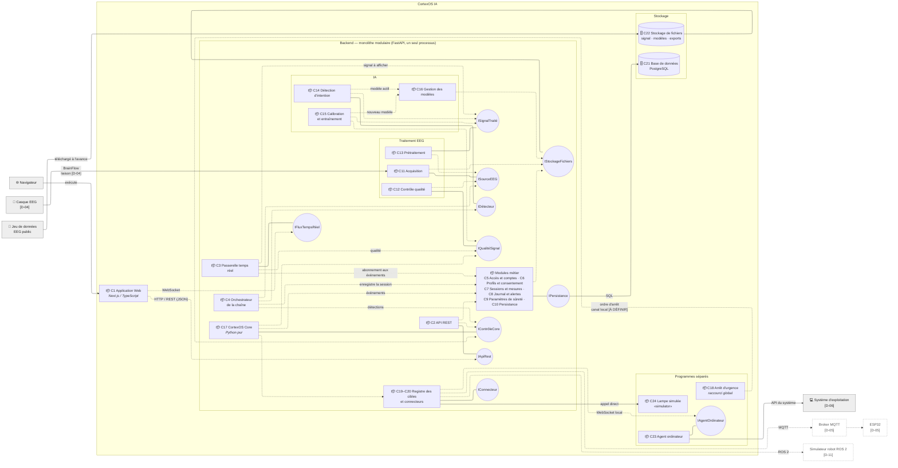
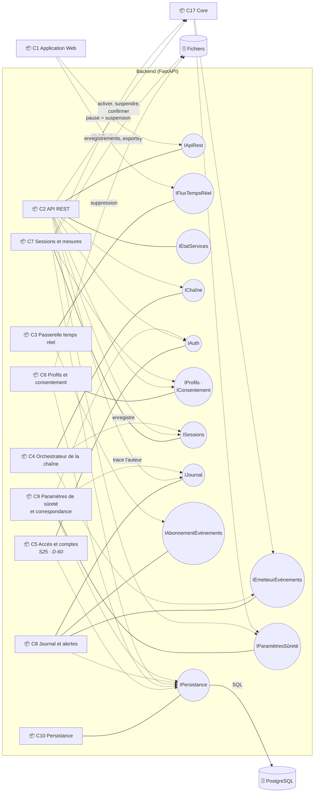
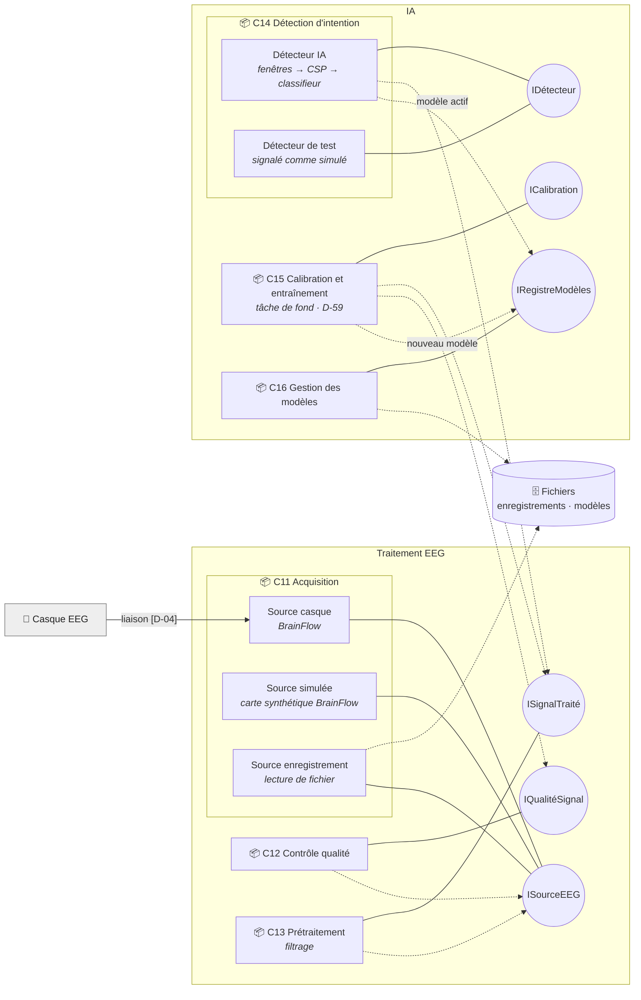
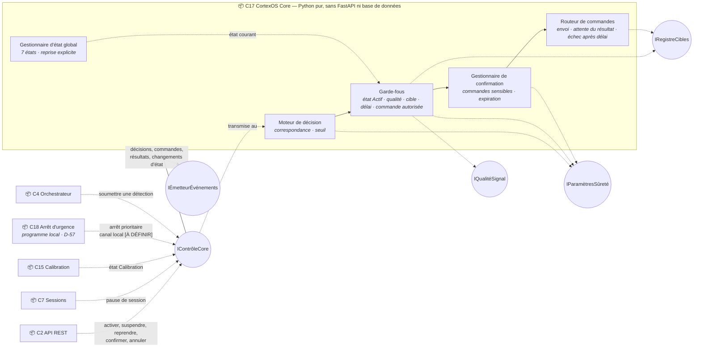
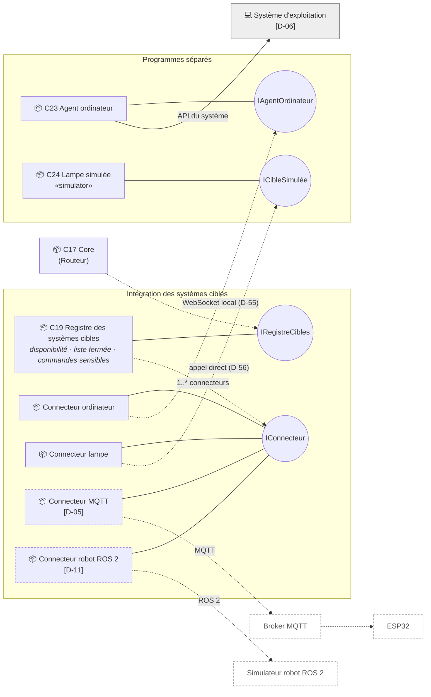

# DIAG-4 — Diagramme de composants

| | |
|---|---|
| **Réf.** | DIAG-4 (Planning MVP, S2, mode B — D-46) |
| **Sources** | Analyse des composants v1.0 (25/09/2026) · Cahier des charges § 10 · Spécification § 4 · Planning § 2 · Décisions D-54 à D-62 · DIAG-1, DIAG-2, DIAG-3 |
| **Version** | 1.1 — 25 septembre 2026 (relecture : détections soumises par l'orchestrateur, canal de l'arrêt d'urgence, passerelle temps réel) |

## Rôle du diagramme

Il montre **les blocs logiciels** de CortexOS IA (composants), **ce que chacun offre et utilise** (interfaces) et **comment ils communiquent** (protocoles). Il répond à : *de quoi le système est-il fait, et qui parle à qui ?*

Il ne montre ni les classes (DIAG-3), ni les tables, ni les routes une par une, ni les écrans, ni les bibliothèques (BrainFlow, MNE, scikit-learn…), ni le matériel comme composant logiciel.

**Décisions qui cadrent ce diagramme :** monolithe modulaire FastAPI · agent ordinateur séparé · Core en Python pur, indépendant de FastAPI (D-62) · interfaces `ISourceEEG` et `IConnecteur` · orchestrateur distinct du Core (D-54) · agent en WebSocket local (D-55) · lampe simulée en appel direct (D-56) · arrêt d'urgence par raccourci global (D-57) · PostgreSQL + fichiers (D-58) · entraînement en tâche de fond (D-59) · authentification minimale en S25 (D-60) · contrôle qualité séparé (D-61).

## Notation

| Élément | Représentation | Sens |
|---|---|---|
| Composant | rectangle (📦) | Bloc logiciel avec une responsabilité claire |
| Interface **fournie** | cercle `○ INom` relié au composant par un trait plein | Ce que le composant **offre** aux autres (« sucette » UML) |
| Interface **requise** | flèche pointillée d'un composant vers le cercle | Ce que le composant **utilise** (« demi-lune » UML) |
| «datastore» | cylindre | Stockage |
| Système externe | rectangle gris, hors du cadre CortexOS IA | Matériel ou logiciel qui n'est pas construit dans le projet |
| Pointillés | trait ou bordure pointillés | À confirmer (D-05) ou extension (D-11) |
| Libellé d'une liaison | texte sur la flèche | Protocole, quand la liaison sort du processus du backend |

Tout ce qui est dans le cadre **Backend** tourne dans **un seul processus** (monolithe) : les liaisons internes sont des appels de fonctions Python. Seules les liaisons qui **sortent** du backend ont un protocole réseau.

---

## 1. Diagramme principal (niveau 1)

---

## 2. Sous-diagrammes (niveau 2)

### 2a — Backend : points d'entrée et modules métier

### 2b — Traitement EEG et IA

Les trois **sources** réalisent la même interface `ISourceEEG` : le reste de la chaîne ne sait pas si le signal vient du casque, de la simulation ou d'un fichier. Même principe pour les deux **détecteurs** avec `IDétecteur`. Fenêtres, CSP et classifieur sont **internes** au Détecteur IA.

### 2c — CortexOS Core

Le Core **ne lit pas lui-même le détecteur** : c'est l'Orchestrateur (C4, D-54) qui lit `IDétecteur` et **soumet** chaque détection au Core par `IContrôleCore`. Le Core ne fait que décider.

Le Core **n'écrit pas lui-même** dans le journal ni dans la base : il **émet** des événements (`IÉmetteurÉvénements`) que le module Journal enregistre. C'est ce qui le garde indépendant de FastAPI et de PostgreSQL, donc testable seul.

### 2d — Intégration des systèmes cibles

Ajouter un type de cible = ajouter un **connecteur** qui réalise `IConnecteur`, **sans modifier le Core** (F-25).

---

## 3. Liste des composants

| # | Composant | Sous-système | Responsabilité | Statut |
|---|---|---|---|---|
| C1 | Application Web | Interface | Tous les écrans ; respecte la charte et l'accessibilité | Confirmé |
| C2 | API REST | Backend | Exposer les opérations, contrôler l'accès | Confirmé |
| C3 | Passerelle temps réel | Backend | Pousser état, qualité, signal, détections, décisions, commandes, résultats, alertes | Confirmé |
| C4 | Orchestrateur de la chaîne | Backend | Boucle temps réel source → qualité → prétraitement → détection → Core ; enregistrement dans la session | Décidé (D-54) |
| C5 | Accès et comptes | Backend | Authentification, comptes, rôles | Décidé (D-60) · détail D-09 |
| C6 | Profils et consentement | Backend | Profils, consentements, suppression des données | Déduit |
| C7 | Sessions et mesures | Backend | Sessions, essais, mesures, rejeu, export | Déduit |
| C8 | Journal et alertes | Backend | Journal unique, gravité, alertes, diffusion | Confirmé |
| C9 | Paramètres de sûreté et correspondance | Backend | Seuil, délais, correspondance ; trace l'auteur des modifications | Déduit · rattachement D-20, D-23 |
| C10 | Persistance | Backend | Accès à PostgreSQL pour tous les modules | Décidé (D-58) |
| C11 | Acquisition | Traitement EEG | Lire une source interchangeable (casque, simulation, enregistrement) | Confirmé |
| C12 | Contrôle qualité | Traitement EEG | Qualité globale et par canal, perte du signal | Décidé (D-61) |
| C13 | Prétraitement | Traitement EEG | Filtrage, réduction du bruit | Confirmé |
| C14 | Détection d'intention | IA | Inférence (détecteur IA) ou détecteur de test | Confirmé |
| C15 | Calibration et entraînement | IA | Essais guidés, entraînement en tâche de fond, évaluation | Décidé (D-59) |
| C16 | Gestion des modèles | IA | Versions, modèle actif | Déduit |
| C17 | CortexOS Core | Core | État global, décision, garde-fous, confirmation, routage | Confirmé · Python (D-62) |
| C18 | Arrêt d'urgence | Programme séparé | Raccourci clavier global → ordre d'arrêt au Core par un canal local, sans passer par l'interface Web | Décidé (D-57) · canal local `[À DÉFINIR]` · déclencheur D-19 |
| C19–C20 | Registre des cibles et connecteurs | Intégration | Cibles, disponibilité, liste fermée ; traduction des commandes | Confirmé · MQTT D-05, robot D-11 |
| C21 | Base de données | Stockage | Données métier | Décidé : PostgreSQL (D-58) |
| C22 | Stockage de fichiers | Stockage | Signal enregistré, modèles, exports | Décidé (D-58) |
| C23 | Agent ordinateur | Programme séparé | Exécuter les commandes sur le système d'exploitation | Confirmé · liaison D-55 |
| C24 | Lampe simulée | Programme séparé | Cible simulée | Confirmé · appel direct D-56 |

**Systèmes externes :** E1 Navigateur · E2 Casque EEG (D-04) · E3 Jeu de données EEG public · E4 Système d'exploitation (D-06) · E5 Broker MQTT et E6 ESP32 (D-05, à confirmer) · E7 Simulateur robot ROS 2 (extension, D-11).

## 4. Interfaces principales

| Interface | Fournie par | Utilisée par | Protocole |
|---|---|---|---|
| `IApiRest` | C2 | C1 | HTTP / REST (JSON) |
| `IFluxTempsRéel` | C3 | C1 | WebSocket |
| `IÉtatServices` | C2 | C1, outils | HTTP (`GET /api/health`) |
| `IChaîne` | C4 | C2 | en processus |
| `ISourceEEG` | C11 (3 sources) | C4, C12, C13 | en processus |
| `IQualitéSignal` | C12 | C17, C15, C3 | en processus |
| `ISignalTraité` | C13 | C14, C15, C3 | en processus |
| `IDétecteur` | C14 (IA, test) | C4 (qui soumet les détections au Core) | en processus |
| `ICalibration` | C15 | C2 | en processus |
| `IRegistreModèles` | C16 | C14, C15 | en processus |
| `IContrôleCore` (soumettre une détection, activer, suspendre, reprendre, état sûr, confirmer, annuler, lire l'état) | C17 | C4, C2, C7, C15, C18 | en processus ; C18 : canal local `[À DÉFINIR]` |
| `IParamètresSûreté` | C9 | C17, C2 | en processus |
| `IRegistreCibles` | C19 | C17, C2 | en processus |
| `IConnecteur` | connecteurs (C20) | C19 | en processus |
| `IAgentOrdinateur` | C23 | connecteur ordinateur | WebSocket local (D-55) |
| `ICibleSimulée` | C24 | connecteur lampe | appel direct (D-56) |
| `IÉmetteurÉvénements` · `IAbonnementÉvénements` · `IJournal` | C8 | C17, C4, C11, C12, C15 · C3 · C2, C6, C7, C9 | en processus |
| `IAuth` · `IProfils` · `IConsentement` · `ISessions` | C5 · C6 · C6 · C7 | C2, C9 · C2, C7, C15 · C2, C7, C15 · C2, C4 | en processus |
| `IPersistance` | C10 | modules métier | en processus → SQL (PostgreSQL) |
| `IStockageFichiers` | C22 | C6, C7, C11, C16 | système de fichiers |

## 5. Flux principaux

1. **Acquisition** : casque / simulation / enregistrement → C11 → C12 et C13 → C14 → détection.
2. **Décision** : détection → C17 (moteur de décision → garde-fous → confirmation si sensible) → commande.
3. **Exécution** : C17 routeur → C19 → connecteur → C23 (→ OS) ou C24 → résultat → C17 → événement → C8.
4. **Supervision** : C17, C12, C13, C8 → C3 → C1 (le Core passe par les événements, jamais directement par le Web).
5. **Calibration** : C1 → C2 → C15 (consentement, qualité, Core en état Calibration) → C11 → C13 → entraînement → C16 → fichiers.
6. **Session d'expérimentation** : C1 → C2 → C7 → C4 démarre la chaîne et enregistre → mesures → export.
7. **Arrêt d'urgence** : C18 → C17 (suspendu / état sûr) → C8 → C3 → C1, **sans dépendre de C1** pour l'ordre d'arrêt.

## 6. Points encore ouverts

- **D-04** : casque, donc liaison physique et pilote éventuel.
- **D-05** : objet connecté réel (MQTT, ESP32) dans le MVP ou non.
- **D-06** : système d'exploitation, donc API utilisée par l'agent.
- **D-09** : authentification précise, droits par rôle, conservation.
- **D-11** : robot et drone.
- **D-19** : qui peut déclencher l'arrêt d'urgence.
- **Canal de l'arrêt d'urgence** : C18 est un programme séparé ; il ne peut donc pas appeler le Core « en direct ». Il faut choisir un canal local vers le backend (par exemple une route HTTP réservée à `localhost`, ou un WebSocket local comme l'agent). `[À DÉFINIR]` — à trancher avec D-19, avant S9.
- **D-20 / D-23** : paramètres et correspondance globaux ou par profil.
- **D-32** : que fait le Core si l'interface Web est perdue pendant une session (chien de garde ?).
