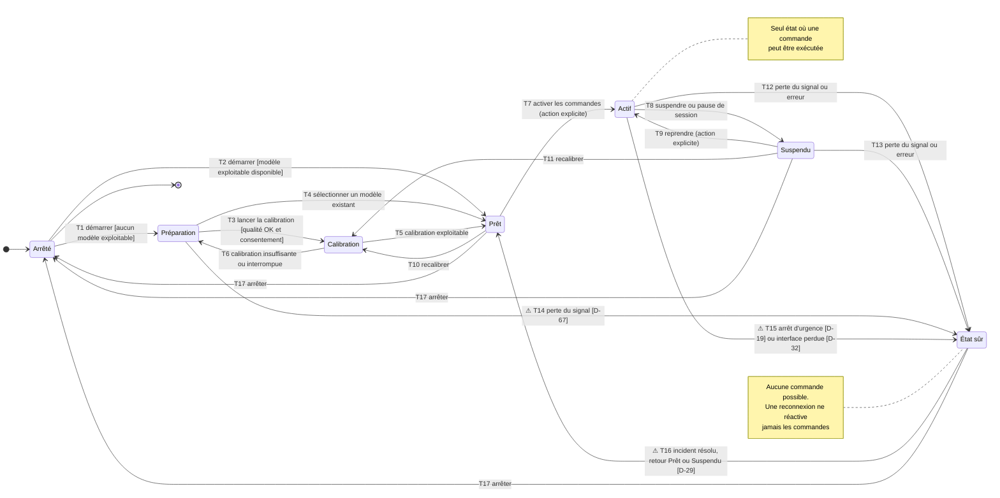
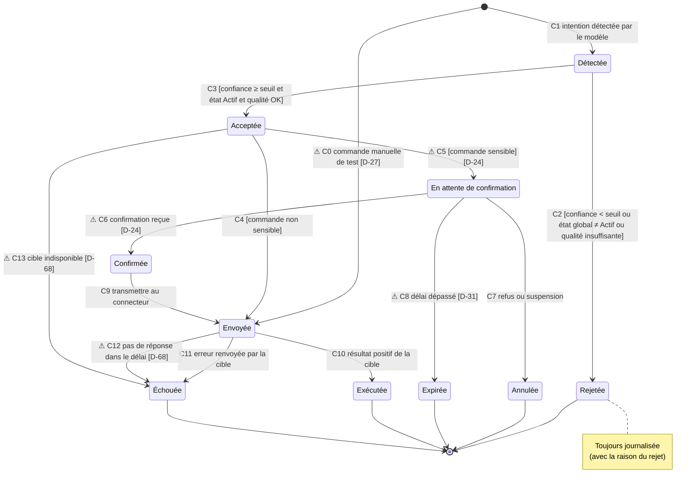
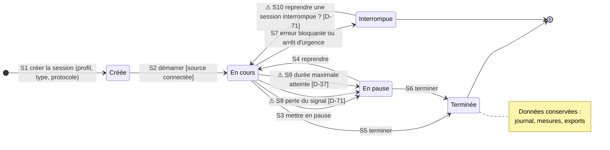
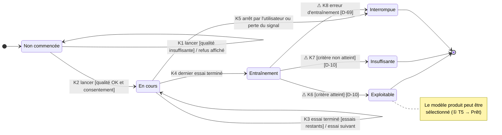
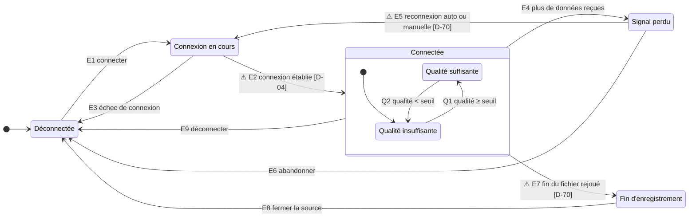

# DIAG-5 — Diagrammes d'états-transitions

| | |
|---|---|
| **Réf.** | DIAG-5 (Planning MVP, S2, mode B) |
| **Sources** | Analyse des états fournie par Eloge · Spécification fonctionnelle 4.2 à 4.7 · DIAG-3 (classes du domaine) · Registre des décisions D-63 à D-71 |
| **Version** | 1.0 — 25 septembre 2026 |
| **Statut** | À relire par Eloge |

## Rôle de ces diagrammes

Un diagramme d'états-transitions décrit **le cycle de vie d'un objet** : les situations stables où il peut se trouver (**états**), les **événements** qui le font changer d'état, et les **conditions** (gardes, entre crochets) qui autorisent le changement.

Le diagramme de classes (DIAG-3) dit *ce qui existe* ; ces diagrammes disent *comment ça évolue dans le temps*. Ils serviront directement au code : chaque diagramme deviendra une énumération d'états et une fonction qui refuse les transitions non prévues.

Cinq diagrammes (D-63) :

| N° | Objet | Importance |
|---|---|---|
| ① | État global de CortexOS | Essentiel : c'est lui qui décide si une commande peut partir |
| ② | Commande, depuis la détection (D-64) | Essentiel : chaîne de sûreté détection → exécution |
| ③ | Session | Utile |
| ④ | Calibration (avec sous-état Entraînement, D-65) | Utile |
| ⑤ | Source de signal | Utile |

### Conventions de lecture

| Notation | Sens |
|---|---|
| `[*]` → état | État initial |
| état → `[*]` | État final |
| `événement [garde]` | La transition a lieu quand l'événement arrive **et** que la garde est vraie |
| **⚠ … [D-xx]** | Comportement **non tranché** : la transition est dessinée pour montrer la question, mais elle n'est pas décidée (D-66) |
| Note | Règle importante à respecter dans le code |

> Mermaid (`stateDiagram-v2`) ne permet pas de dessiner une flèche en pointillés. Les transitions non tranchées sont donc repérées par le symbole **⚠** et leur référence `[D-xx]` dans le libellé.

---

## ① État global de CortexOS

**Objet :** la plateforme dans son ensemble (porté par l'orchestrateur, D-54).
**Question à laquelle il répond :** « Est-ce qu'une commande a le droit de partir maintenant ? » → **uniquement dans l'état Actif.**

### Lecture

| Élément | Ce qu'il faut retenir |
|---|---|
| **Actif** | Le seul état où l'orchestrateur transmet une commande. Dans tous les autres états, une intention détectée est affichée mais rejetée (voir ②). |
| **Prêt → Actif** | Toujours par une **action explicite** de l'utilisateur ou de l'accompagnant (parcours B). Le système ne s'active jamais tout seul. |
| **Suspendu** | Différent de *Prêt* : on garde la session et le modèle, on coupe seulement les commandes. La pause de session y mène aussi. |
| **État sûr** | État de repli après un incident. On n'en sort que par une décision humaine (D-29 à trancher : retour à *Prêt* ou à *Suspendu*). |
| **Qualité insuffisante** | Ne change **pas** l'état global : elle est signalée (diagramme ⑤) et la chaîne rejette les détections pendant ce temps. |
| **T14** | En *Préparation*, aucune commande n'est active : faut-il vraiment passer en État sûr, ou simplement revenir à *Arrêté* ? → D-67. |

---

## ② Cycle de vie d'une commande (depuis la détection)

**Objet :** une intention détectée qui devient (ou non) une commande. Option (a) retenue (D-64), fidèle à la spécification 4.5.
**Question à laquelle il répond :** « Qu'arrive-t-il à une intention entre la détection et l'action sur la cible ? »

### Lecture

| Élément | Ce qu'il faut retenir |
|---|---|
| **C2 / C3** | C'est ici que les **trois garde-fous** s'appliquent : seuil de confiance, état global *Actif* (diagramme ①), qualité du signal (diagramme ⑤). Il suffit d'un seul « non » pour rejeter. |
| **Rejetée** | Ce n'est pas une erreur : c'est le fonctionnement normal quand le système n'est pas sûr. Chaque rejet est journalisé avec sa raison (utile pour les mesures de l'expérimentateur). |
| **Commande sensible** | Passe par *En attente de confirmation*. Le moyen de confirmer (EEG, accompagnant…) n'est pas décidé : D-24. |
| **Cinq états finaux** | Rejetée, Annulée, Expirée, Exécutée, Échouée : une commande finit **toujours** dans l'un d'eux, ce qui garantit une trace complète dans le journal. |
| **C0** | Le test manuel d'une cible sans EEG (D-27) entrerait directement en *Envoyée*, sans passer par la détection. |

---

## ③ Session

**Objet :** une session d'utilisation ou d'expérimentation (classe `Session`, attribut `type`, D-50).

### Lecture

| Élément | Ce qu'il faut retenir |
|---|---|
| **Pause ≠ Suspendu** | Mettre la session en pause suspend aussi les commandes (① T8), mais l'inverse n'est pas vrai : on peut suspendre les commandes sans mettre la session en pause. |
| **Terminée / Interrompue** | Toutes deux sont des fins de session ; la différence est la **cause** (volontaire ou incident), enregistrée dans le journal. |
| **D-71** | Plusieurs questions ouvertes : effet de la perte du signal, reprise d'une session interrompue, enregistrement pendant la pause, état des commandes à la reprise. |

---

## ④ Calibration

**Objet :** une calibration (série d'essais guidés puis entraînement du modèle). Sous-état *Entraînement* retenu (D-65). Chaque essai suit la règle `{xor}` de D-51.

### Lecture

| Élément | Ce qu'il faut retenir |
|---|---|
| **K1** | Auto-transition : on reste en *Non commencée*, mais le refus est affiché avec la raison (qualité). |
| **K3** | Auto-transition sur *En cours* : un essai après l'autre, sans changer d'état. |
| **Entraînement** | Le modèle est calculé à partir des essais. Cela peut prendre quelques secondes : l'interface doit montrer que le système travaille. |
| **D-10** | Le seuil qui distingue *Exploitable* d'*Insuffisante* n'est pas encore fixé (bloc casque). |
| **Lien avec ①** | Exploitable → ① T5 (Prêt) ; Insuffisante ou Interrompue → ① T6 (Préparation). |

---

## ⑤ Source de signal

**Objet :** la source EEG active (casque, carte synthétique BrainFlow ou fichier rejoué, interface `ISourceEEG`).

### Lecture

| Élément | Ce qu'il faut retenir |
|---|---|
| **État composite** | *Connectée* contient deux sous-états : la qualité peut changer sans que la source se déconnecte. On démarre en *insuffisante* par prudence tant que la qualité n'est pas mesurée. |
| **Signal perdu → ①** | Déclenche ① T12/T13 (État sûr) si les commandes étaient actives. |
| **Fin d'enregistrement** | N'existe que pour un fichier rejoué (PhysioNet…). Que fait-on ensuite : boucler, s'arrêter ? → D-70. |
| **D-04** | La connexion réelle dépend du casque choisi (Bluetooth, USB, dongle). |

---

## Vérification croisée entre les diagrammes

| Événement | ① Global | ② Commande | ③ Session | ④ Calibration | ⑤ Source |
|---|---|---|---|---|---|
| Qualité insuffisante | pas de changement | C2 rejet | — | K1 refus | Q2 |
| Perte du signal | T12/T13 État sûr, ⚠ T14 | — | ⚠ S8 | K5 Interrompue | E4 |
| Suspendre / pause | T8 Suspendu | C7 Annulée si en attente | S3 (pause) | — | — |
| Arrêt d'urgence | ⚠ T15 | ⚠ D-68 (annuler une action envoyée ?) | S7 Interrompue | — | — |
| Calibration terminée | T5 ou T6 | — | — | Exploitable / Insuffisante | — |

Ce tableau vérifie qu'un même événement a un effet cohérent partout. Il servira de base aux tests de la machine à états.

## Objets écartés

Pas de diagramme pour le **système cible** ni pour l'**alerte** (D-63) : leurs états sont simples (disponible / indisponible ; émise / acquittée) et déjà visibles dans ② et dans la supervision. Ils pourront être ajoutés si le code montre qu'ils se compliquent.

## Points à définir

- **D-19** : qui peut déclencher l'arrêt d'urgence.
- **D-24** : commandes sensibles et moyen de confirmation.
- **D-27** : test manuel d'une cible sans EEG.
- **D-29** : sortie de l'État sûr (retour à *Prêt* ou à *Suspendu*).
- **D-31** : délai d'expiration de la confirmation.
- **D-32** : interface Web fermée pendant une session active.
- **D-37** : durée maximale d'une session.
- **D-04 / D-10** : casque ; critère de calibration exploitable.
- **D-67** : perte du signal en Préparation ; conditions d'activation.
- **D-68** : délai du résultat, cible indisponible, annulation d'une action envoyée.
- **D-69** : erreur d'entraînement.
- **D-70** : reconnexion ; fin d'un enregistrement rejoué.
- **D-71** : session et perte du signal, reprise, enregistrement en pause.
