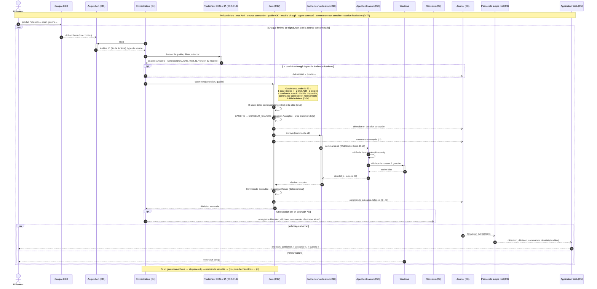
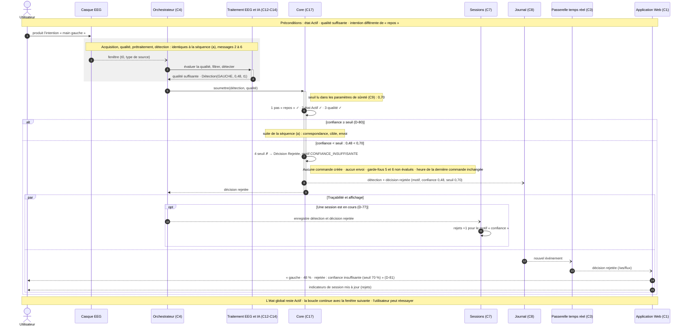
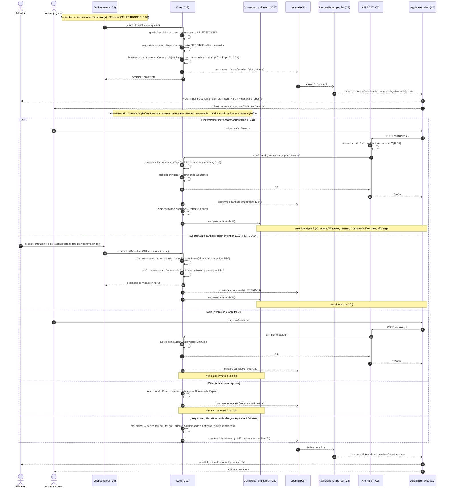
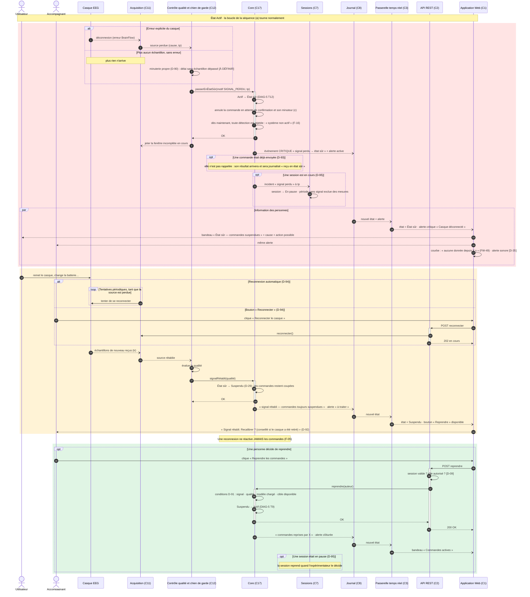

# DIAG-6 — Diagrammes de séquence

| | |
|---|---|
| **Réf.** | DIAG-6 (Planning MVP, S3, mode A — D-96) |
| **Sources** | Analyses textuelles des séquences (a) à (d) par Eloge (25/09/2026) · Spécification § 1.4, 2, 4.1 à 4.8 · DIAG-4 (composants) · DIAG-5 (états) · ARCH-0 · Décisions D-54, D-55, D-72, D-73, D-24, D-29, D-31, D-77 à D-95 |
| **Version** | 1.0 — 26 septembre 2026 · les 4 séquences sont faites |
| **Statut** | (a) à (d) : à relire par Eloge |

## Rôle de ces diagrammes

Un diagramme de séquence montre **qui envoie quel message à qui, et dans quel ordre**, pour **un scénario précis**. Il se lit de haut en bas (le temps passe vers le bas).

| Notation Mermaid | Sens |
|---|---|
| `->>` flèche pleine | Appel **synchrone** : l'émetteur attend la réponse |
| `-->>` flèche pointillée | **Réponse** (retour d'un appel) |
| `--)` flèche ouverte | Message **asynchrone** : l'émetteur n'attend pas (événement, envoi réseau) |
| Rectangle sur une ligne de vie | Le participant est **actif** (il travaille) |
| `loop` / `opt` / `par` | Boucle / optionnel (si…) / en parallèle |
| Numéros | Ordre des messages (`autonumber`) |

| N° | Scénario | Statut |
|---|---|---|
| (a) | Intention acceptée → action | Fait (v0.1) |
| (b) | Rejet pour confiance insuffisante | Fait (v0.2) |
| (c) | Commande sensible : confirmation ou expiration | Fait (v0.3) |
| (d) | Perte du signal → état sûr | Fait (v1.0) |

---

## (a) Intention acceptée → action

### Le scénario en une phrase

L'utilisateur produit une intention ; CortexOS la détecte avec une confiance suffisante, l'accepte, envoie la commande à l'**ordinateur** (cible réelle du MVP, D-72), qui exécute l'action sous **Windows** (D-73) et renvoie un **succès** ; tout est journalisé et affiché en direct. C'est le **chemin nominal** : aucun garde-fou ne bloque et la commande n'est **pas sensible**.

### Préconditions

| # | Précondition | Source |
|---|---|---|
| P1 | État global **Actif** (activé explicitement par une personne) | Spéc. 4.1, F-19 · DIAG-5 ① T7 |
| P2 | Une **source** est connectée (casque, simulation ou enregistrement) | F-01, F-03 · DIAG-5 ⑤ |
| P3 | **Qualité** du signal suffisante | F-04 |
| P4 | Un **modèle exploitable** est chargé pour le profil | Spéc. 4.1 |
| P5 | La **correspondance** intention → commande existe pour l'intention produite | F-14 |
| P6 | La cible **Ordinateur** est **disponible** : l'agent est connecté au backend | F-23 · ARCH-0 § 5 |
| P7 | La commande **n'est pas sensible** (sinon séquence (c)) | F-18 |
| P8 | Le **délai minimal** depuis la dernière commande est écoulé | F-17 `[D-30]` |
| P9 | L'interface Web est ouverte et reçoit le flux temps réel | Déduit |
| P10 | Une **session** en cours est **facultative** : hors session, la commande est possible mais toujours journalisée | **D-77** |

### Participants

Pour rester lisible, le diagramme regroupe tes 17 lignes de vie en **13** (choix de présentation, rien n'est supprimé) :

| Ligne de vie du diagramme | Regroupe (ton analyse) | Composant |
|---|---|---|
| Utilisateur | L1 | Acteur |
| Casque EEG | L2 | E2 |
| Acquisition | L3 | C11 |
| Orchestrateur | L4 | C4 (D-54) |
| Traitement EEG et IA | L5 Contrôle qualité + L6 Prétraitement + L7 Détection | C12, C13, C14 |
| Core | L8 + L9 Paramètres de sûreté + L10 Registre des cibles (lectures en auto-messages) | C17, C9, C19 |
| Connecteur ordinateur | L11 | C20 |
| Agent ordinateur | L12 | C23 |
| Windows | L13 | E4 (D-73) |
| Sessions et mesures | L15 | C7 |
| Journal | L14 | C8 |
| Passerelle temps réel | L16 | C3 |
| Application Web | L17 | C1 |

### Diagramme

### Lecture

| Étape | Ce qu'il faut retenir |
|---|---|
| **Boucle** | Tout se répète à chaque fenêtre (quelques fois par seconde). Une même intention qui dure 2 s donne plusieurs détections : c'est le **délai minimal** (D-30) qui évite plusieurs commandes. |
| **t0 à t3** | t0 = fin de la fenêtre, t1 = détection, t2 = envoi, t3 = résultat. Sans t0 horodaté dès l'acquisition, la **latence de bout en bout** (F-31) est incalculable. |
| **Type de source et version du modèle** | Voyagent avec la fenêtre et la détection : ils permettent de ne jamais mélanger réel et simulé (F-32) et de savoir quel modèle a décidé (F-27). |
| **Le Core** | Seul endroit où une commande peut naître. Il **n'écrit pas** lui-même dans le journal : il **émet des événements** (flèches ouvertes) que le Journal enregistre (DIAG-4, `IÉmetteurÉvénements`). |
| **`id` de la commande** | Transmis jusqu'à l'agent et renvoyé avec le résultat : c'est ce qui relie un résultat à **sa** commande. |
| **Agent** | Deuxième contrôle de la liste fermée (proposé) : même si un message arrivait par erreur, l'agent refuserait une commande inconnue. |
| **Affichage** | L'interface est alimentée **par le journal** (principe P8) : elle n'affiche que ce qui est enregistré. |
| **États de DIAG-5** | La commande suit C1 (Détectée) → C3 (Acceptée) → C4 (Envoyée) → C10 (Exécutée). L'état global reste **Actif**. |

### Postconditions

- La commande est **Exécutée** ; l'action a eu lieu sous Windows.
- Le journal contient, dans l'ordre : détection, décision acceptée, commande envoyée, commande exécutée (avec la latence).
- Si une session est en cours, elle contient les mêmes éléments et t0 à t3 (D-77).
- L'heure de la dernière commande est mise à jour ; l'état global reste **Actif**.

### Ce que j'ai complété ou corrigé par rapport à ton analyse

| Point | Ton analyse | Dans le diagramme | Pourquoi |
|---|---|---|---|
| Protocole connecteur ↔ agent | « À confirmer » | **WebSocket local** | Décidé par D-55 (et ARCH-0 § 5) |
| Système d'exploitation | `[D-06]` | **Windows** | D-06 tranchée par D-73 |
| Session | P10 « non déterminé » | **Facultative** (`opt`) | Ta décision D-77 |
| Ordre des garde-fous | Proposition | **Fixé** : repos, état, qualité, seuil, cible, délai | Ta décision D-79 |
| Type de source | — | Ajouté au retour de l'acquisition | F-32 : ne jamais mélanger réel et simulé |
| Version du modèle | — | Ajoutée à la détection | F-27 : la session enregistre le modèle utilisé |
| Événement qualité | Envoyé par le Contrôle qualité | Envoyé par l'**Orchestrateur** | Le Contrôle qualité est regroupé dans « Traitement » ; c'est l'orchestrateur qui sait si la qualité a **changé** |
| Journal des détections | Question Q3 | En expérimentation : toutes · en utilisation : filtrées | Ta décision D-78 |

### Points encore ouverts pour (a)

- **Protection de la liaison agent** (écoute locale + jeton) et **revérification par l'agent** : proposés (ARCH-0 P8), pas encore validés.
- **Scénarios (e) résultat « échec » et (f) pas de résultat dans le délai** : non retenus pour l'instant ; ils relèvent de D-68 (délai du résultat).
- **Suspension reçue pendant l'envoi** (entre l'envoi et le résultat) : `[À DÉFINIR — D-68]`.
- **Valeurs** : durée de fenêtre, seuil (D-10), délai minimal (D-30), délai d'attente du résultat (D-68).

---

## (b) Rejet pour confiance insuffisante

### Le scénario en une phrase

L'utilisateur produit une intention, mais la détection sort avec une **confiance inférieure au seuil** : le Core **rejette** la détection avec le motif « confiance insuffisante », **aucune commande n'est créée ni envoyée**, et le refus est journalisé et affiché **avec la confiance et le seuil** (D-81). Ce diagramme montre un **garde-fou qui bloque** (P2) et la **transparence** du refus (P1, F-21).

> Le seuil ne garantit pas qu'une détection est correcte : il réduit seulement le nombre de commandes envoyées sur des détections peu sûres (spéc. 4.5).

### Préconditions

Identiques à (a), sauf :

| # | Précondition | Source |
|---|---|---|
| P1 | État global **Actif** (sinon le premier motif serait « système non actif », D-79) | Spéc. 4.1 |
| P2 | Source connectée | F-01 |
| P3 | Qualité **suffisante** (sinon le motif serait « qualité insuffisante », D-79) | F-04 |
| P4 | Modèle exploitable chargé | Spéc. 4.1 |
| P5 | L'intention détectée n'est **pas « repos »** | F-12 `[D-28]` |
| P6 | Seuil défini ; sa valeur et qui peut le modifier : `[À DÉFINIR — D-10, D-23]` | F-15 |

Cible, commande sensible et délai minimal **n'interviennent pas** : le rejet arrive avant ces vérifications (ordre D-79).

### Participants

8 lignes de vie : Utilisateur, Casque EEG, Orchestrateur, Traitement EEG et IA, Core, Journal, Passerelle temps réel, Application Web. **Connecteur, Agent et Windows sont volontairement absents** : aucune commande ne part. Paramètres de sûreté et Sessions sont représentés par des notes et des messages du Core / de l'Orchestrateur.

### Diagramme

### Lecture

| Élément | Ce qu'il faut retenir |
|---|---|
| **Le bloc grisé** | Résume les étapes déjà détaillées en (a) : on ne redessine pas ce qui est identique. |
| **`alt`** | Les deux branches d'une même décision : « ≥ seuil » mène à (a), « < seuil » au rejet. La limite exacte est tranchée : **égal au seuil = accepté** (D-80). |
| **Un rejet est une décision** | Il est créé, horodaté, journalisé et affiché, exactement comme une acceptation (F-21, P1). Ce n'est pas « rien ». |
| **Confiance et seuil affichés** | Sans les deux chiffres, l'utilisateur ne comprend pas pourquoi il est refusé (D-81 ; la jauge de la charte a un repère de seuil). |
| **Ce qui ne se passe pas** | Pas de correspondance, pas de registre des cibles, pas d'envoi, et **l'heure de la dernière commande ne change pas** : le délai minimal ne compte que les commandes exécutées. |
| **Mesures** | Le rejet est compté **par motif** (taux de rejet, F-31) et **compte dans la précision** en expérimentation, car la précision porte sur les détections (D-83). |
| **Rejets répétés** | Au MVP, aucune alerte : ils sont seulement comptés (D-82). La recommandation de recalibration reste une extension (F-10, D-33). |
| **États de DIAG-5** | ① reste **Actif** ; ② la commande suit C1 (Détectée) → C2 (**Rejetée**), état final. |

### Les autres motifs de rejet

(b) est le **modèle de tous les rejets** ; seul le garde-fou qui échoue change. Ordre d'évaluation et motif affiché : D-79.

| Ordre | Motif (spéc. 4.5) | Particularité |
|---|---|---|
| 1 | Intention « repos » | Pas vraiment un rejet : aucune commande n'est attendue. Classement dans les mesures `[À DÉFINIR — D-84]` |
| 2 | Système non actif (Prêt, Suspendu, État sûr) | Fréquent : tout est rejeté tant que les commandes ne sont pas activées |
| 3 | Qualité du signal insuffisante | S'accompagne d'une alerte (F-04) |
| 4 | **Confiance insuffisante** | **Cas de (b)** |
| 5 | Cible indisponible · commande non autorisée · commande sensible | Nécessite le registre des cibles ; « sensible » n'est pas un rejet mais la séquence (c) |
| 6 | Délai minimal non écoulé | `[D-30]` |

### Postconditions

- Aucune commande pour cette détection ; aucune action sur la cible.
- Le journal contient la détection et la décision « rejetée, confiance insuffisante », avec la confiance et le seuil.
- Si une session est en cours, le compteur « rejets — confiance » augmente.
- L'état global reste **Actif** ; l'heure de la dernière commande est inchangée.

### Ce que j'ai complété ou corrigé par rapport à ton analyse

| Point | Ton analyse | Dans le diagramme | Pourquoi |
|---|---|---|---|
| Ordre des garde-fous | Proposition Q1, avec « liste fermée » à la fin | Ordre **D-79** ; « commande non autorisée » est vérifiée avec la cible (étape 5) | Décision déjà prise en (a) : c'est le registre des cibles qui connaît la liste fermée |
| Limite égale au seuil | Proposition | **Accepté** | D-80 |
| Seuil affiché | Proposition | **Oui** | D-81 |
| Session | Toujours présente | `opt` (session facultative) | D-77 |
| Sessions et mesures | Note | Message + compteur par motif | Rend visible le « taux de rejet par motif » (F-31) |
| « Repos » dans les mesures | Proposition Q6 | Reste ouvert | Non validé : question D-84 |

### Points encore ouverts pour (b)

- **D-84** : dans les mesures, une détection « repos » est-elle un rejet ou une catégorie à part ?
- Valeur du seuil et qui peut le modifier : D-10, D-23.
- Journal inondé par les rejets : réglé par D-78 (tout en expérimentation, filtré en utilisation).

---

## (c) Commande sensible : confirmation ou expiration

### Le scénario en une phrase

La détection passe tous les garde-fous, mais la commande est **sensible** : le Core la met **en attente de confirmation** et démarre **son** minuteur (D-86). Quatre issues : une personne **confirme** à temps → envoi et exécution comme en (a) ; une personne **annule** → rien n'est envoyé ; **personne ne répond** → la commande **expire** ; une **suspension, un état sûr ou un arrêt d'urgence** survient → la commande en attente est annulée.

**Nouveauté par rapport à (a) et (b) :** un **chemin retour** Interface → API REST → Core. Jusqu'ici l'interface affichait seulement ; ici une personne **agit** sur une décision en cours.

### Décisions qui cadrent ce diagramme

| Décision | Contenu |
|---|---|
| **D-24** | Confirmation par l'**accompagnant** (clic) **ou** par l'**utilisateur** au moyen d'une **intention EEG « oui »** ; le clic de l'utilisateur est accepté en développement |
| **D-31** | Délai d'expiration : valeur par défaut **réglable par profil** (accessibilité A-06) ; valeur `[À DÉFINIR]` |
| **D-85** | Pendant l'attente, les nouvelles détections sont **rejetées** avec le motif « confirmation en attente » (une seule commande en attente à la fois) ; seule exception : l'intention « oui », qui confirme |
| **D-86** | C'est le **minuteur du Core** qui fait foi pour l'expiration ; l'interface ne fait qu'afficher le compte à rebours |
| **D-87** | `confirmer` et `annuler` sont **idempotents** : une deuxième demande sur la même commande répond « déjà traitée » |
| **D-88** | Le **temps de décision humaine** est mesuré à part et exclu de la latence de bout en bout |
| **D-89** | Auteur enregistré : le **compte connecté** (D-74) pour un clic, « intention EEG » pour une confirmation par EEG |

### Préconditions

| # | Précondition | Source |
|---|---|---|
| P1 | État global **Actif**, qualité suffisante, modèle chargé | Spéc. 4.1 |
| P2 | La détection passe les garde-fous 1 à 4 et 6 (D-79) | Séquence (a) |
| P3 | Le registre des cibles marque la commande comme **sensible** ; liste des commandes sensibles `[À DÉFINIR]` | F-18 |
| P4 | **Aucune autre commande** n'est déjà en attente | D-85 |
| P5 | Le délai du profil est connu | D-31 |
| P6 | Pour confirmer par EEG, l'intention « oui » fait partie des intentions entraînées | D-24 ; liste des intentions `[À DÉFINIR — D-03]` |

### Participants

Utilisateur et Accompagnant (acteurs), Orchestrateur (qui résume l'acquisition et la détection de (a)), Core, Connecteur ordinateur, Journal, Passerelle temps réel, **API REST** (nouvelle ligne de vie : elle reçoit les clics), Application Web. Le registre des cibles et le minuteur sont des messages internes du Core.

### Diagramme

### Lecture

| Élément | Ce qu'il faut retenir |
|---|---|
| **`alt` à 5 branches** | Deux façons de confirmer (clic de l'accompagnant, intention « oui » de l'utilisateur), puis annulation, expiration, interruption. Une seule branche se produit. |
| **Le minuteur est dans le Core** (D-86) | Si l'interface se fige ou se ferme (D-32), la commande **expire quand même** : aucune commande sensible ne reste « en suspens ». L'interface calcule seulement l'affichage du compte à rebours à partir de l'**échéance**. |
| **Revérifications** | Au moment de confirmer : la commande est-elle **encore** en attente ? (sinon « trop tard » ou « déjà traitée », D-87). Juste avant l'envoi : la cible est-elle **encore** disponible ? L'attente a pu durer plusieurs secondes. |
| **Idempotence** (D-87) | Un double clic, ou deux écrans qui confirment en même temps : une seule confirmation compte, la seconde reçoit « déjà traitée ». Le premier qui répond gagne ; les autres écrans sont mis à jour. |
| **Confirmation par EEG** | C'est une **deuxième détection** qui passe par la chaîne normale. Pendant l'attente, toute autre intention est rejetée (D-85) : ainsi un « gauche » involontaire ne crée pas une seconde commande. |
| **Contrôle d'accès** | Le clic passe par l'API REST, qui vérifie la session (D-74) et le rôle (droits détaillés `[D-09]`) **avant** d'appeler le Core. |
| **Mesures** (D-88) | Le temps entre la demande et la confirmation est un temps **humain** : il est mesuré à part, sinon la latence de la chaîne paraîtrait énorme. |
| **États de DIAG-5 ②** | C3 Acceptée → C5 **En attente** → C6 Confirmée → C9 Envoyée → C10 Exécutée ; ou C7 **Annulée** ; ou C8 **Expirée**. |

### Postconditions

| Branche | État final de la commande | Action sur la cible | Heure de la dernière commande |
|---|---|---|---|
| Confirmée (clic ou EEG) | Exécutée (ou Échouée si la cible ne répond pas, D-68) | Oui | Mise à jour à l'exécution |
| Annulée | Annulée | Non | Inchangée |
| Expirée | Expirée | Non | Inchangée |
| Interrompue | Annulée (motif : suspension ou état sûr) | Non | Inchangée |

Dans tous les cas, le journal contient l'issue, son **auteur** (sauf expiration) et son horodatage ; la demande disparaît de tous les écrans.

### Ce que j'ai complété ou corrigé par rapport à ton analyse

| Point | Ton analyse | Dans le diagramme | Pourquoi |
|---|---|---|---|
| Qui confirme | Question ouverte (D-24) | 2 branches : clic de l'accompagnant, intention EEG « oui » | Ta décision D-24 |
| Rejets pendant l'attente | Proposition (i) | Motif « confirmation en attente », **sauf** l'intention « oui » | D-85 ; sans cette exception, la confirmation par EEG serait elle-même rejetée |
| Minuteur | Ligne de vie ou note | Message interne du Core | D-86 ; Mermaid n'a pas de symbole d'événement temporel |
| Écrans multiples | Point de vigilance | Message final vers **tous** les écrans (utilisateur et accompagnant) | Ton point 10 |
| Orchestrateur | Retiré | Gardé (il porte la 2e détection « oui ») | Nécessaire pour la branche EEG |
| Spécification | — | Nouveau motif de rejet ajouté en § 4.5 | D-85 |

### Points encore ouverts pour (c)

- **Liste des commandes sensibles** et **valeur par défaut du délai** : `[À DÉFINIR]` (avant S7).
- **Intention « oui »** : dépend du choix des intentions (D-03) ; tant qu'elle n'existe pas, seule la confirmation par l'accompagnant fonctionne.
- **Annulation par EEG** (« non ») : non prévue ; l'utilisateur peut laisser expirer ou l'accompagnant annuler `[À DÉFINIR]`.
- **Droits détaillés** (quel rôle peut confirmer) : D-09.
- **Échec après confirmation** et délai du résultat : D-68.

---

## (d) Perte du signal → état sûr

### Le scénario en une phrase

Pendant que les commandes sont actives, le casque **cesse d'envoyer des échantillons**. Le **chien de garde** du Contrôle qualité s'en aperçoit (D-90), le Core passe en **État sûr**, annule ce qui attendait une confirmation, et une **alerte critique** est journalisée et affichée. L'acquisition retente **seule** de se reconnecter (D-94). Quand le signal revient, CortexOS passe en **Suspendu** (D-29) : **aucune commande ne repart** tant qu'une personne n'a pas cliqué « Reprendre » (F-05).

### Décisions qui cadrent ce diagramme

| Décision | Contenu |
|---|---|
| **F-05** | Perte du signal → état sûr + alerte ; une reconnexion ne réactive jamais les commandes |
| **D-29** | Après un incident résolu : état **Suspendu** ; reprise uniquement par une action explicite |
| **D-94** | Reconnexion **automatique** (tentatives périodiques) **et** bouton « Reconnecter » |
| **D-95** | Session en cours → **En pause** automatiquement ; la période sans signal est exclue des mesures |
| **D-90** | Le **chien de garde** du signal est dans le **Contrôle qualité (C12)**, avec sa **propre minuterie**, indépendante de la boucle d'acquisition |
| **D-91** | Conditions pour reprendre : signal présent, qualité suffisante, modèle chargé, cible disponible |
| **D-92** | Après une reconnexion, l'interface **propose** (sans l'imposer) une recalibration si le casque a été retiré |
| **D-93** | Une commande **déjà envoyée** n'est pas rappelée : on la laisse finir et son résultat est journalisé « reçu en état sûr » |

### Perte du signal ou qualité insuffisante ?

| Situation | Classement | Séquence |
|---|---|---|
| Le casque se déconnecte (erreur BrainFlow) | **Perte** | (d) |
| Plus aucun échantillon pendant un délai `[À DÉFINIR — Documentation technique, ordre de grandeur 1 à 2 s]` | **Perte** | (d) |
| Signal présent mais mauvais (bruit, électrode mal posée, signal plat) | **Qualité insuffisante** : détections rejetées, état inchangé | (b), motif qualité |
| Fin d'un enregistrement rejoué | Fin normale, pas une perte | `[À DÉFINIR — D-70]` |

### Préconditions

| # | Précondition | Source |
|---|---|---|
| P1 | État **Actif** (cas le plus critique ; la séquence vaut aussi depuis Prêt ou Suspendu) | Spéc. 4.1 |
| P2 | Source = casque réel, connectée | F-01 |
| P3 | Une session **peut** être en cours ; une commande **peut** attendre une confirmation ou être déjà envoyée | D-77, séquences (a) et (c) |

### Diagramme

### Lecture

| Élément | Ce qu'il faut retenir |
|---|---|
| **3 couleurs = 3 phases** | Rouge : mise en sécurité · orange : reconnexion · vert : reprise. |
| **Chien de garde** (D-90) | Il a **sa propre minuterie**. Si c'était la boucle d'acquisition qui surveillait, elle resterait bloquée à attendre des données et **personne ne verrait la perte**. |
| **Deux façons de constater la perte** | Une erreur explicite (le casque dit « je suis déconnecté ») ou un silence (plus rien n'arrive). La seconde est la plus dangereuse : c'est pour elle qu'existe le chien de garde. |
| **Détections « en vol »** | Une fenêtre en cours de traitement peut arriver au Core **juste après** le passage en État sûr : le Core la rejette, car il vérifie l'état **au moment de décider** (garde-fou 2, D-79). La fenêtre coupée par la perte est jetée. |
| **Commande déjà envoyée** (D-93) | On ne peut pas rappeler une action déjà partie ; on la laisse finir et on le trace. |
| **Reconnexion ≠ reprise** | Le signal revient → **Suspendu**, jamais Actif. Il faut un humain (P3), même si c'est moins confortable. |
| **Conditions de reprise** (D-91) | Le Core refuse « Reprendre » si le signal est encore mauvais, le modèle absent ou la cible indisponible. |
| **Interface honnête** | La courbe affiche « aucune donnée depuis X s » au lieu de rester figée sur le dernier tracé (FW-49). |
| **États de DIAG-5** | ① Actif → **État sûr** (T12) → **Suspendu** (T16, D-29) → Actif (T9) · ⑤ Connectée → Signal perdu (E4) → Connexion en cours (E5, D-94) → Connectée · ③ En cours → **En pause** (S8, D-95). |

### Postconditions

| Moment | État global | Commandes | Session |
|---|---|---|---|
| Après la mise en sécurité | **État sûr** | Attente annulée ; nouvelles détections rejetées | En pause ; période sans signal marquée |
| Après la reconnexion | **Suspendu** | Toujours coupées | En pause |
| Après la reprise | **Actif** | Autorisées | Reprend quand l'expérimentateur le décide |

### Autres passages en État sûr (même forme)

| Déclencheur | Différence |
|---|---|
| **Arrêt d'urgence** (C18, D-75) | Le message vient de C18 par la route locale, pas du chien de garde ; qui peut le déclencher : `[D-19]` |
| **Erreur interne** (exception dans la chaîne) | Motif « erreur » (DIAG-5 T12) |
| **Perte pendant une calibration** | Calibration → **Interrompue**, jamais utilisée (F-08) |
| **Perte en Préparation** | État sûr ou Arrêté ? `[À DÉFINIR — D-67]` |
| Perte de l'**interface** ou de l'**agent** | Pas (d) : interface perdue → D-32 ; agent perdu → cible indisponible, détections rejetées |

### Ce que j'ai complété ou corrigé par rapport à ton analyse

| Point | Ton analyse | Dans le diagramme | Pourquoi |
|---|---|---|---|
| Surveillance du signal | Ligne de vie séparée (proposition) | Fusionnée avec le **Contrôle qualité (C12)** | Ta décision D-90 ; DIAG-4 mis à jour |
| État après résolution | Prêt ou Suspendu | **Suspendu** | D-29 |
| Reconnexion | Branche non décidée | Automatique **et** manuelle | D-94 |
| Session | Pause, interrompue ou continue ? | **En pause** | D-95 |
| Réponse de « Reconnecter » | — | **202** (demande acceptée, en cours) | La reconnexion prend du temps : l'API ne bloque pas en attendant |
| Couleurs | Suggestion | Rouge, orange, vert | Ta proposition § 10 |

### Points encore ouverts pour (d)

- **Délai sans échantillon** avant de déclarer la perte : Documentation technique.
- **Fin d'un enregistrement rejoué** : D-70 (partie encore ouverte).
- **Qui déclenche l'arrêt d'urgence** : D-19 · **alerte sonore** : D-35 · **perte en Préparation** : D-67.
- **Session interrompue** : peut-elle reprendre ? l'enregistrement continue-t-il pendant la pause ? : D-71 (parties encore ouvertes).
