# DIAG-7 — Diagrammes d'activité

| | |
|---|---|
| **Réf.** | DIAG-7 (Planning MVP, S3, mode A — D-96) |
| **Sources** | Analyse des diagrammes d'activité v1.1 par Eloge (27/09/2026) · Spécification § 2, 3, 4.1, 4.3, 4.5, 4.7, 4.9 · DIAG-5 (états) · DIAG-6 (séquences (a) à (d)) · Décisions D-24, D-29, D-31, D-59, D-77 à D-100 |
| **Version** | 1.0 — 4 octobre 2026 (validé ; 0.1 du 27/09) |
| **Statut** | Validé par Eloge (04/10/2026, D-103) · 8 diagrammes (D-97) |

## Rôle de ces diagrammes

Un diagramme d'activité montre **quelles actions s'enchaînent**, avec quelles **décisions**, quelles **boucles**, quelles actions **en parallèle**, et **qui** fait chaque action (les **couloirs**). Contrairement à une séquence (un seul scénario à la fois), il met **toutes les branches** sur le même schéma.

| Diagramme | Question |
|---|---|
| Séquence (DIAG-6) | Qui envoie quel message à qui, dans quel ordre ? |
| États (DIAG-5) | Dans quels états un objet peut-il être ? |
| **Activité (DIAG-7)** | Quelles actions, décisions, boucles et parallélismes, et qui les fait ? |

## Notation

Mermaid n'a **pas** de diagramme d'activité UML : on utilise un `flowchart` en respectant les formes UML.

| Élément UML | Dans le diagramme |
|---|---|
| Nœud initial ● | petit disque noir |
| Action | rectangle arrondi |
| Appel d'une autre activité ⋔ | rectangle arrondi **bleu pointillé**, texte commençant par ⋔ |
| Décision / fusion ◇ | losange ; les **gardes** `[condition]` sont écrites sur les flèches ; un petit losange vide = fusion |
| Bifurcation / jonction | barre noire épaisse (début / fin d'actions en parallèle) |
| Nœud d'objet | rectangle blanc à bord foncé, avec l'état entre crochets : `Commande [acceptée]` |
| Réception d'un événement | drapeau rouge (ex. « Perte du signal ») |
| Couloir | cadre coloré titré (Utilisateur, Core…) |
| Région interruptible | cadre à bord **rouge pointillé** |
| Fin d'activité ◉ | cible (cercle dans un cercle) : tout s'arrête |
| Fin de flot ⊗ | cercle barré : **ce** chemin s'arrête, le reste continue (ex. la fenêtre suivante) |
| Rouge | rejet, annulation, échec · **Vert** : issue réussie · **Jaune pointillé ⚠** : comportement non décidé |

> **Limite de Mermaid :** les couloirs ne peuvent pas être de vraies colonnes parallèles. Ils sont dessinés comme des **zones empilées dans l'ordre du flot** ; un même acteur peut donc apparaître deux fois (ex. « Utilisateur » au début et à la fin). La version draw.io du rapport (D-39) pourra utiliser de vraies colonnes.

## Liste des diagrammes

| Réf. | Activité | Origine | Statut |
|---|---|---|---|
| A1 | Conduire une session d'expérimentation — vue d'ensemble | Planning (parcours C) | Fait |
| A1-b | Boucle des essais (détail de A1) | Découpage de A1 pour la lisibilité | Fait |
| A2 | Traiter une fenêtre jusqu'à la décision (vue d'ensemble de (a), (b), (c)) | Analyse d'Eloge (proposé) | Fait |
| A3 | Préparer une première utilisation (parcours A) | Analyse d'Eloge (proposé) | Fait |
| A4 | (a) Intention acceptée → action | Demandé par Eloge | Fait |
| A5 | (b) Rejet pour confiance insuffisante | Demandé par Eloge | Fait |
| A6 | (c) Commande sensible : confirmation ou expiration | Demandé par Eloge | Fait |
| A7 | (d) Perte du signal → état sûr | Demandé par Eloge | Fait |

**Activité commune AC — « Acquérir et détecter »** (appelée par A4 à A6) : nouvelle fenêtre (t0) → évaluer la qualité → filtrer → détecter l'intention et la confiance → **Détection**. Son détail est dans A2 (couloir « Traitement EEG et IA »).

**Ordre de lecture conseillé :** A5 → A4 → A2 → A6 → A7 → A3 → A1 → A1-b.

---

## A5 — (b) Rejet pour confiance insuffisante

**Objectif :** un garde-fou arrête la procédure **avant** toute commande, et le refus est quand même tracé et expliqué.
**Préconditions :** état Actif, qualité suffisante, modèle chargé (sinon le motif serait un autre, D-79).

```mermaid
---
config:
  layout: elk
  flowchart:
    curve: linear
---
flowchart TB
  subgraph LU["Utilisateur"]
    s0@{ shape: fr-circ, label: "début" }
    u1(["Produire l'intention"])
  end
  subgraph LC["Casque EEG"]
    c1(["Envoyer les échantillons"])
  end
  subgraph LT["Traitement EEG et IA"]
    t1(["⋔ Acquérir et détecter (AC)"])
    o1["Détection<br/>[intention · confiance 0,48 · t0 · t1]"]
  end
  subgraph LK["CortexOS Core — garde-fous dans l'ordre D-79"]
    k1{"1 · Intention<br/>= repos ?"}
    k1r(["Aucune commande attendue<br/>(ce n'est pas un rejet)"])
    xR@{ shape: cross-circ, label: "fin de flot" }
    k2{"2 · État global<br/>= Actif ?"}
    r2(["Rejeter : système non actif"])
    k3{"3 · Qualité<br/>suffisante ?"}
    r3(["Rejeter : qualité insuffisante<br/>+ alerte (F-04)"])
    k4a(["Lire le seuil<br/>(valeur D-10, réglage D-23)"])
    k4{"4 · Confiance<br/>≥ seuil ? (D-80)"}
    r4(["Rejeter : confiance insuffisante<br/>aucune commande créée ·<br/>heure de la dernière commande inchangée"])
    m1{" "}
    o2["Décision<br/>[rejetée · motif · confiance · seuil]"]
    a4(["⋔ Suite normale : A4"])
  end
  subgraph LS["Supervision (journal, passerelle, interface)"]
    f1@{ shape: fork, label: "bifurcation" }
    s1(["Journaliser le rejet<br/>et son motif (F-21)"])
    s2(["Si session : compter le rejet par motif<br/>(taux de rejet ; compte dans la précision<br/>en expérimentation, D-83)"])
    s3(["Afficher « rejetée : 48 % &lt; seuil 70 % »<br/>(motif, confiance, seuil — D-81)"])
    j1@{ shape: fork, label: "jonction" }
  end
  subgraph LU2["Utilisateur"]
    u3(["Voir le refus et son motif ;<br/>refaire l'intention si besoin<br/>(nouvelle fenêtre = l'activité recommence)"])
    xU@{ shape: cross-circ, label: "fin de flot" }
  end

  s0 --> u1 --> c1 --> t1 --> o1 --> k1
  k1 -->|"[oui]"| k1r --> xR
  k1 -->|"[non]"| k2
  k2 -->|"[non]"| r2 --> m1
  k2 -->|"[oui]"| k3
  k3 -->|"[non]"| r3 --> m1
  k3 -->|"[oui]"| k4a --> k4
  k4 -->|"[oui]"| a4
  k4 -->|"[non]"| r4 --> m1
  m1 --> o2 --> f1
  f1 --> s1 --> j1
  f1 --> s2 --> j1
  f1 --> s3 --> j1
  j1 --> u3 --> xU
  class o1,o2 obj
  class r2,r3,r4 rej
  class t1,a4 appel

  classDef ini fill:#111,stroke:#111
  classDef barre fill:#111,stroke:#111
  classDef finA fill:#fff,stroke:#111,stroke-width:2px
  classDef obj fill:#fff,stroke:#444,stroke-width:1.5px
  classDef rej fill:#fdecea,stroke:#c0392b,color:#7b241c
  classDef appel fill:#eef3fb,stroke:#2c5aa0,stroke-dasharray:4 3
  classDef ok fill:#e8f6ec,stroke:#2e8b57,color:#1d5c3a
  classDef ouvert fill:#fff8e1,stroke:#c79100,stroke-dasharray:4 3
  classDef evt fill:#fff,stroke:#c0392b,color:#7b241c
  class s0 ini
  class f1 barre
  class j1 barre
  style LU fill:#fbf7ea,stroke:#b9a45a
  style LC fill:#f3f3f3,stroke:#999
  style LT fill:#eef7f1,stroke:#5a9a70
  style LK fill:#eef1fa,stroke:#5a6fa0
  style LS fill:#f6eef8,stroke:#9a6aa0
  style LU2 fill:#fbf7ea,stroke:#b9a45a
```

| Élément | Ce qu'il faut retenir |
|---|---|
| **Pas de couloir « Système cible »** | C'est le message du diagramme : rien n'arrive à la cible. |
| **Losanges 1 à 4** | Ordre D-79 ; le premier qui échoue donne le motif. Égal au seuil = accepté (D-80). |
| **Repos** | Sort par une fin de flot à part : ce n'est pas un rejet (classement dans les mesures : D-84). |
| **Petit losange vide** | **Fusion** : tous les rejets se rejoignent pour être traités de la même façon. |
| **Bifurcation dans Supervision** | Journaliser, compter et afficher se font **en même temps**. |

---

## A4 — (a) Intention acceptée → action

**Objectif :** la procédure nominale, de l'intention au résultat affiché.
**Préconditions :** celles de la séquence (a) (Actif, qualité, modèle, cible disponible, commande non sensible, délai écoulé).

```mermaid
---
config:
  layout: elk
  flowchart:
    curve: linear
---
flowchart TB
  subgraph LU["Utilisateur"]
    s0@{ shape: fr-circ, label: "début" }
    u1(["Produire l'intention"])
  end
  subgraph LC["Casque EEG"]
    c1(["Envoyer les échantillons"])
  end
  subgraph LT["Traitement EEG et IA"]
    t1(["⋔ Acquérir et détecter (AC)<br/>t0 horodaté dès l'acquisition"])
    o1["Détection<br/>[intention · confiance · t1 · source · version du modèle]"]
  end
  subgraph LK["CortexOS Core (décision)"]
    k1(["⋔ Évaluer les garde-fous 1 à 6<br/>dans l'ordre D-79 (détail : A2)"])
    d1{"Résultat des<br/>garde-fous ?"}
    r1(["⋔ Rejet : activité A5<br/>(motif du 1er garde-fou qui échoue)"])
    a6(["⋔ Commande sensible :<br/>activité A6"])
    k2(["Créer la Commande (id)<br/>décision « acceptée »"])
    o2["Commande [acceptée]"]
    f1@{ shape: fork, label: "bifurcation" }
    k3(["Envoyer la commande au connecteur<br/>(t2)"])
  end
  subgraph LK2["CortexOS Core (retour)"]
    d2{"Résultat reçu<br/>avant le délai ?"}
    d3{"Succès ?"}
    k4(["Commande Exécutée<br/>heure de la dernière commande<br/>mise à jour (délai minimal)"])
    k5(["Commande Échouée"])
    m1{" "}
  end
  subgraph LY["Système cible (connecteur + agent + Windows)"]
    y1(["Recevoir la commande<br/>(WebSocket local, D-55)"])
    y2{"Commande dans la<br/>liste fermée ?"}
    y3(["Exécuter l'action sous Windows<br/>(curseur, sélection — D-73)"])
    y4(["Refuser la commande"])
    y5(["Renvoyer le résultat<br/>(id, succès ou échec, t3)"])
  end
  subgraph LS["Supervision (journal, passerelle, interface)"]
    s1(["Journaliser détection et décision ;<br/>afficher intention, confiance, décision<br/>(FW-03)"])
    j1@{ shape: fork, label: "jonction" }
    s2(["Journaliser le résultat · latence = t3 − t0 ;<br/>si session : tout enregistrer (D-77, F-29)"])
    s3(["Afficher commande et résultat (FW-04)"])
  end
  subgraph LU2["Utilisateur"]
    u2(["Voir l'action et le retour à l'écran"])
    xF@{ shape: cross-circ, label: "fin de flot" }
  end

  s0 --> u1 --> c1 --> t1 --> o1 --> k1 --> d1
  d1 -->|"[un garde-fou échoue]"| r1
  d1 -->|"[commande sensible]"| a6
  d1 -->|"[tous passent]"| k2 --> o2 --> f1
  f1 --> k3 --> y1 --> y2
  y2 -->|"[oui]"| y3 --> y5
  y2 -->|"[non]"| y4 --> y5
  y5 --> d2
  d2 -->|"[oui]"| d3
  d2 -->|"[non : délai dépassé, D-68]"| k5
  d3 -->|"[oui]"| k4 --> m1
  d3 -->|"[non]"| k5 --> m1
  f1 --> s1 --> j1
  m1 --> j1
  j1 --> s2 --> s3 --> u2 --> xF
  class o1,o2 obj
  class t1,k1,r1,a6 appel
  class k4 ok
  class k5,y4 rej

  classDef ini fill:#111,stroke:#111
  classDef barre fill:#111,stroke:#111
  classDef finA fill:#fff,stroke:#111,stroke-width:2px
  classDef obj fill:#fff,stroke:#444,stroke-width:1.5px
  classDef rej fill:#fdecea,stroke:#c0392b,color:#7b241c
  classDef appel fill:#eef3fb,stroke:#2c5aa0,stroke-dasharray:4 3
  classDef ok fill:#e8f6ec,stroke:#2e8b57,color:#1d5c3a
  classDef ouvert fill:#fff8e1,stroke:#c79100,stroke-dasharray:4 3
  classDef evt fill:#fff,stroke:#c0392b,color:#7b241c
  class s0 ini
  class f1 barre
  class j1 barre
  style LU fill:#fbf7ea,stroke:#b9a45a
  style LC fill:#f3f3f3,stroke:#999
  style LT fill:#eef7f1,stroke:#5a9a70
  style LK fill:#eef1fa,stroke:#5a6fa0
  style LK2 fill:#eef1fa,stroke:#5a6fa0
  style LY fill:#fff4e6,stroke:#c58a3a
  style LS fill:#f6eef8,stroke:#9a6aa0
  style LU2 fill:#fbf7ea,stroke:#b9a45a
```

| Élément | Ce qu'il faut retenir |
|---|---|
| **⋔ Garde-fous 1 à 6** | Le détail est dans A2 ; ici on ne garde que les trois issues : rejet (A5), sensible (A6), tout passe. |
| **Bifurcation** | L'envoi à la cible et l'affichage de la décision se font **en parallèle** ; la jonction attend les deux avant de journaliser le résultat. |
| **Deux couloirs « Core »** | « décision » puis « retour » : même composant, coupé en deux pour que le flot descende sans remonter. |
| **Liste fermée côté cible** | Deuxième contrôle (proposé, ARCH-0) : l'agent refuse une commande inconnue et renvoie un échec. |
| **Heure de la dernière commande** | Mise à jour **à l'exécution** (cohérent avec (b) et (c)). |
| **Échouée** | Aussi une sortie de ce diagramme : délai dépassé (D-68) ou échec renvoyé. |

---

## A2 — Traiter une fenêtre jusqu'à la décision

**Objectif :** montrer **toutes** les issues d'une fenêtre de signal sur un seul schéma. C'est la **spécification de l'algorithme de décision du Core** : `core/decision.py` suivra ce diagramme, et chaque losange deviendra un test.

```mermaid
---
config:
  layout: elk
  flowchart:
    curve: linear
---
flowchart TB
  subgraph LT["Traitement EEG et IA"]
    s0@{ shape: fr-circ, label: "début" }
    t0(["Nouvelle fenêtre de signal (t0)"])
    t1(["Évaluer la qualité (F-02)"])
    t2(["Filtrer"])
    t3(["Détecter l'intention et la confiance (F-11)"])
    o1["Détection<br/>[intention · confiance · t1 · source · modèle]"]
  end
  subgraph LK["CortexOS Core — garde-fous dans l'ordre D-79"]
    k1{"1 · Intention<br/>= repos ?"}
    k1r(["Aucune commande attendue<br/>journal : en expérimentation seulement (D-78)<br/>classement dans les mesures [D-84]"])
    k2{"2 · État global<br/>= Actif ?"}
    r2(["Rejet : système non actif"])
    k3{"3 · Qualité<br/>suffisante ?"}
    r3(["Rejet : qualité insuffisante<br/>+ alerte"])
    k4{"4 · Confiance<br/>≥ seuil ? (D-80)"}
    r4(["Rejet : confiance insuffisante"])
    k5{"Une commande attend<br/>sa confirmation ?<br/>(D-85, placé ici : D-100)"}
    k5b{"Intention<br/>= « oui » ?"}
    a6c(["⋔ Confirmer la commande en attente<br/>(auteur « intention EEG ») : A6"])
    r5(["Rejet : confirmation en attente"])
    k6(["Trouver la commande<br/>(correspondance F-14)"])
    k7{"5 · Cible<br/>disponible ?"}
    r7(["Rejet : cible indisponible"])
    k8{"5 · Commande dans<br/>la liste fermée ?"}
    r8(["Rejet : commande non autorisée"])
    k9{"5 · Commande<br/>sensible ?"}
    a6(["⋔ Attente de confirmation : A6"])
    k10{"6 · Délai minimal<br/>écoulé ? [D-30]"}
    r10(["Rejet : délai non écoulé"])
    mR{" "}
    k11(["Décision acceptée · créer la Commande (id)<br/>envoyer (t2)"])
  end
  subgraph LY["Système cible"]
    y1(["Revérifier la liste fermée,<br/>exécuter, renvoyer le résultat (t3)"])
  end
  subgraph LK2["CortexOS Core (retour)"]
    k12{"Résultat reçu à temps<br/>et succès ? [D-68]"}
    k13(["Exécutée · heure de la<br/>dernière commande mise à jour"])
    k14(["Échouée"])
    mF{" "}
    k15(["Enregistrer dans le journal et la session :<br/>décision, motif ou résultat (F-21, F-29, F-36)"])
    xF@{ shape: cross-circ, label: "fin de flot" }
  end

  s0 --> t0 --> t1 --> t2 --> t3 --> o1 --> k1
  k1 -->|"[oui]"| k1r --> xF
  k1 -->|"[non]"| k2
  k2 -->|"[non]"| r2 --> mR
  k2 -->|"[oui]"| k3
  k3 -->|"[non]"| r3 --> mR
  k3 -->|"[oui]"| k4
  k4 -->|"[non]"| r4 --> mR
  k4 -->|"[oui]"| k5
  k5 -->|"[oui]"| k5b
  k5b -->|"[oui]"| a6c
  k5b -->|"[non]"| r5 --> mR
  k5 -->|"[non]"| k6 --> k7
  k7 -->|"[non]"| r7 --> mR
  k7 -->|"[oui]"| k8
  k8 -->|"[non]"| r8 --> mR
  k8 -->|"[oui]"| k9
  k9 -->|"[oui]"| a6
  k9 -->|"[non]"| k10
  k10 -->|"[non]"| r10 --> mR
  k10 -->|"[oui]"| k11 --> y1 --> k12
  k12 -->|"[oui]"| k13 --> mF
  k12 -->|"[non]"| k14 --> mF
  mR --> mF
  mF --> k15 --> xF
  class o1 obj
  class r2,r3,r4,r5,r7,r8,r10,k14 rej
  class a6,a6c appel
  class k13 ok

  classDef ini fill:#111,stroke:#111
  classDef barre fill:#111,stroke:#111
  classDef finA fill:#fff,stroke:#111,stroke-width:2px
  classDef obj fill:#fff,stroke:#444,stroke-width:1.5px
  classDef rej fill:#fdecea,stroke:#c0392b,color:#7b241c
  classDef appel fill:#eef3fb,stroke:#2c5aa0,stroke-dasharray:4 3
  classDef ok fill:#e8f6ec,stroke:#2e8b57,color:#1d5c3a
  classDef ouvert fill:#fff8e1,stroke:#c79100,stroke-dasharray:4 3
  classDef evt fill:#fff,stroke:#c0392b,color:#7b241c
  class s0 ini
  style LT fill:#eef7f1,stroke:#5a9a70
  style LK fill:#eef1fa,stroke:#5a6fa0
  style LY fill:#fff4e6,stroke:#c58a3a
  style LK2 fill:#eef1fa,stroke:#5a6fa0
```

| Élément | Ce qu'il faut retenir |
|---|---|
| **Ordre D-79** | 1 repos · 2 état Actif · 3 qualité · 4 confiance ≥ seuil · 5 cible disponible, commande autorisée, non sensible · 6 délai minimal. |
| **« Confirmation en attente » (D-85)** | Placé **après le garde-fou 4** (D-100) : un « oui » ne confirme que s'il a une qualité et une confiance suffisantes, comme dans la séquence (c). |
| **Trois sorties sans rejet** | Repos (aucune commande attendue), commande sensible (→ A6), confirmation par « oui » (→ A6). |
| **Fin de flot ⊗** | L'activité recommence à chaque fenêtre : on ne termine jamais « tout CortexOS ». |
| **Tout chemin finit par l'enregistrement** | Principe de transparence (P1) : décision, motif ou résultat est toujours journalisé. |

---

## A6 — (c) Commande sensible : confirmation ou expiration

**Objectif :** montrer l'**attente** d'une décision humaine, ses cinq issues et le **minuteur** qui tourne **en parallèle**.
**Préconditions :** aucune autre commande en attente (D-85) ; délai du profil connu (D-31).

```mermaid
---
config:
  layout: elk
  flowchart:
    curve: linear
---
flowchart TB
  subgraph LU["Utilisateur"]
    s0@{ shape: fr-circ, label: "début" }
    u1(["Produire l'intention<br/>(ex. « sélectionner »)"])
  end
  subgraph LT["Traitement EEG et IA"]
    t1(["⋔ Acquérir et détecter (AC)"])
    o1["Détection"]
  end
  subgraph LK["CortexOS Core (décision)"]
    k1(["⋔ Garde-fous 1 à 4 (A2)"])
    d0{"Une commande attend<br/>déjà sa confirmation ?"}
    r0(["⋔ A2 : rejet « confirmation<br/>en attente » (D-85)<br/>sauf l'intention « oui »"])
    k2(["Trouver la commande<br/>(correspondance F-14)"])
    d1{"5 · Cible disponible et<br/>commande autorisée ?"}
    r1(["⋔ Rejet : A5"])
    d2{"5 · Commande<br/>sensible ?"}
    a4(["⋔ Non sensible : A4"])
    k3(["Créer la Commande (id)<br/>décision « en attente »"])
    o2["Commande [en attente]"]
    f1@{ shape: fork, label: "bifurcation" }
    k4(["Démarrer le minuteur du Core<br/>délai du profil (D-31) —<br/>c'est lui qui fait foi (D-86)"])
  end
  subgraph LS["Supervision"]
    s1(["Journaliser « en attente » ;<br/>afficher la demande sur tous les écrans,<br/>boutons Confirmer / Annuler,<br/>compte à rebours depuis l'échéance (FW-28)"])
  end
  subgraph LA["Accompagnant"]
    ac1(["Voir la demande et décider"])
    ac2>"Clic « Confirmer » ou « Annuler »<br/>(API REST : session et rôle vérifiés)"]
  end
  subgraph LU2["Utilisateur"]
    u2>"Intention « oui »<br/>(passe les garde-fous 1 à 4, A2)"]
  end
  subgraph LK2["CortexOS Core (attente)"]
    j1@{ shape: fork, label: "jonction" }
    w1(["Attendre le premier événement"])
    d3{"Premier<br/>événement ?"}
    d4{"Commande encore<br/>« en attente » ?"}
    k5(["Répondre « déjà traitée »<br/>ou « trop tard » (D-87)"])
    k6(["Commande Confirmée · arrêter le minuteur ·<br/>retirer la demande des écrans<br/>auteur : compte connecté ou « intention EEG » (D-89)<br/>temps humain mesuré à part (D-88)"])
    d5{"Cible encore<br/>disponible ?"}
    k7(["⚠ Cible devenue indisponible :<br/>Échouée ou Annulée ? [D-68]"])
    a4b(["⋔ A4 à partir de « Envoyer »"])
    k8(["Commande Annulée<br/>(auteur, D-89)"])
    k9(["Commande Expirée"])
    k10(["Commande Annulée<br/>(motif : suspension, état sûr<br/>ou arrêt d'urgence)"])
    m1{" "}
  end
  subgraph LS2["Supervision"]
    s2(["Arrêter le minuteur ; retirer la demande<br/>de tous les écrans ; journaliser l'issue,<br/>son auteur et l'heure"])
    xF@{ shape: cross-circ, label: "fin de flot" }
  end

  s0 --> u1 --> t1 --> o1 --> k1 --> d0
  d0 -->|"[oui]"| r0
  d0 -->|"[non]"| k2 --> d1
  d1 -->|"[non]"| r1
  d1 -->|"[oui]"| d2
  d2 -->|"[non]"| a4
  d2 -->|"[oui]"| k3 --> o2 --> f1
  f1 --> k4 --> j1
  f1 --> s1 --> j1
  s1 -.-> ac1 --> ac2
  j1 --> w1 --> d3
  ac2 -. "événement" .-> w1
  u2 -. "événement" .-> w1
  d3 -->|"[confirmation : clic ou « oui »]"| d4
  d4 -->|"[non]"| k5 --> xF
  d4 -->|"[oui]"| k6 --> d5
  d5 -->|"[oui]"| a4b
  d5 -->|"[non]"| k7 --> m1
  d3 -->|"[annulation]"| k8 --> m1
  d3 -->|"[échéance du minuteur]"| k9 --> m1
  d3 -->|"[suspension, état sûr,<br/>arrêt d'urgence]"| k10 --> m1
  m1 --> s2 --> xF
  class o1,o2 obj
  class t1,k1,r0,r1,a4,a4b appel
  class k6 ok
  class k8,k9,k10,k5 rej
  class k7 ouvert
  class ac2,u2 evt

  classDef ini fill:#111,stroke:#111
  classDef barre fill:#111,stroke:#111
  classDef finA fill:#fff,stroke:#111,stroke-width:2px
  classDef obj fill:#fff,stroke:#444,stroke-width:1.5px
  classDef rej fill:#fdecea,stroke:#c0392b,color:#7b241c
  classDef appel fill:#eef3fb,stroke:#2c5aa0,stroke-dasharray:4 3
  classDef ok fill:#e8f6ec,stroke:#2e8b57,color:#1d5c3a
  classDef ouvert fill:#fff8e1,stroke:#c79100,stroke-dasharray:4 3
  classDef evt fill:#fff,stroke:#c0392b,color:#7b241c
  class s0 ini
  class f1 barre
  class j1 barre
  style LU fill:#fbf7ea,stroke:#b9a45a
  style LT fill:#eef7f1,stroke:#5a9a70
  style LK fill:#eef1fa,stroke:#5a6fa0
  style LS fill:#f6eef8,stroke:#9a6aa0
  style LA fill:#fdf0f0,stroke:#b56565
  style LU2 fill:#fbf7ea,stroke:#b9a45a
  style LK2 fill:#eef1fa,stroke:#5a6fa0
  style LS2 fill:#f6eef8,stroke:#9a6aa0
```

| Élément | Ce qu'il faut retenir |
|---|---|
| **Bifurcation minuteur / affichage** | Le minuteur démarre **en même temps** que l'affichage de la demande ; c'est lui qui fait foi (D-86). |
| **Flèches pointillées « événement »** | Le clic de l'accompagnant (via l'API REST, session et rôle vérifiés) et l'intention « oui » arrivent **pendant** l'attente. |
| **« Premier événement ? »** | Le premier des cinq gagne ; les autres arrivent trop tard. |
| **« Encore en attente ? »** | Idempotence (D-87) : un double clic ou deux écrans reçoivent « déjà traitée ». |
| **Temps humain** | Mesuré à part, exclu de la latence (D-88) ; auteur enregistré (D-89). |
| **⚠ Cible devenue indisponible** | Après une longue attente, la cible peut avoir disparu : issue non décidée (D-68). |

---

## A7 — (d) Perte du signal → état sûr

**Objectif :** la procédure de mise en sécurité puis de reprise, avec la règle « la reconnexion ne réactive jamais les commandes ».

```mermaid
---
config:
  layout: elk
  flowchart:
    curve: linear
---
flowchart TB
  subgraph LK0["CortexOS Core"]
    s0@{ shape: fr-circ, label: "début" }
    k0(["Chaîne en fonctionnement<br/>(état Actif)"])
  end
  subgraph LT["Traitement EEG et IA — Contrôle qualité (C12)"]
    t1(["Surveiller l'arrivée des échantillons :<br/>chien de garde avec sa propre minuterie,<br/>indépendante de l'acquisition (D-90)"])
    d1{"Situation ?"}
    a5(["⋔ Signal présent mais mauvais :<br/>A5, motif « qualité insuffisante »"])
    o0(["⚠ Fin d'un fichier rejoué :<br/>fin normale, suite [D-70]"])
  end
  subgraph LK["CortexOS Core — mise en sécurité"]
    f1@{ shape: fork, label: "bifurcation" }
    k1(["État global → État sûr (T12)"])
    k2(["Annuler la commande en attente<br/>de confirmation et son minuteur"])
    k3(["Rejeter les détections « en vol »<br/>(garde-fou 2) · jeter la fenêtre coupée"])
    d2{"Commande déjà<br/>envoyée ?"}
    k4(["La laisser finir ; son résultat est<br/>journalisé « reçu en état sûr » (D-93)"])
    m1{" "}
  end
  subgraph LS["Supervision"]
    s1(["Créer l'alerte critique ;<br/>journaliser l'incident (cause, heure)"])
    s2(["Afficher « État sûr — commandes suspendues »,<br/>l'alerte et « aucune donnée depuis X s »<br/>(FW-25, FW-49) · alerte sonore [D-35]"])
    d3{"Session<br/>en cours ?"}
    s3(["Session → En pause (S8) ; période sans signal<br/>marquée et exclue des mesures (D-95)"])
    m2{" "}
    j1@{ shape: fork, label: "jonction" }
  end
  subgraph LTR["Reconnexion (D-94)"]
    f2@{ shape: fork, label: "bifurcation" }
    t2(["Traitement : tentatives<br/>automatiques périodiques"])
    ac1(["Accompagnant : vérifier le casque<br/>(batterie, liaison, position) ;<br/>bouton « Reconnecter » (réponse 202)"])
    m3{" "}
    d4{"Signal rétabli et<br/>qualité suffisante ?"}
  end
  subgraph LK2["CortexOS Core — après l'incident"]
    k5(["État global → Suspendu (T16, D-29)<br/>jamais Actif (F-05)<br/>alerte : « signal rétabli »"])
  end
  subgraph LA["Accompagnant / Utilisateur"]
    d5{"Casque retiré ou<br/>repositionné ?"}
    ac2(["L'interface propose une recalibration,<br/>sans l'imposer (D-92) → ⋔ A3"])
    m4{" "}
    d6{"Reprendre les<br/>commandes ?"}
    ac3(["Rester en Suspendu"])
    e1@{ shape: framed-circle, label: "fin" }
    ac4(["Cliquer « Reprendre »"])
  end
  subgraph LK3["CortexOS Core — reprise"]
    d7{"Conditions D-91 : signal,<br/>qualité, modèle, cible ?"}
    k6(["Refuser et afficher<br/>la condition manquante"])
    k7(["État global → Actif (T9) ;<br/>alerte close ; auteur journalisé"])
    e2@{ shape: framed-circle, label: "fin" }
  end

  s0 --> k0 --> t1 --> d1
  d1 -->|"[échantillons normaux]"| t1
  d1 -->|"[présent mais mauvais]"| a5
  d1 -->|"[fin de fichier]"| o0
  d1 -->|"[erreur du casque ou<br/>aucun échantillon depuis X s]"| f1
  f1 --> k1 --> m1
  f1 --> k2 --> m1
  f1 --> k3 --> m1
  f1 --> d2
  d2 -->|"[oui]"| k4 --> m1
  d2 -->|"[non]"| m1
  f1 --> s1 --> s2 --> j1
  f1 --> d3
  d3 -->|"[oui]"| s3 --> m2
  d3 -->|"[non]"| m2
  m1 --> j1
  m2 --> j1
  j1 --> f2
  f2 --> t2 --> m3
  f2 --> ac1 --> m3
  m3 --> d4
  d4 -->|"[non] réessayer"| m3
  d4 -->|"[oui]"| k5 --> d5
  d5 -->|"[oui ou doute]"| ac2 --> m4
  d5 -->|"[non]"| m4
  m4 --> d6
  d6 -->|"[non]"| ac3 --> e1
  d6 -->|"[oui]"| ac4 --> d7
  d7 -->|"[non]"| k6 --> d6
  d7 -->|"[oui]"| k7 --> e2
  class a5,ac2 appel
  class o0 ouvert
  class k1,k2,k3 rej
  class k7 ok

  classDef ini fill:#111,stroke:#111
  classDef barre fill:#111,stroke:#111
  classDef finA fill:#fff,stroke:#111,stroke-width:2px
  classDef obj fill:#fff,stroke:#444,stroke-width:1.5px
  classDef rej fill:#fdecea,stroke:#c0392b,color:#7b241c
  classDef appel fill:#eef3fb,stroke:#2c5aa0,stroke-dasharray:4 3
  classDef ok fill:#e8f6ec,stroke:#2e8b57,color:#1d5c3a
  classDef ouvert fill:#fff8e1,stroke:#c79100,stroke-dasharray:4 3
  classDef evt fill:#fff,stroke:#c0392b,color:#7b241c
  class s0 ini
  class f1 barre
  class j1 barre
  class f2 barre
  class e1 finA
  class e2 finA
  style LK0 fill:#eef1fa,stroke:#5a6fa0
  style LT fill:#eef7f1,stroke:#5a9a70
  style LK fill:#eef1fa,stroke:#5a6fa0
  style LS fill:#f6eef8,stroke:#9a6aa0
  style LTR fill:#eef7f1,stroke:#5a9a70
  style LK2 fill:#eef1fa,stroke:#5a6fa0
  style LA fill:#fdf0f0,stroke:#b56565
  style LK3 fill:#eef1fa,stroke:#5a6fa0
```

| Élément | Ce qu'il faut retenir |
|---|---|
| **Chien de garde (D-90)** | Dans le Contrôle qualité, avec sa **propre minuterie** : il voit un silence même si l'acquisition est bloquée. |
| **« Situation ? »** | Distingue nettement signal **perdu** (A7), signal **mauvais** (A5, motif qualité) et **fin de fichier** (D-70). |
| **Grande bifurcation** | Sécuriser **et** informer en même temps : état sûr, annulations, alerte, pause de la session (D-95). |
| **Reconnexion (D-94)** | Automatique **et** manuelle, en parallèle ; la fusion prend le premier qui réussit ; boucle tant que le signal n'est pas bon. |
| **Suspendu, jamais Actif (D-29)** | Puis reprise par un humain, refusée tant que les conditions D-91 ne sont pas réunies. |
| **Recalibration (D-92)** | Proposée, jamais imposée. |

---

## A3 — Préparer une première utilisation (parcours A)

**Objectif :** du consentement au modèle exploitable, avec les deux boucles (qualité, calibration).

```mermaid
---
config:
  layout: elk
  flowchart:
    curve: linear
---
flowchart TB
  subgraph LU["Utilisateur"]
    s0@{ shape: fr-circ, label: "début" }
    u1(["Prendre connaissance des<br/>traitements de données"])
    d1{"Consentir ?"}
    x0(["Rien n'est enregistré"])
    e0@{ shape: framed-circle, label: "fin" }
  end
  subgraph LX["CortexOS"]
    x1(["Enregistrer le consentement et sa portée<br/>(utilisation, expérimentation, export — F-40)"])
    o1["Consentement"]
  end
  subgraph LA["Accompagnant / Expérimentateur (avec l'utilisateur)"]
    a1(["Créer ou sélectionner le profil (F-39)"])
    a2(["Poser et connecter le casque,<br/>ou choisir la simulation (F-01)"])
  end
  subgraph LX2["CortexOS — vérifications (l'accompagnant ajuste)"]
    x2(["Afficher la source (F-03)"])
    d2{"Connexion<br/>réussie ?"}
    x2b(["Afficher l'erreur et la cause ;<br/>l'accompagnant corrige (liaison, batterie)"])
    d3{"Qualité<br/>suffisante ?"}
    x3(["Afficher la qualité par canal ;<br/>l'accompagnant ajuste le casque"])
  end
  subgraph LI["Région interruptible : perte du signal → calibration Interrompue (K5), jamais utilisée"]
    x4(["⋔ Calibration guidée : consignes et essais<br/>par intention, progression (F-06)<br/>détail : DIAG-14 · intentions [D-03]"])
    d4{"Interrompue ?"}
    x6(["Entraîner le modèle en tâche de fond<br/>et l'évaluer (D-59)"])
    d5{"Exploitable ?<br/>critère [D-10]"}
    x5(["Résultat jeté (F-08)"])
    d6{"Recommencer ?<br/>(utilisateur)"}
    e1@{ shape: framed-circle, label: "fin" }
  end
  subgraph LX3["CortexOS — fin de la préparation"]
    x7(["Associer le modèle au profil ;<br/>enregistrer sa version (F-09)"])
    o2["Modèle de détection [version]"]
    x8(["État global → Prêt (T5)<br/>commandes suspendues — l'activation<br/>reste un geste séparé (§ 4.1)"])
    e2@{ shape: framed-circle, label: "fin" }
  end

  s0 --> u1 --> d1
  d1 -->|"[non]"| x0 --> e0
  d1 -->|"[oui]"| x1 --> o1 --> a1 --> a2 --> x2 --> d2
  d2 -->|"[non]"| x2b --> d2
  d2 -->|"[oui]"| d3
  d3 -->|"[non]"| x3 --> d3
  d3 -->|"[oui]"| x4 --> d4
  d4 -->|"[oui : utilisateur<br/>ou perte du signal]"| x5 --> d6
  d4 -->|"[non]"| x6 --> d5
  d5 -->|"[non : insuffisante]"| d6
  d5 -->|"[oui]"| x7 --> o2 --> x8 --> e2
  d6 -->|"[oui] recommencer<br/>(qualité revérifiée au départ, F-07)"| x4
  d6 -->|"[non]"| e1
  class o1,o2 obj
  class x4 appel
  class x5 rej
  class x8 ok

  classDef ini fill:#111,stroke:#111
  classDef barre fill:#111,stroke:#111
  classDef finA fill:#fff,stroke:#111,stroke-width:2px
  classDef obj fill:#fff,stroke:#444,stroke-width:1.5px
  classDef rej fill:#fdecea,stroke:#c0392b,color:#7b241c
  classDef appel fill:#eef3fb,stroke:#2c5aa0,stroke-dasharray:4 3
  classDef ok fill:#e8f6ec,stroke:#2e8b57,color:#1d5c3a
  classDef ouvert fill:#fff8e1,stroke:#c79100,stroke-dasharray:4 3
  classDef evt fill:#fff,stroke:#c0392b,color:#7b241c
  class s0 ini
  class e0 finA
  class e1 finA
  class e2 finA
  style LU fill:#fbf7ea,stroke:#b9a45a
  style LX fill:#eef1fa,stroke:#5a6fa0
  style LA fill:#fdf0f0,stroke:#b56565
  style LX2 fill:#eef1fa,stroke:#5a6fa0
  style LI fill:#fffaf0,stroke:#c0392b,stroke-dasharray:6 4
  style LX3 fill:#eef1fa,stroke:#5a6fa0
```

| Élément | Ce qu'il faut retenir |
|---|---|
| **Refus du consentement** | Fin d'activité propre : rien n'est enregistré (F-40). |
| **Deux boucles** | Connexion et qualité (l'accompagnant corrige), puis calibration (recommencer). |
| **Région interruptible** | Une perte du signal pendant la calibration la rend **Interrompue** (DIAG-5 K5) : elle n'est jamais utilisée (F-08). |
| **⋔ Calibration guidée** | Une seule activité ici ; son détail sera DIAG-14 (S26). |
| **Prêt, pas Actif** | L'activation des commandes reste un geste séparé (spéc. § 4.1). |

---

## A1 — Conduire une session d'expérimentation (vue d'ensemble)

**Objectif :** du début à la fin d'une session d'expérimentation : préparation, exécution, exploitation. C'est ce qui produit les **résultats scientifiques** du projet.
**Préconditions :** profil existant ; consentement ; source connectée ; protocole défini `[À DÉFINIR]`.

```mermaid
---
config:
  layout: elk
  flowchart:
    curve: linear
---
flowchart TB
  subgraph LE["Expérimentateur — préparation"]
    s0@{ shape: fr-circ, label: "début" }
    e1(["Créer la session (F-27, FW-29) : type expérimentation,<br/>profil, scénario [D-05], protocole [À DÉFINIR],<br/>conditions, notes"])
  end
  subgraph LX["CortexOS — vérifications"]
    x1(["Enregistrer automatiquement la source<br/>et la version du modèle (F-27)"])
    o1["Session [Créée] (S1)"]
    d2{"Consentement couvre<br/>l'expérimentation ?"}
    x2(["Afficher « consentement requis »<br/>→ ⋔ A3 pour le recueillir"])
    xF1@{ shape: cross-circ, label: "fin de flot" }
    d3{"Modèle exploitable<br/>pour ce profil ?"}
    x3(["⋔ Calibrer d'abord :<br/>activité A3 (D-99)"])
    d4{"Qualité du signal<br/>suffisante ?"}
    x4(["Afficher la qualité par canal ;<br/>ajuster le casque du participant"])
  end
  subgraph LE2["Expérimentateur"]
    e2(["Démarrer la session (S2, F-28)"])
  end
  subgraph LX2["CortexOS — phase 2 : exécution (région interruptible)"]
    f1@{ shape: fork, label: "bifurcation" }
    x5(["Enregistrer en continu : signal, toutes les détections<br/>(D-78), décisions, commandes, résultats (F-29)"])
    x6(["Afficher la supervision<br/>(FW-01 à FW-07)"])
    x7(["⋔ Dérouler le protocole :<br/>boucle des essais (A1-b)"])
  end
  subgraph LI["Interruptions : quittent la phase 2 à tout moment"]
    i2>"Arrêt d'urgence (C18)"]
    i3>"Retrait du consentement"]
    i3a(["Arrêter tout enregistrement ;<br/>suppression si demandée (F-41)"])
    o4["Session [Interrompue] (S7)"]
  end
  subgraph LX4["CortexOS — phase 3 : exploitation"]
    j1@{ shape: fork, label: "jonction" }
    o3["Session [Terminée]"]
    m1{" "}
    x10(["Calculer les mesures (F-31) : précision vs hasard,<br/>matrice de confusion, latence (hors temps humain, D-88),<br/>rejets par motif, commandes involontaires, réussite ;<br/>hors pauses et périodes sans signal (D-95)"])
    x11(["Marquer la source sur chaque mesure :<br/>réelle, simulée, rejouée (F-32)"])
    o5["Mesures"]
  end
  subgraph LE4["Expérimentateur — exploitation"]
    e6(["Consulter les mesures (FW-31)"])
    d9{"Comparer ?"}
    e7(["Comparer des sessions<br/>(F-33, extension)"])
    m2{" "}
    d10{"Exporter ?"}
    eF1@{ shape: framed-circle, label: "fin" }
  end
  subgraph LX5["CortexOS — export"]
    d11{"Consentement<br/>couvre l'export ?"}
    x12(["« Export non autorisé »"])
    x13(["Exporter données et métadonnées<br/>(pseudonymisation [D-34])"])
    o6["Fichier d'export"]
    eF2@{ shape: framed-circle, label: "fin" }
  end

  s0 --> e1 --> x1 --> o1 --> d2
  d2 -->|"[non]"| x2 --> xF1
  d2 -->|"[oui]"| d3
  d3 -->|"[non]"| x3 --> d4
  d3 -->|"[oui]"| d4
  d4 -->|"[non]"| x4 --> d4
  d4 -->|"[oui]"| e2 --> f1
  f1 --> x5 --> j1
  f1 --> x6 --> j1
  f1 --> x7 --> j1
  j1 --> o3 --> m1
  i2 --> o4
  i3 --> i3a --> o4
  o4 --> m1
  m1 --> x10 --> x11 --> o5 --> e6 --> d9
  d9 -->|"[oui]"| e7 --> m2
  d9 -->|"[non]"| m2
  m2 --> d10
  d10 -->|"[non]"| eF1
  d10 -->|"[oui]"| d11
  d11 -->|"[non]"| x12 --> eF2
  d11 -->|"[oui]"| x13 --> o6 --> eF2
  class o1,o3,o4,o5,o6 obj
  class x2,x3,x7 appel
  class i2,i3 evt
  class x12 rej

  classDef ini fill:#111,stroke:#111
  classDef barre fill:#111,stroke:#111
  classDef finA fill:#fff,stroke:#111,stroke-width:2px
  classDef obj fill:#fff,stroke:#444,stroke-width:1.5px
  classDef rej fill:#fdecea,stroke:#c0392b,color:#7b241c
  classDef appel fill:#eef3fb,stroke:#2c5aa0,stroke-dasharray:4 3
  classDef ok fill:#e8f6ec,stroke:#2e8b57,color:#1d5c3a
  classDef ouvert fill:#fff8e1,stroke:#c79100,stroke-dasharray:4 3
  classDef evt fill:#fff,stroke:#c0392b,color:#7b241c
  class s0 ini
  class f1 barre
  class j1 barre
  class eF1 finA
  class eF2 finA
  style LE fill:#eaf6fb,stroke:#3a8fb5
  style LX fill:#eef1fa,stroke:#5a6fa0
  style LE2 fill:#eaf6fb,stroke:#3a8fb5
  style LX2 fill:#eef1fa,stroke:#5a6fa0
  style LI fill:#fffaf0,stroke:#c0392b,stroke-dasharray:6 4
  style LX4 fill:#eef1fa,stroke:#5a6fa0
  style LE4 fill:#eaf6fb,stroke:#3a8fb5
  style LX5 fill:#eef1fa,stroke:#5a6fa0
```

| Élément | Ce qu'il faut retenir |
|---|---|
| **Trois phases** | Préparation (vérifications) → exécution (bifurcation en 3 flots parallèles) → exploitation (mesures, comparaison, export). |
| **Consentement vérifié deux fois** | Avant d'enregistrer (expérimentation) et avant d'exporter (export) — F-40, F-35. |
| **⋔ Boucle des essais** | Détaillée dans A1-b pour garder ce schéma lisible. |
| **Interruptions** | Arrêt d'urgence et retrait du consentement → session **Interrompue** (S7) ; les mesures restent calculables sur les données partielles ; l'export est bloqué si le consentement ne le couvre plus. |
| **Mesures** | Hors pauses et périodes sans signal (D-95), latence hors temps humain (D-88), source marquée (F-32). |

## A1-b — Boucle des essais (détail de A1)

```mermaid
---
config:
  flowchart:
    curve: linear
---
flowchart TB
%%dagre
  subgraph LX["CortexOS"]
    s0@{ shape: fr-circ, label: "début" }
    x0(["Session En cours (S2)"])
    d7{"Reste-t-il<br/>des essais ?"}
    x8(["Afficher la consigne de l'essai ;<br/>enregistrer l'intention attendue (F-30)"])
  end
  subgraph LU["Participant"]
    u1(["Produire l'intention demandée<br/>(durée d'un essai : protocole [À DÉFINIR])"])
  end
  subgraph LX2["CortexOS — essai"]
    x9(["⋔ A2 pour chaque fenêtre de l'essai<br/>(détection liée à l'intention attendue)<br/>commandes réellement exécutées,<br/>lampe ou ordinateur (D-98)"])
    o2["Essai [terminé]"]
    x10(["Pause entre deux essais<br/>(durée : protocole)"])
  end
  subgraph LE["Expérimentateur"]
    d8{"Pause demandée ?<br/>(fatigue, incident)"}
    e3(["Mettre en pause (S3) :<br/>commandes suspendues"])
    e4(["Reprendre (S4)"])
    e5(["Arrêter la session (S5)"])
    eF@{ shape: framed-circle, label: "fin" }
  end
  subgraph LI["Interruptions pendant la boucle"]
    i1>"Perte du signal"]
    i1a(["⋔ A7 · session En pause (S8, D-95) ;<br/>période exclue des mesures"])
    i4>"Durée maximale atteinte"]
    i4a(["⚠ En pause (S9) [D-37]"])
  end

  s0 --> x0 --> d7
  d7 -->|"[oui]"| x8 --> u1 --> x9 --> o2 --> x10 --> d8
  d8 -->|"[oui]"| e3 --> e4
  d8 -->|"[non]"| d7
  e4 --> d7
  d7 -->|"[non]"| e5 --> eF
  i1 --> i1a --> e4
  i4 --> i4a --> e4
  class o2 obj
  class x9,i1a appel
  class i4a ouvert
  class i1,i4 evt

  classDef ini fill:#111,stroke:#111
  classDef barre fill:#111,stroke:#111
  classDef finA fill:#fff,stroke:#111,stroke-width:2px
  classDef obj fill:#fff,stroke:#444,stroke-width:1.5px
  classDef rej fill:#fdecea,stroke:#c0392b,color:#7b241c
  classDef appel fill:#eef3fb,stroke:#2c5aa0,stroke-dasharray:4 3
  classDef ok fill:#e8f6ec,stroke:#2e8b57,color:#1d5c3a
  classDef ouvert fill:#fff8e1,stroke:#c79100,stroke-dasharray:4 3
  classDef evt fill:#fff,stroke:#c0392b,color:#7b241c
  class s0 ini
  class eF finA
  style LX fill:#eef1fa,stroke:#5a6fa0
  style LU fill:#fbf7ea,stroke:#b9a45a
  style LX2 fill:#eef1fa,stroke:#5a6fa0
  style LE fill:#eaf6fb,stroke:#3a8fb5
  style LI fill:#fffaf0,stroke:#c0392b,stroke-dasharray:6 4
```

| Élément | Ce qu'il faut retenir |
|---|---|
| **Intention attendue** | Enregistrée à **chaque** essai : sans elle, précision et commandes involontaires sont incalculables. |
| **⋔ A2 pour chaque fenêtre** | Un essai dure plusieurs fenêtres ; chaque détection est reliée à l'intention attendue de l'essai. |
| **Pause** | Mettre en pause (S3) suspend les commandes ; reprendre (S4) revient au test « reste-t-il des essais ? ». |
| **Interruptions de la boucle** | Perte du signal → A7, session En pause (S8, D-95) ; durée maximale → En pause (S9, D-37 à décider). |

---

## Ce que j'ai complété ou corrigé par rapport à ton analyse

| Point | Ton analyse | Dans les diagrammes | Pourquoi |
|---|---|---|---|
| Ordre des garde-fous (A2) | … cible → liste fermée → **délai** → confirmation en attente → **sensible** | cible → liste fermée → **sensible** → **délai** (D-79) | D-79 place « non sensible » dans le garde-fou 5, avant le délai (6) |
| « Confirmation en attente » | Motif absent de la Spécification | Motif **déjà ajouté** en § 4.5 (D-85) ; placé après le garde-fou 4 | Un « oui » doit passer qualité et seuil (D-100) |
| Qui confirme (A6) | `[À DÉFINIR — D-24]` | Accompagnant (clic) ou utilisateur (« oui ») | D-24 |
| Minuteur, double clic, auteur, temps humain (A6) | Propositions | Décidés | D-86, D-87, D-89, D-88 |
| Revérification « état toujours Actif ? » (A6) | Au moment de confirmer | Retirée | Une suspension ou un état sûr **annule déjà** la commande (5e issue) ; reste « cible encore disponible ? » (⚠ D-68) |
| Chien de garde (A7) | Proposition | Dans le Contrôle qualité, minuterie propre | D-90 |
| Reconnexion (A7) | Non déterminée | Automatique **et** bouton, en parallèle | D-94 |
| État après résolution (A7) | Suspendu / Prêt `[D-29]` | **Suspendu** | D-29 |
| Conditions de reprise, recalibration, commande déjà envoyée (A7) | Déduit / proposition | Décidés | D-91, D-92, D-93 |
| Session et perte du signal (A1, A7) | Non déterminé | **En pause**, période exclue des mesures | D-95 |
| Arrêt d'urgence (A1) | « Interrompue ? » | **Interrompue** (S7) | DIAG-5 ③ |
| Durée maximale (A1) | Pause ou arrêt | En pause (S9), toujours ⚠ | DIAG-5 ③, D-37 ouvert |
| Égal au seuil, rejet dans la précision, affichage du seuil (A5) | Proposés | Décidés | D-80, D-83, D-81 |
| Lecture du seuil (A5) | Avant le test « repos » | Juste avant le test 4 | Inutile de le lire si un garde-fou précédent échoue |
| Heure de la dernière commande (A4) | Envoi ou résultat : à décider | À l'**exécution** | Déjà écrit dans DIAG-6 (b) et (c) |
| Journal des détections (A1, A2) | — | Toutes en expérimentation ; pas le repos en utilisation | D-78 |
| Boucle « refaire l'intention » (A5) | Retour à l'étape 2 | Fin de flot : une nouvelle fenêtre relance l'activité | Évite une boucle qui ferait croire qu'une même fenêtre est retraitée |
| Recommencer la calibration (A3) | Retour à la vérification de la qualité | Retour à la calibration, qui revérifie la qualité au départ | F-07 : la calibration refuse de démarrer si la qualité est insuffisante |
| Modèle absent au début de A1 | Non déterminé | Calibration A3 avant de démarrer | D-99 |
| Commandes pendant l'expérimentation | Non déterminé (D-18) | Réellement exécutées, lampe ou ordinateur | D-98 |
| Taille de A1 | Un seul diagramme | A1 (vue d'ensemble) + A1-b (boucle des essais) | Un seul schéma devenait illisible (boucle + interruptions + 3 phases) |
| Entraînement (A3) | — | En tâche de fond (D-59) | Décision existante |

## Vérification croisée

| Comparaison | Constat |
|---|---|
| A1 / A1-b ↔ DIAG-5 ③ Session | Créée (S1) → En cours (S2) ⇄ En pause (S3, S4, S8, S9) → Terminée (S5) / Interrompue (S7) : cohérent |
| A2 ↔ séquences (a), (b), (c) | Même ordre D-79, mêmes motifs ; « oui » passe les garde-fous 1 à 4 comme dans (c) |
| A2, A4 à A6 ↔ DIAG-5 ② Commande | Sorties : Rejetée, En attente → Confirmée / Annulée / Expirée, Exécutée, Échouée : cohérent |
| A7 ↔ DIAG-5 ① et ⑤ | Actif → État sûr (T12) → Suspendu (T16) → Actif (T9) ; Connectée → Signal perdu (E4) → Connexion en cours (E5) : cohérent |
| A3 ↔ DIAG-5 ④ et ① | Non commencée → En cours → Exploitable / Insuffisante / Interrompue (K5) ; puis Prêt (T5) : cohérent |

## Décisions prises pendant ce travail

| ID | Décision |
|---|---|
| D-97 | DIAG-7 compte 8 diagrammes (A1, A1-b, A2 à A7) |
| D-98 | En expérimentation, les commandes sont réellement exécutées, sur la lampe comme sur l'ordinateur |
| D-99 | Pas de modèle exploitable → calibration (A3) avant de démarrer la session |
| D-100 | Le contrôle « confirmation en attente » se place après le garde-fou 4 |

## Points encore ouverts

| # | Question | Proposition |
|---|---|---|
| Q2 | Forme du **protocole** : nombre d'essais, ordre des intentions, durée d'un essai et des pauses | À rédiger avant S22 ; exemple : 20 essais par intention, ordre aléatoire, 4 s par essai |
| Q6 | Limiter le nombre de tentatives (qualité, calibration) ? | Non bloquant ; conseil affiché après 3 échecs (lié à D-37) |
| — | D-18 (mode expérimentation / utilisation, reste) · D-68 (cible indisponible après confirmation, délai du résultat) · D-69 (erreur d'entraînement) · D-70 (fin de fichier rejoué) · D-84 (repos dans les mesures) · D-34 (pseudonymisation) · D-37 (durée maximale) | — |
