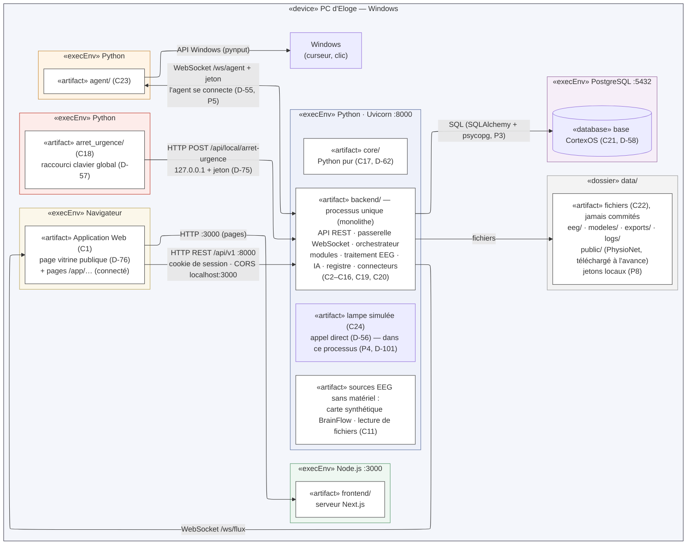

# DIAG-8a — Diagramme de déploiement : tout sur le PC

| | |
|---|---|
| **Réf.** | DIAG-8, vue 1 (Planning MVP, S3, mode A — D-96) · vue 2 : `diag-08b-deploiement-materiel.md` |
| **Sources** | Analyse du déploiement v1.0 par Eloge (27/09/2026) · ARCH-0 (§ 2, 5, 7, 8, 11) · DIAG-4 (composants C1 à C24) · Décisions D-54 à D-62, D-72 à D-76 |
| **Version** | 1.0 — 4 octobre 2026 (validé ; 0.1 du 27/09) |
| **Statut** | Validé par Eloge (04/10/2026, D-103) |

## Rôle du diagramme

| DIAG-4 Composants | DIAG-8 Déploiement |
|---|---|
| **Quels** blocs logiciels et comment ils se parlent | **Où** ils tournent physiquement : quelle machine, quel programme, quel lien |

Cette vue montre la configuration du **MVP sans matériel** (tranches 0 à 4, S4 à S19). Aujourd'hui rien ne tourne encore : le dépôt contient la documentation et un squelette Next.js.

## Notation

Mermaid n'a pas de diagramme de déploiement UML : on utilise un `flowchart` avec des cadres imbriqués.

| Élément UML | Dans le diagramme |
|---|---|
| «device» (nœud matériel) | grand cadre (le PC) |
| «execEnv» (environnement d'exécution : un programme qui tourne) | cadre coloré **dans** le PC |
| «artifact» (fichier ou dossier déployé) | rectangle blanc, avec les composants qu'il réalise (C1…) |
| «database» | cylindre |
| Chemin de communication | flèche avec le protocole, le port ou la route |

> `«execEnv»` est l'abréviation de «executionEnvironment», raccourcie pour que Mermaid ne superpose pas les cadres.

## Diagramme

## Nœuds et environnements

| Élément | Contient | Démarré par | Source |
|---|---|---|---|
| «device» **PC d'Eloge** | tout ; Windows ; tout écoute sur 127.0.0.1 | — | D-73, D-74 ; configuration `[D-13]` |
| «execEnv» **Navigateur** | Application Web (C1) : page vitrine publique et pages `/app/…` | l'utilisateur | D-76 |
| «execEnv» **Node.js :3000** | `frontend/` : serveur Next.js | `npm run dev` | ARCH-0 |
| «execEnv» **Python · Uvicorn :8000** | **un seul processus** : `backend/` (C2–C16, C19, C20), `core/` (C17), sources sans matériel, lampe simulée | `uvicorn` | D-62, monolithe ; lampe dans ce processus : D-101 (P4) |
| «execEnv» **Python (agent)** | `agent/` (C23) | `python -m agent` | D-55 |
| «execEnv» **Python (arrêt d'urgence)** | `arret_urgence/` (C18) | `python -m arret_urgence` | D-57, D-75 |
| «execEnv» **PostgreSQL :5432** | base CortexOS (C21) | service Windows | D-58 |
| «dossier» **data/** | `eeg/`, `modeles/`, `exports/`, `logs/`, `public/` (PhysioNet, téléchargé à l'avance), jetons locaux | — | D-58, ARCH-0 § 8, P8 |

**Pas un nœud :** la carte synthétique BrainFlow et la lecture de fichiers tournent **dans** le processus backend. L'entraînement (D-59) et la lecture du signal (P6) sont des **fils d'exécution** du même processus.

**Hors du diagramme :** le fichier `.env` (mot de passe de PostgreSQL), lu au démarrage par le backend, jamais commité.

## Chemins de communication

| De | Vers | Protocole · adresse | Protection | Source |
|---|---|---|---|---|
| Navigateur | Next.js | HTTP `localhost:3000` | — | P2 |
| Navigateur | Backend | HTTP REST `/api/v1` `:8000` | cookie de session ; CORS limité à `localhost:3000` | D-74, ARCH-0 § 7 |
| Backend | Navigateur | WebSocket `/ws/flux` | cookie vérifié à l'ouverture | ARCH-0 § 5 |
| Agent | Backend | WebSocket `/ws/agent` ; l'agent se connecte | jeton local | D-55 ; P5, P8 |
| Arrêt d'urgence | Backend | HTTP POST `/api/local/arret-urgence` | 127.0.0.1 seulement + jeton dédié | D-75 |
| Agent | Windows | API du système (pynput) | liste fermée de commandes | D-73, P3 |
| Backend | PostgreSQL | SQL `127.0.0.1:5432` | mot de passe dans `.env` | D-58, P3 |
| Backend | data/ | fichiers | — | D-58 |
| Backend | Lampe simulée | appel de fonction Python (pas de réseau) | — | D-56, D-101 |

## Ordre de démarrage (proposé, ARCH-0 § 11)

1. PostgreSQL (service Windows, souvent déjà lancé). 2. Backend. 3. Frontend. 4. Agent, si la cible Ordinateur est utilisée. 5. Arrêt d'urgence, dès qu'une session est active.

Le backend démarre avant l'agent et l'arrêt d'urgence, car ce sont eux qui s'y connectent.

## À retenir

| Point | Pourquoi c'est important |
|---|---|
| **Quatre programmes du projet** + PostgreSQL + le navigateur | Chacun se lance séparément : il faut savoir lequel tourne quand quelque chose ne marche pas |
| **Un seul processus Python pour le backend** | Traitement, IA et Core partagent le processeur : l'entraînement est dans un fil séparé (D-59) pour ne pas bloquer la boucle temps réel |
| **Tout sur 127.0.0.1** | Aucun autre appareil du réseau ne peut joindre CortexOS (D-74) |
| **Même horloge pour tout** | t0 à t3 viennent de la même machine : la latence mesurée est fiable |
| **Pas de réseau vers l'extérieur pendant l'exécution** | Le jeu de données public est téléchargé à l'avance dans `data/public/` |
| **Pas de carte graphique nécessaire** | CSP + LDA tournent sur le processeur |

## Vérification croisée

| Comparaison | Constat |
|---|---|
| DIAG-4 ↔ déploiement | C1 → navigateur ; C2–C17, C19–C20, C24 → processus backend ; C18 → programme d'arrêt d'urgence ; C21 → PostgreSQL ; C22 → `data/` ; C23 → agent. Aucun composant oublié |
| ARCH-0 § 2 ↔ vue 1 | Mêmes 4 programmes, mêmes ports, mêmes routes |
| DIAG-6 (a) ↔ vue 1 | Le chemin de l'action (backend → agent → Windows) est bien WebSocket `/ws/agent` |
| DIAG-6 (d) ↔ vue 1 | L'arrêt d'urgence a son propre processus et son propre canal : il marche même si l'interface ou l'agent sont tombés |

## Ce que j'ai complété ou corrigé par rapport à ton analyse

| Point | Ton analyse | Dans le diagramme | Pourquoi |
|---|---|---|---|
| **Programme d'arrêt d'urgence** | Absent | **Ajouté** : processus Python séparé, route locale + jeton | D-57, D-75 ; c'est un programme à part entière (C18) |
| Base de données | PostgreSQL ou SQLite (Q1) | **PostgreSQL** | D-58 |
| Liaison backend ↔ agent | À confirmer (Q4) | WebSocket `/ws/agent` + jeton ; l'agent se connecte | D-55 ; jeton et sens de connexion : P5, P8 |
| Système d'exploitation | `[D-06]` | **Windows** | D-73 |
| Tout sur `localhost` | Proposition (Q3) | Décidé | D-74 |
| Navigateur → backend | Direct ou via Next.js (Q2) | **Direct**, CORS limité à `localhost:3000` | ARCH-0 § 5 et § 7 |
| Lampe simulée | Processus séparé ; directe ou MQTT (Q5) | **Appel direct**, dans le processus backend | D-56 ; « dans le backend » : P4, validé (D-101) |
| Broker MQTT en vue 1 | Optionnel | **Retiré** de la vue 1 (passe en vue 2) | La lampe est en appel direct (D-56) ; MQTT et ESP32 sont une extension (D-72) |
| Artefact `lampe_simulee/` | Dossier séparé | Dans `backend/app/cibles/` | ARCH-0 § 4 (P1, P4) |
| Uvicorn, SQLAlchemy, pynput | Déduits | Écrits sur les flèches | Bibliothèques P3, validées (D-101) |
| Version de Python | — | 3.14.3 ; paquets vérifiés le 04/10 | ARCH-0 § 3.4 |
| Lancement | Script (Q8) | Ordre ARCH-0 § 11 (proposé) ; Docker `[D-08]` | Déjà proposé dans ARCH-0 |

## Points encore ouverts

- **D-13** : configuration du PC (processeur, mémoire, Bluetooth).
- **D-08** : Docker en fin de projet ; script de lancement unique ou non.
- **Machine de soutenance** : même PC ou non.
