# DIAG-8b — Diagramme de déploiement : ajouts matériels (casque, ESP32)

| | |
|---|---|
| **Réf.** | DIAG-8, vue 2 (Planning MVP, S3, mode A — D-96) · vue 1 : `diag-08a-deploiement-pc.md` |
| **Sources** | Analyse du déploiement v1.0 par Eloge (27/09/2026) · Cahier des charges § 8 · ARCH-0 · Décisions D-04, D-11, D-19, D-72 |
| **Version** | 0.1 — 27 septembre 2026 |
| **Statut** | À relire par Eloge |

## Rôle de cette vue

C'est la vue 1 **copiée**, avec ce qui s'ajoute quand le matériel arrive : le **casque** (bloc casque, S27–S30) et, en extension, un **ESP32** (D-72). Tout ce qui n'est pas encore là est en **bleu pointillé**. La notation est celle de DIAG-8a.

## Diagramme

```mermaid
---
config:
  layout: elk
---
flowchart LR
  subgraph PC["«device» PC d'Eloge — Windows"]
    subgraph NAV["«execEnv» Navigateur"]
      aWeb["«artifact» Application Web (C1)<br/>page vitrine publique (D-76)<br/>+ pages /app/… (connecté)"]
    end
    subgraph NODE["«execEnv» Node.js :3000"]
      aFront["«artifact» frontend/<br/>serveur Next.js"]
    end
    subgraph PY["«execEnv» Python · Uvicorn :8000"]
      aBack["«artifact» backend/ — processus unique (monolithe)<br/>API REST · passerelle WebSocket · orchestrateur<br/>modules · traitement EEG · IA · registre · connecteurs<br/>(C2–C16, C19, C20)"]
      aCore["«artifact» core/<br/>Python pur (C17, D-62)"]
      aSrc["«artifact» sources EEG (C11) :<br/>carte synthétique · fichiers · <b>casque</b> (BrainFlow)"]
      aSdk["«artifact» pilote / SDK du fabricant<br/>si le casque l'exige [D-04]"]
      aMqtt["«artifact» connecteur MQTT (C20)<br/>nouveau connecteur, Core inchangé (F-25)"]
      aLampe["«artifact» lampe simulée (C24)<br/>appel direct (D-56) — dans ce processus (P4, proposé)"]
    end
    subgraph AGP["«execEnv» Python"]
      aAgent["«artifact» agent/ (C23)"]
    end
    subgraph AUP["«execEnv» Python"]
      aAU["«artifact» arret_urgence/ (C18)<br/>raccourci clavier global (D-57)"]
    end
    subgraph PGS["«execEnv» PostgreSQL :5432"]
      db[("«database» base CortexOS (C21, D-58)")]
    end
    subgraph BRK["«execEnv» broker MQTT"]
      aBrk["«artifact» broker (Mosquitto, proposé)<br/>écoute aussi sur le réseau local<br/>mot de passe + TLS :8883 (proposé)"]
    end
    subgraph DATA["«dossier» data/"]
      fData["«artifact» fichiers (C22), jamais commités<br/>eeg/ · modeles/ · exports/ · logs/<br/>public/ (PhysioNet, téléchargé à l'avance)<br/>jetons locaux (P8)"]
    end
    os["Windows<br/>(curseur, clic)"]
  end
  subgraph CASQUE["«device» Casque EEG [D-04]"]
    fwC["«artifact» firmware du fabricant<br/>(hors projet)"]
  end
  subgraph WIFI["«device» Box / point d'accès Wi-Fi"]
    lan["réseau local"]
  end
  subgraph ESP["«device» ESP32 — extension (D-72)"]
    fwE["«artifact» firmware CortexOS<br/>langage [À DÉFINIR]"]
    act["«device» actionneur<br/>LED ou relais + lampe"]
  end

  aWeb -- "HTTP :3000 (pages)" --> aFront
  aWeb -- "HTTP REST /api/v1 :8000<br/>cookie de session · CORS localhost:3000" --> aBack
  aBack -- "WebSocket /ws/flux" --> aWeb
  aAgent <-- "WebSocket /ws/agent + jeton<br/>l'agent se connecte (D-55, P5)" --> aBack
  aAU -- "HTTP POST /api/local/arret-urgence<br/>127.0.0.1 + jeton (D-75)" --> aBack
  aAgent -- "API Windows (pynput)" --> os
  aBack -- "SQL (SQLAlchemy + psycopg, P3)" --> db
  aBack -- "fichiers" --> fData
  fwC -- "Bluetooth, dongle USB ou Wi-Fi [D-04]" --> aSdk
  aSdk -- "appel de bibliothèque" --> aSrc
  aMqtt -- "MQTT (127.0.0.1)" --> aBrk
  aBrk -- "MQTT sur Wi-Fi" --> lan
  lan -- "MQTT" --> fwE
  fwE -- "broches (GPIO)" --> act

  classDef art fill:#fff,stroke:#444
  classDef prop fill:#fff8e1,stroke:#c79100,stroke-dasharray:4 3
  class aWeb,aFront,aBack,aCore,aSrc,aAgent,aAU,fData art
  class aLampe prop
  classDef futur fill:#fff,stroke:#2c5aa0,stroke-dasharray:5 5
  class aSdk,aMqtt,aBrk,fwC,fwE,act,lan futur
  style PC fill:#f4f6fb,stroke:#334
  style NAV fill:#fbf7ea,stroke:#b9a45a
  style NODE fill:#eef7f1,stroke:#5a9a70
  style PY fill:#eef1fa,stroke:#5a6fa0
  style AGP fill:#fff4e6,stroke:#c58a3a
  style AUP fill:#fdecea,stroke:#c0392b
  style PGS fill:#f6eef8,stroke:#9a6aa0
  style DATA fill:#f3f3f3,stroke:#999
  style BRK fill:#fff,stroke:#2c5aa0,stroke-dasharray:5 5
  style CASQUE fill:#fff,stroke:#2c5aa0,stroke-dasharray:5 5
  style WIFI fill:#fff,stroke:#2c5aa0,stroke-dasharray:5 5
  style ESP fill:#fff,stroke:#2c5aa0,stroke-dasharray:5 5
```

## Ce qui s'ajoute

| Élément | Type | Rôle | Liaison | Statut |
|---|---|---|---|---|
| **Casque EEG** | «device» + firmware du fabricant (hors projet) | Mesure le signal | Bluetooth, dongle USB ou Wi-Fi | Modèle et liaison `[D-04]` ; bloc casque S27–S30 |
| **Pilote / SDK du fabricant** | «artifact» sur le PC | Nécessaire si le casque l'exige ; appelé par BrainFlow **dans** le processus backend | appel de bibliothèque | `[D-04]` (Cahier § 8.2) |
| Source « casque » | dans `backend/` | Troisième implémentation de `ISourceEEG` : **le reste du code ne change pas** | — | DIAG-4, A3 d'ARCH-0 |
| **Connecteur MQTT** | «artifact» dans `backend/` | Nouveau connecteur ; le Core ne change pas (F-25) | MQTT vers le broker en 127.0.0.1 | Extension (D-72) |
| **Broker MQTT** | «execEnv» sur le PC | Relais des messages vers l'ESP32 | écoute aussi sur le réseau local | Extension ; Mosquitto proposé |
| **Box / point d'accès Wi-Fi** | «device» | Relie l'ESP32 au PC | Wi-Fi | Nécessaire : l'ESP32 n'a pas d'autre moyen de joindre le broker |
| **ESP32** | «device» + firmware CortexOS | Objet connecté réel, **en plus** de la lampe simulée | MQTT sur Wi-Fi | Extension (D-72) ; langage du firmware `[À DÉFINIR]` |
| Actionneur | «device» | LED, ou relais + lampe | broches (GPIO) | Achat `[D-13]` |

## Ce qui change par rapport à la vue 1

| Point | Vue 1 | Vue 2 |
|---|---|---|
| Ouverture au réseau | Rien ; tout sur 127.0.0.1 | **Seul le broker** écoute sur le réseau local ; le backend, l'agent et l'arrêt d'urgence restent sur 127.0.0.1 |
| Sécurité | Jetons locaux, cookie | **Mot de passe MQTT obligatoire**, TLS (port 8883) proposé : sinon n'importe quel appareil du Wi-Fi peut commander l'actionneur |
| Horloges | Une seule | L'ESP32 a sa propre horloge : la latence se mesure **côté PC** (envoi → résultat), jamais avec l'heure de l'ESP32 |
| Perte du signal | Rare (simulation) | Le Bluetooth ajoute du retard et peut perdre des paquets : cause concrète de la séquence (d) et de l'activité A7 |

## Ajouts possibles, non dessinés (pas décidés)

| Ajout | Ce qu'il impliquerait | Statut |
|---|---|---|
| Poste séparé pour l'accompagnant | Ouvrir le backend au réseau → HTTPS et droits par rôle obligatoires | Non décidé (D-74 : tout sur le PC ; D-09) |
| Bouton d'arrêt physique | Un 2e déclencheur de C18, par exemple sur un ESP32 | `[D-19]` |
| Robot ou drone simulé (ROS 2) | Nouvel environnement d'exécution et nouveau connecteur | `[D-11]` |
| Conteneurs Docker | Installation simplifiée | `[D-08]`, fin de projet |
| Machine de soutenance | Refaire l'installation, vérifier Windows et le Bluetooth | Non décidé |

## Ce que j'ai complété ou corrigé par rapport à ton analyse

| Point | Ton analyse | Dans le diagramme | Pourquoi |
|---|---|---|---|
| ESP32 | « remplace la lampe simulée » | S'**ajoute** : la lampe simulée reste | D-72 : MVP en simulation, ESP32 réel en extension ; F-25 : un nouveau connecteur |
| Broker | Obligatoire, port 1883 | Obligatoire en vue 2 ; 8883 + mot de passe proposés | Il est le seul élément ouvert au réseau |
| Connecteur MQTT | Implicite | Artefact explicite dans `backend/` | Montre que le Core n'est pas modifié |
| Ce qui reste fermé | — | Backend, agent, arrêt d'urgence restent sur 127.0.0.1 | D-74, D-75 |
| Statut de MQTT / ESP32 | `[D-05]` | Extension | D-72 |

## Points encore ouverts

- **D-04** : casque, donc liaison (Bluetooth, USB, Wi-Fi) et besoin d'un pilote. **À commander avant le 04/10.**
- Langage du firmware ESP32 (Arduino C++ ou MicroPython) et choix du broker : à décider seulement si l'extension est réalisée.
- **D-19** (bouton physique), **D-11** (robot, drone), **D-08** (Docker), **D-13** (achats).
